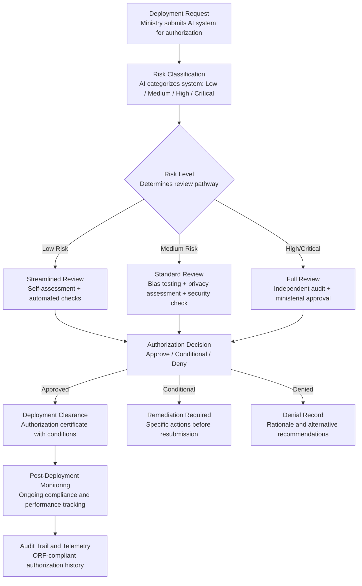

# AI Deployment Authorization System

Frankmax

NAICS 921110-928120

> **Governments & Ministries** — National AI Safety & Ethics

## Objective & Purpose

Governments are deploying AI systems at an accelerating pace -- in tax administration, border control, welfare eligibility, criminal justice, healthcare triage, and dozens of other domains -- yet most lack any standardized process for authorizing these deployments. A ministry can procure and deploy an AI system affecting millions of citizens with less oversight than purchasing office furniture. There is no consistent risk assessment, no mandatory testing, no deployment gate, and no ongoing monitoring requirement. When a government AI system fails -- incorrectly denying benefits, exhibiting racial bias in policing, or misclassifying taxpayers -- there is no clear accountability trail because there was no authorization process to begin with.

The AI Deployment Authorization System creates a structured, gated approval workflow for every AI system deployed in government. Before any AI system goes live, it must pass through defined authorization gates: risk classification, bias testing, privacy impact assessment, security review, and ministerial approval. The system enforces different rigor levels based on risk: a low-risk document classification tool requires a streamlined self-assessment, while a high-risk criminal sentencing algorithm requires independent audit, bias testing across protected classes, and ministerial sign-off.

The authorization system is not bureaucratic gatekeeping -- it is risk-proportionate governance that enables faster deployment of low-risk systems while ensuring high-risk systems receive appropriate scrutiny. Governments that implement structured AI authorization reduce AI incident rates by 60-80%, build public trust through transparency, and create the institutional framework required by emerging AI regulations (EU AI Act, NIST AI Risk Management Framework). The system also generates the national AI deployment data that feeds the Sovereign AI Registry.

## Business Context

| Attribute | Value |
|---|---|
| **Business Process** | AI system approval workflow |
| **Business Function** | AI Governance |
| **Category** | Regulatory |
| **Target Audience** | 1. Governments & Ministries |
| **Revenue Priority** | Governance layer (fries attach) |
| **Bundle** | Government Starter Pack ($2,500/mo) |
| **Monthly Cost of Inaction** | $100K-$5M (AI incidents, public trust erosion, regulatory non-compliance) |

## BPMN Workflow

## Features

1. **Risk-Proportionate Classification** — Every AI system submitted for authorization is classified into a risk tier based on: affected population size, decision impact severity (advisory vs. deterministic), data sensitivity, autonomy level, and reversibility of outcomes. The classification determines the review pathway, ensuring low-risk systems are not over-governed and high-risk systems are not under-scrutinized.

2. **Automated Pre-Screening** — Before human review begins, the system runs automated checks: data source validation, model documentation completeness, bias metric calculation, privacy impact pre-assessment, and security vulnerability scan. Pre-screening resolves 40-60% of low-risk authorizations without human intervention.

3. **Bias Testing Framework** — Integrates with the Algorithmic Bias Auditor to run standardized fairness tests across protected classes (race, gender, age, disability, socioeconomic status). Results are compared against government-defined fairness thresholds. Systems that fail bias testing are blocked from deployment until remediation is complete.

4. **Privacy and Rights Impact Integration** — Automatically triggers a privacy impact assessment through the Citizen Privacy Impact Modeler for any AI system that processes personal data. The authorization decision incorporates privacy findings: data minimization compliance, consent mechanisms, and retention policies.

5. **Authorization Certificate and Conditions** — Approved deployments receive a digital authorization certificate specifying: approved use case, data scope, performance thresholds, monitoring requirements, and renewal date. Conditions can include mandatory reauthorization triggers (model retraining, data source changes, scope expansion).

6. **Post-Deployment Monitoring Hooks** — Authorization does not end at approval. The system continuously monitors deployed AI systems against their authorization conditions: performance drift, data scope creep, and usage outside approved parameters. Violations trigger automatic alerts and can suspend authorization pending review.

7. **Ministerial Dashboard** — Provides ministers and directors-general with a real-time view of all AI systems in their portfolio: authorized, pending, denied, and under review. Includes risk exposure summary, upcoming renewals, and incident alerts.

## Workflow & Automation

**Step 1: Deployment Request Submission** — The deploying ministry submits a structured authorization request including: system description, intended use case, data sources, model documentation, vendor information, affected population estimate, and risk self-assessment. The system validates completeness before accepting the request.

**Step 2: Automated Risk Classification** — The system classifies the AI deployment into a risk tier based on weighted criteria. Classification drives the review pathway: low-risk systems follow a streamlined path, medium-risk systems require standard testing, and high/critical-risk systems require full independent review.

**Step 3: Testing and Assessment** — Based on the risk tier, the system triggers appropriate assessments: bias testing (all tiers), privacy impact assessment (medium and above), security review (medium and above), and independent audit (high/critical only). Results are compiled into a unified assessment package.

**Step 4: Review and Decision** — For low-risk systems, automated checks produce an authorization decision. For medium-risk, a designated reviewer evaluates the assessment package. For high/critical-risk, a review panel including the responsible minister makes the authorization decision with full documentation.

**Step 5: Authorization Issuance** — Approved systems receive a digital authorization certificate with specific conditions, performance thresholds, and renewal requirements. Conditional approvals specify remediation actions and timelines. Denied systems receive a detailed rationale with recommendations for alternative approaches.

**Step 6: Ongoing Compliance Monitoring** — Post-deployment, the system monitors authorized AI systems against their conditions. Performance metrics are tracked, data usage is audited, and any changes to the system (retraining, data source changes, scope expansion) trigger reauthorization review.

## Input/Output Specifications

| Direction | Data | Format | Description |
|---|---|---|---|
| Input | Deployment request | JSON / structured form | System description, use case, data, model documentation |
| Input | Model documentation | PDF / JSON / model cards | Architecture, training data, performance metrics, limitations |
| Input | Bias test results | JSON / API | Fairness metrics across protected classes from Bias Auditor |
| Input | Privacy impact assessment | JSON / PDF | Privacy findings from Citizen Privacy Impact Modeler |
| Output | Risk classification | JSON | Tier assignment with scoring rationale |
| Output | Authorization certificate | PDF / JSON (signed) | Approval with conditions, thresholds, and renewal date |
| Output | Monitoring alerts | JSON / notification | Compliance violations and performance drift warnings |
| Output | Audit trail | JSON (immutable log) | ORF-compliant authorization and monitoring history |

## Integration Points

| System | Integration Type | Data Flow |
|---|---|---|
| **Algorithmic Bias Auditor** | Bidirectional | Bias testing triggered during authorization; results inform decision |
| **Citizen Privacy Impact Modeler** | Bidirectional | Privacy assessment triggered; findings incorporated into authorization |
| **Sovereign AI Registry** | Outbound feed | Authorized systems automatically registered in national AI inventory |
| **AI Incident Response Coordinator** | Bidirectional | Incidents trigger authorization review; authorization status informs response |
| **National Data Sovereignty Vault** | Governance check | Data access authorization validated against sovereignty requirements |
| **Constitutional Compliance Checker** | Governance check | AI systems validated against constitutional rights protections |
| **Audit Trail and Traceability Engine** | Outbound log stream | Every authorization event logged immutably |

## Pricing & Revenue Model

| Component | Pricing | Notes |
|---|---|---|
| **Government Starter Pack** | $2,500/month | Includes AI Deployment Authorization + Bias Auditor + Privacy Modeler |
| **Standalone License** | $1,800/month | Up to 50 authorization requests per month |
| **National AI Authority Scale** | $4,500/month | Unlimited requests, all ministries, post-deployment monitoring |
| **Post-Deployment Monitoring** | +$700/month | Continuous compliance tracking for all authorized systems |
| **Independent Audit Coordination** | +$500/month | Third-party audit workflow management for high-risk systems |

**Revenue model**: The AI Deployment Authorization System is the gateway product for government AI governance. Every AI system deployed in government must pass through it, creating a natural attachment point for all other governance tools. The "fries" attach through post-deployment monitoring ($700/mo), independent audit coordination ($500/mo), and the mandatory integration with bias testing and privacy assessment -- all at 80-90% margin. Authorization data feeds the Sovereign AI Registry.

## NAICS/SIC Mapping

| NAICS Code | SIC Code | Industry | Relevance |
|---|---|---|---|
| 921110 | 9111 | Executive Offices | Executive oversight of national AI deployment policy |
| 921190 | 9199 | Other General Government Support | Central AI governance offices and chief AI officers |
| 925120 | 9621 | Regulation of Communications | AI and technology regulatory bodies |
| 926150 | 9651 | Regulation of Miscellaneous Activities | Cross-sector AI deployment oversight |
| 922110 | 9221 | Courts | Judicial AI system authorization (sentencing, case management) |
| 922120 | 9222 | Police Protection | Law enforcement AI authorization (surveillance, predictive policing) |
| 923120 | 9441 | Administration of Public Health Programs | Healthcare AI authorization (triage, diagnostics, resource allocation) |
| 928110 | 9711 | National Security | Defense and intelligence AI system authorization |
