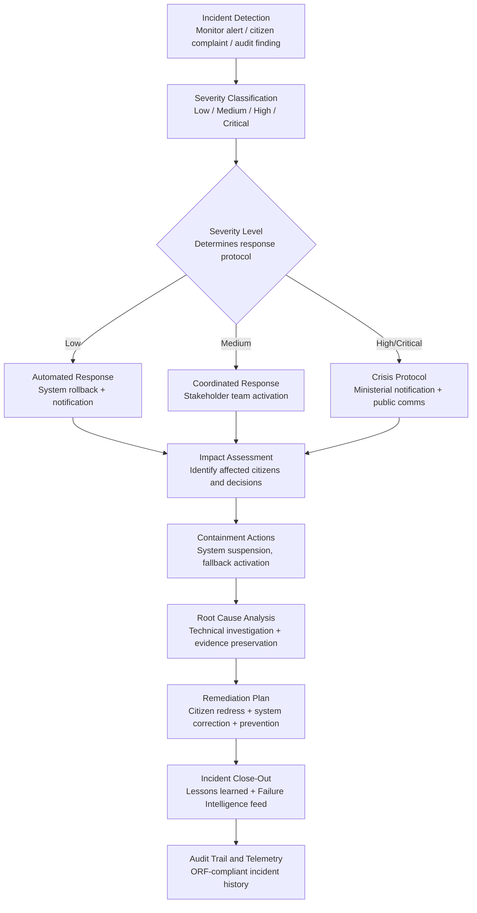

# AI Incident Response Coordinator

Frankmax

NAICS 921110-928120

> **Governments & Ministries** — National AI Safety & Ethics

## Objective & Purpose

When a government AI system fails -- a welfare algorithm wrongly denies thousands of benefits, a border control system exhibits racial profiling, a health triage AI makes incorrect prioritization decisions -- there is typically no playbook. Ministries scramble to understand what happened, who is affected, how to contain the damage, and what to tell the public. The absence of a structured incident response process means that containment is slow (often weeks), communication is inconsistent, affected citizens are not identified for months, and the root cause is never formally determined. The damage compounds: a 48-hour containment failure becomes a 6-month political crisis.

The AI Incident Response Coordinator provides a structured, automated response framework for AI system failures in government. When an incident is detected -- through monitoring alerts, citizen complaints, media reports, or audit findings -- the system activates a response protocol calibrated to the incident severity: automated containment for technical failures, coordinated response for service disruptions, and crisis management for high-impact events affecting citizen rights. The Coordinator orchestrates stakeholder notification, impact assessment, containment actions, communication, root cause analysis, and remediation tracking through a single command center.

The value is measured in speed and accountability. Governments with structured AI incident response contain incidents 5-10x faster than ad-hoc response, identify and remediate affected citizens in days rather than months, and produce defensible incident reports that satisfy parliamentary inquiries and legal proceedings. The Coordinator also builds institutional memory: every incident response feeds the marketplace's Failure Intelligence Library, ensuring that the same failure pattern is caught faster -- or prevented entirely -- in future deployments.

## Business Context

| Attribute | Value |
|---|---|
| **Business Process** | Incident management |
| **Business Function** | Crisis Management |
| **Category** | Operations |
| **Target Audience** | 1. Governments & Ministries |
| **Revenue Priority** | Governance layer (fries attach) |
| **Bundle** | Government Starter Pack ($2,500/mo) |
| **Monthly Cost of Inaction** | $500K-$50M (uncontained incidents, citizen harm, political crises) |

## BPMN Workflow

## Features

1. **Multi-Source Incident Detection** — Monitors for AI incidents from multiple sources: system monitoring alerts (performance degradation, anomaly detection), citizen complaint patterns (clustering of similar complaints), media monitoring (news and social media), audit findings, and whistleblower reports. Correlates signals across sources to detect incidents that no single source would reveal.

2. **Severity-Calibrated Response Protocols** — Each incident is classified by severity based on: number of affected citizens, decision impact (advisory vs. deterministic), rights implications, reversibility, and public visibility. The classification triggers a pre-defined response protocol with specific roles, timelines, and escalation paths.

3. **Automated Containment Playbooks** — For each incident type, pre-configured containment playbooks execute automatically: system suspension, fallback to manual processing, affected-decision quarantine, and notification triggers. Containment occurs in minutes rather than the days or weeks typical of ad-hoc response.

4. **Affected Citizen Identification** — When an AI system failure is confirmed, the Coordinator traces every decision made by the failed system to identify all affected citizens. Produces a comprehensive impact register: who was affected, what decision was made, what the correct decision should have been, and what remediation is required.

5. **Stakeholder Communication Engine** — Generates pre-drafted communications for each stakeholder group: ministerial briefings, parliamentary notifications, media statements, citizen notifications, and data protection authority reports. Communications are calibrated to the incident severity and audience, ensuring consistent messaging.

6. **Root Cause Analysis Framework** — Guides technical investigation through a structured framework: data issues (quality, bias, drift), model issues (performance degradation, adversarial inputs, edge cases), system issues (integration failures, infrastructure problems), and human factors (operator error, process failures). Produces a formal root cause report with evidence chain.

7. **Lessons Learned and Prevention** — Every resolved incident produces a lessons-learned document with: what happened, why it happened, how it was contained, what worked and what did not, and what changes prevent recurrence. Lessons feed back into the AI Deployment Authorization System to update risk assessments and testing requirements.

## Workflow & Automation

**Step 1: Incident Detection and Triage** — An incident is detected through monitoring alerts, complaint analysis, or manual reporting. The Coordinator performs initial triage: what system is affected, what is the apparent failure mode, and how many citizens may be impacted. A severity classification is assigned within 15 minutes.

**Step 2: Response Team Activation** — Based on severity, the appropriate response team is activated: technical team (all incidents), legal counsel (medium and above), communications team (high and above), and ministerial office (critical). Each team member receives a briefing package with current known facts and their specific responsibilities.

**Step 3: Containment Execution** — Pre-configured containment actions execute: the affected AI system is suspended or switched to fallback mode, decisions made since the incident onset are flagged for review, and affected services transition to manual processing. Containment status is tracked in real time.

**Step 4: Impact Assessment** — The system identifies every citizen affected by the failed AI system. For each affected citizen, it determines: the decision that was made, the data inputs to that decision, the likely correct decision, and the remediation required (benefit restoration, notification, compensation).

**Step 5: Root Cause Investigation** — The technical team conducts a structured investigation following the root cause analysis framework. All evidence is preserved in an immutable log. The investigation produces a formal root cause determination with contributing factors and evidence chain.

**Step 6: Remediation and Close-Out** — A remediation plan is developed and executed: citizen redress (correcting decisions, providing compensation), system correction (fixing the root cause), and prevention measures (updated testing requirements, new monitoring rules). The incident is formally closed with a comprehensive lessons-learned report.

## Input/Output Specifications

| Direction | Data | Format | Description |
|---|---|---|---|
| Input | Monitoring alerts | JSON / webhook | System performance, anomaly, and drift alerts |
| Input | Citizen complaints | JSON / form data / text | Complaint patterns indicating potential AI failure |
| Input | Media monitoring | API / RSS | News and social media mentions of AI system issues |
| Input | System logs and data | JSON / database | Affected AI system's decision logs and input data |
| Output | Incident reports | PDF / JSON / HTML | Severity classification, impact assessment, root cause |
| Output | Stakeholder communications | PDF / DOCX / email | Pre-drafted briefings, statements, and notifications |
| Output | Affected citizen register | JSON / database | All affected citizens with decisions and remediation needs |
| Output | Audit trail | JSON (immutable log) | ORF-compliant incident response and resolution history |

## Integration Points

| System | Integration Type | Data Flow |
|---|---|---|
| **AI Deployment Authorization System** | Bidirectional | Incidents trigger authorization review; authorization data informs response |
| **Sovereign AI Registry** | Bidirectional | Registry provides system metadata; incident status updates registry |
| **Algorithmic Bias Auditor** | Inbound trigger | Bias-related incidents trigger immediate re-audit |
| **Citizen Privacy Impact Modeler** | Inbound trigger | Data breach incidents trigger privacy impact reassessment |
| **Citizen Service Orchestrator** | Outbound coordination | Affected service delivery rerouted during containment |
| **National Data Sovereignty Vault** | Evidence preservation | Incident evidence and system logs preserved in sovereign storage |
| **Failure Intelligence Library** | Outbound anonymized patterns | Incident patterns feed cross-sector failure intelligence |

## Pricing & Revenue Model

| Component | Pricing | Notes |
|---|---|---|
| **Government Starter Pack** | $2,500/month | Includes AI Incident Response Coordinator + Authorization + Registry |
| **Standalone License** | $1,500/month | Up to 10 active incident responses per month |
| **National AI Authority Scale** | $3,800/month | Unlimited incidents, all agencies, crisis protocol integration |
| **Automated Containment Playbooks** | +$600/month | Pre-configured response automation for common failure modes |
| **Media Monitoring Integration** | +$400/month | Real-time news and social media incident detection |
| **Citizen Redress Management** | +$500/month | End-to-end affected citizen identification and remediation tracking |

**Revenue model**: The AI Incident Response Coordinator is insurance infrastructure -- its value is most visible when things go wrong. A single uncontained AI incident costs $500K-$50M; the Coordinator prevents that escalation. The "fries" attach through automated containment ($600/mo), media monitoring ($400/mo), and citizen redress management ($500/mo) -- all at 80-90% margin. Every incident feeds the Failure Intelligence Library, making the marketplace smarter with each response.

## NAICS/SIC Mapping

| NAICS Code | SIC Code | Industry | Relevance |
|---|---|---|---|
| 921190 | 9199 | Other General Government Support | Central AI governance and risk management offices |
| 921110 | 9111 | Executive Offices | Executive crisis management and ministerial briefing |
| 922120 | 9222 | Police Protection | Law enforcement AI failure response (predictive policing, surveillance) |
| 923120 | 9441 | Administration of Public Health Programs | Healthcare AI failure response (triage, diagnostics) |
| 923130 | 9451 | Administration of Human Resource Programs | Welfare AI failure response (eligibility, benefit calculation) |
| 928110 | 9711 | National Security | Defense and intelligence AI incident containment |
| 922110 | 9221 | Courts | Judicial AI failure response (sentencing, case management) |
| 925120 | 9621 | Regulation of Communications | Technology platform AI incident oversight |
