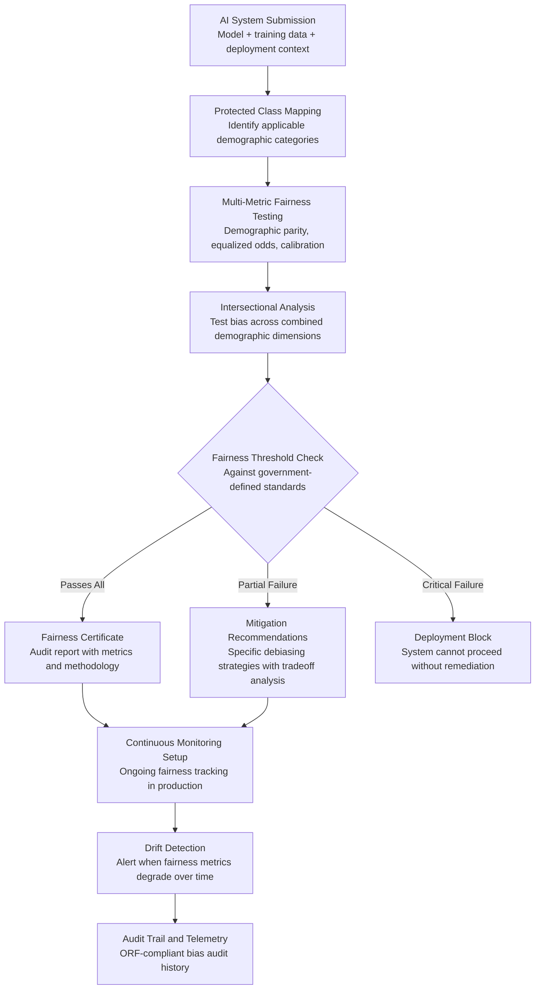

# Algorithmic Bias Auditor

Frankmax

NAICS 921110-928120

> **Governments & Ministries** — National AI Safety & Ethics

## Objective & Purpose

Government AI systems make decisions that affect citizens' lives: welfare eligibility, tax audit selection, criminal risk scoring, healthcare resource allocation, immigration processing, and education placement. When these systems exhibit bias -- producing systematically different outcomes for different demographic groups without legitimate justification -- the consequences are severe: citizens are denied benefits they deserve, communities are over-policed, and vulnerable populations face discrimination by algorithm. Unlike private sector bias (which costs revenue), government AI bias violates constitutional equal protection guarantees and can trigger legal liability, political crisis, and institutional delegitimization.

The Algorithmic Bias Auditor provides automated, continuous fairness assessment for every AI system deployed in government. The system tests AI models against all legally protected classes (race, gender, age, disability, national origin, religion, socioeconomic status) using multiple fairness metrics: demographic parity, equalized odds, predictive parity, calibration, and individual fairness. It does not impose a single definition of fairness -- it measures across all definitions and presents the tradeoffs, because different use cases legitimately require different fairness standards.

The business case is both ethical and financial. A single biased government AI system can trigger class-action litigation costing $10M-$100M, congressional investigations, and mandatory system shutdowns. The Algorithmic Bias Auditor catches these problems before deployment through pre-release auditing and after deployment through continuous monitoring. It provides the evidentiary basis for defending AI systems that are challenged -- or for correcting them when the challenge is legitimate. Every audit contributes to the marketplace's fairness benchmark library, building cross-sector fairness standards that no single government could develop alone.

## Business Context

| Attribute | Value |
|---|---|
| **Business Process** | Fairness assessment |
| **Business Function** | Ethics & Compliance |
| **Category** | Audit |
| **Target Audience** | 1. Governments & Ministries |
| **Revenue Priority** | Governance layer (fries attach) |
| **Bundle** | Government Starter Pack ($2,500/mo) |
| **Monthly Cost of Inaction** | $200K-$10M (litigation, system shutdowns, institutional credibility loss) |

## BPMN Workflow

## Features

1. **Multi-Metric Fairness Assessment** — Tests each AI system against six fairness metrics simultaneously: demographic parity (equal selection rates), equalized odds (equal true/false positive rates), predictive parity (equal precision), calibration (equal accuracy across groups), counterfactual fairness (same decision if protected attribute changed), and individual fairness (similar individuals treated similarly). Results show the tradeoffs between metrics.

2. **Protected Class Coverage** — Tests across all legally protected classes relevant to the jurisdiction: race, ethnicity, gender, age, disability status, national origin, religion, sexual orientation, veteran status, and socioeconomic indicators. The system adapts to jurisdiction-specific protected class definitions and can incorporate additional dimensions as regulations evolve.

3. **Intersectional Bias Detection** — Goes beyond single-axis fairness to test combinations: Black women, elderly disabled persons, young male immigrants. Intersectional testing catches biases that single-dimension analysis misses -- a system may appear fair for women and fair for minorities while being biased against minority women.

4. **Explainable Bias Attribution** — When bias is detected, the system traces the source: training data imbalance, feature correlation with protected attributes, proxy variables, historical bias encoded in labels, or model architecture. This attribution enables targeted remediation rather than guesswork.

5. **Debiasing Strategy Recommendations** — For each detected bias, the system recommends specific mitigation strategies: pre-processing (resampling, reweighting), in-processing (fairness constraints, adversarial debiasing), and post-processing (threshold adjustment, calibrated equalized odds). Each recommendation includes the expected impact on both fairness and accuracy.

6. **Continuous Production Monitoring** — After deployment, the auditor continuously tracks fairness metrics on live data. Population shifts, data distribution changes, and model drift can degrade fairness over time -- the monitor catches degradation before it becomes a crisis.

7. **Audit Evidence Package** — Produces a comprehensive audit report suitable for regulatory review, legal defense, and public disclosure. Includes methodology, data characteristics, all metric results, intersectional findings, and any limitations or caveats. Meets requirements of emerging AI audit standards (EU AI Act, NIST AI RMF).

## Workflow & Automation

**Step 1: System Intake and Context Definition** — The AI system owner submits the model (or API access), training data sample, deployment context (use case, affected population, decision impact), and applicable fairness requirements. The auditor maps the regulatory framework to determine which protected classes and metrics apply.

**Step 2: Data and Model Profiling** — The system profiles the training data for demographic representation, class imbalance, and potential proxy variables. The model is profiled for architecture type, feature importance, and sensitivity to protected attributes. This baseline informs the audit scope.

**Step 3: Comprehensive Fairness Testing** — The auditor runs all applicable fairness tests: single-axis demographic metrics, intersectional analysis, counterfactual testing, and individual fairness assessment. Each test produces quantitative results compared against government-defined fairness thresholds.

**Step 4: Bias Source Attribution** — For any metric that fails or approaches the threshold, the system traces the bias source through the model pipeline: data collection bias, labeling bias, feature engineering bias, model amplification, or post-processing effects. The attribution report identifies the most effective intervention point.

**Step 5: Remediation Planning** — When bias is detected, the system generates a remediation plan with specific debiasing strategies, expected fairness improvement, accuracy impact, and implementation complexity. Decision-makers see the tradeoff: how much accuracy are they willing to sacrifice for how much fairness improvement.

**Step 6: Certification and Monitoring Activation** — Systems that pass (or are remediated to pass) receive a fairness certificate valid for a defined period. Continuous monitoring activates to track fairness metrics on production data, with automatic alerts when metrics drift outside certified bounds.

## Input/Output Specifications

| Direction | Data | Format | Description |
|---|---|---|---|
| Input | AI model | API access / model file | Trained model for fairness testing |
| Input | Training/test data | CSV / Parquet / API | Data samples with demographic attributes for bias testing |
| Input | Deployment context | JSON / structured form | Use case, affected population, decision impact level |
| Input | Fairness requirements | JSON / policy document | Jurisdiction-specific protected classes and thresholds |
| Output | Fairness audit report | PDF / JSON / HTML | Multi-metric results across all protected classes |
| Output | Bias attribution analysis | JSON + visualization | Source identification and feature contribution to bias |
| Output | Remediation plan | PDF / JSON | Debiasing strategies with tradeoff analysis |
| Output | Audit trail | JSON (immutable log) | ORF-compliant bias audit and monitoring history |

## Integration Points

| System | Integration Type | Data Flow |
|---|---|---|
| **AI Deployment Authorization System** | Bidirectional | Bias audit required for authorization; results inform decision |
| **Sovereign AI Registry** | Outbound feed | Fairness metrics registered alongside system metadata |
| **AI Incident Response Coordinator** | Outbound trigger | Critical bias findings trigger incident response process |
| **Citizen Privacy Impact Modeler** | Coordination | Bias testing coordinated with privacy assessment for same system |
| **Constitutional Compliance Checker** | Governance check | Bias findings validated against constitutional equal protection |
| **National Data Sovereignty Vault** | Data source | Audit data accessed from sovereign infrastructure |
| **Failure Intelligence Library** | Outbound anonymized patterns | Bias patterns feed cross-sector fairness intelligence |

## Pricing & Revenue Model

| Component | Pricing | Notes |
|---|---|---|
| **Government Starter Pack** | $2,500/month | Includes Algorithmic Bias Auditor + AI Authorization + Privacy Modeler |
| **Standalone License** | $1,600/month | Up to 20 AI system audits per month |
| **National AI Authority Scale** | $4,000/month | Unlimited audits, all agencies, continuous monitoring |
| **Continuous Monitoring** | +$600/month | Real-time fairness tracking for all deployed systems |
| **Intersectional Analysis Module** | +$400/month | Multi-dimensional bias detection beyond single-axis |
| **Debiasing Toolkit** | +$500/month | Automated remediation strategies and impact modeling |

**Revenue model**: The Algorithmic Bias Auditor is mandatory infrastructure for any government deploying AI at scale. As AI regulation tightens globally, bias auditing moves from optional to required. The "fries" attach through continuous monitoring ($600/mo), intersectional analysis ($400/mo), and the debiasing toolkit ($500/mo) -- all at 85-90% margin. Fairness benchmarks feed the marketplace's cross-sector bias intelligence library, becoming more valuable with each audit.

## NAICS/SIC Mapping

| NAICS Code | SIC Code | Industry | Relevance |
|---|---|---|---|
| 921190 | 9199 | Other General Government Support | Central AI ethics and governance offices |
| 921110 | 9111 | Executive Offices | Executive AI policy and oversight |
| 922110 | 9221 | Courts | Judicial AI fairness in sentencing and case management |
| 922120 | 9222 | Police Protection | Law enforcement AI bias in predictive policing and surveillance |
| 923130 | 9451 | Administration of Human Resource Programs | Welfare eligibility AI fairness across demographics |
| 923120 | 9441 | Administration of Public Health Programs | Healthcare AI fairness in resource allocation and triage |
| 923110 | 9431 | Administration of Education Programs | Education AI fairness in placement and assessment |
| 925120 | 9621 | Regulation of Communications | AI platform regulation and algorithmic accountability |
