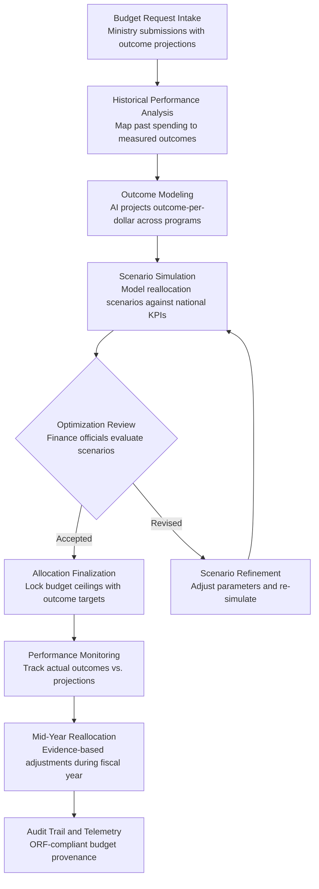

# Budget Allocation Optimizer

Frankmax

NAICS 921110-928120

> **Governments & Ministries** — Sovereign AI Governance Stack

## Objective & Purpose

National budget allocation is one of the highest-stakes decisions any government makes, yet the process remains driven by political negotiation, historical precedent, and incremental adjustments rather than outcome data. A typical ministry receives a budget ceiling based on last year's allocation plus or minus a political adjustment -- with little evidence linking spending to measurable outcomes. The World Bank estimates that 20-40% of government expenditure in developing nations fails to achieve its stated objectives, while even OECD nations routinely allocate billions to programs with no rigorous outcome measurement.

The Budget Allocation Optimizer applies AI-driven outcome modeling to national budget planning. It ingests historical spending data, program performance metrics, economic indicators, and demographic projections to model the expected outcome-per-dollar for every budget line item. Ministers and finance officials can simulate reallocation scenarios -- shifting funds from low-performing programs to high-performing ones -- and see the projected impact on national KPIs: poverty reduction, educational attainment, health outcomes, infrastructure quality, and economic growth.

The tool does not replace political judgment; it informs it with data. When a finance minister must decide between a $500M allocation to rural infrastructure vs. urban healthcare, the Optimizer quantifies the expected outcomes of each scenario with confidence intervals. Governments that adopt evidence-based budget allocation consistently improve outcome-per-dollar by 15-30%, translating to billions in more effective spending without increasing total expenditure.

## Business Context

| Attribute | Value |
|---|---|
| **Business Process** | National budget planning |
| **Business Function** | Financial Management |
| **Category** | Finance |
| **Target Audience** | 1. Governments & Ministries |
| **Revenue Priority** | Governance layer (fries attach) |
| **Bundle** | Government Starter Pack ($2,500/mo) |
| **Monthly Cost of Inaction** | $1M-$50M (misallocated spending, low outcome-per-dollar, program inefficiency) |

## BPMN Workflow

## Features

1. **Outcome-Per-Dollar Scoring** — Every budget line item is scored based on its historical and projected outcome-per-dollar. The scoring model considers program efficiency, delivery capacity, target population reach, and external factors (economic conditions, demographic shifts). Finance officials see which programs deliver the most impact per unit of spending.

2. **Multi-Scenario Simulation Engine** — Finance officials can model unlimited reallocation scenarios: "What happens if we shift 10% from defense to education?" The engine calculates projected changes in national KPIs for each scenario with confidence intervals, enabling evidence-based tradeoff discussions.

3. **Program Performance Benchmarking** — Benchmarks each government program against comparable programs in other jurisdictions and against its own historical performance trajectory. Identifies programs that have declined in efficiency, programs that are outperforming expectations, and programs with untapped scaling potential.

4. **Demographic and Economic Projection Integration** — Incorporates population growth forecasts, urbanization trends, labor market projections, and macroeconomic scenarios into budget models. Ensures allocations account for changing demand patterns rather than static historical averages.

5. **Earmark and Mandate Compliance** — Automatically enforces budgetary constraints: constitutional spending floors (e.g., 6% of GDP on education), donor conditionalities, debt service obligations, and earmarked revenues. Ensures optimization recommendations stay within legal and political boundaries.

6. **Mid-Year Reallocation Intelligence** — Monitors actual spending and outcomes during the fiscal year and recommends evidence-based reallocations when programs underperform or emergency needs arise. Replaces ad-hoc supplementary budgets with structured, data-driven adjustments.

7. **Budget Transparency Dashboard** — Provides a public-facing view of budget allocations, outcome targets, and performance metrics. Supports open government initiatives and citizen oversight by making budget decisions transparent and outcome-linked.

## Workflow & Automation

**Step 1: Ministry Budget Submissions** — Each ministry submits its budget request through a structured template that includes: requested amounts by program, stated outcomes and KPIs, historical performance data, and justification for changes from prior year. The system validates submissions for completeness and consistency.

**Step 2: Historical Outcome Analysis** — The Optimizer analyzes 3-5 years of historical spending data against measured outcomes for each program. It calculates outcome-per-dollar trends, identifies programs with declining efficiency, and flags programs with no measurable outcome data (a common problem that the tool makes visible).

**Step 3: Forward-Looking Outcome Projection** — Using historical performance, demographic projections, and economic scenarios, the system models expected outcomes for each budget line item at various funding levels. Each projection includes confidence intervals and sensitivity analysis to key assumptions.

**Step 4: Scenario Simulation and Comparison** — Finance officials use the simulation engine to model reallocation scenarios. The system presents side-by-side comparisons showing the projected impact on national KPIs: poverty rate, educational attainment, health outcomes, infrastructure index, and fiscal sustainability.

**Step 5: Optimization Review and Decision** — Senior officials review scenarios in a structured decision interface. Each scenario shows winners, losers, and net national outcome impact. The system highlights scenarios that achieve the greatest outcome improvement within political and legal constraints.

**Step 6: Allocation Finalization and Monitoring Setup** — Once allocations are approved, the system locks budget ceilings with associated outcome targets. Performance monitoring dashboards activate automatically, tracking actual spending and outcomes against projections throughout the fiscal year.

## Input/Output Specifications

| Direction | Data | Format | Description |
|---|---|---|---|
| Input | Ministry budget requests | JSON / structured form / Excel | Program-level funding requests with outcome projections |
| Input | Historical spending data | API / CSV / ERP export | 3-5 years of actual expenditure by program and line item |
| Input | Program outcome data | JSON / API / survey data | Measured results: beneficiary counts, quality metrics, KPI achievement |
| Input | Economic and demographic projections | API / CSV | GDP forecasts, population projections, labor market data |
| Output | Outcome-per-dollar scorecards | JSON + PDF | Program-level efficiency ratings with trend analysis |
| Output | Scenario comparison reports | PDF / interactive dashboard | Side-by-side allocation scenarios with projected KPI impacts |
| Output | Final allocation package | JSON / PDF / ERP import | Approved budget with outcome targets and monitoring framework |
| Output | Audit trail | JSON (immutable log) | ORF-compliant budget decision provenance and rationale |

## Integration Points

| System | Integration Type | Data Flow |
|---|---|---|
| **Regulatory Impact Analyzer** | Inbound feed | Fiscal impact estimates from regulatory proposals inform budget planning |
| **Inter-Ministry Coordination Platform** | Bidirectional | Cross-ministry budget negotiations coordinated through shared platform |
| **Grant and Subsidy Fraud Detector** | Inbound intelligence | Fraud recovery data informs program efficiency calculations |
| **National Statistics Accelerator** | Inbound data | Economic and demographic data feeds outcome models |
| **Policy Compiler Engine** | Upstream trigger | Budget-related legislation references allocation data |
| **National Data Sovereignty Vault** | Outbound storage | All budget models and decisions stored in sovereign infrastructure |
| **Audit Trail and Traceability Engine** | Outbound log stream | Every scenario, decision, and reallocation event logged immutably |

## Pricing & Revenue Model

| Component | Pricing | Notes |
|---|---|---|
| **Government Starter Pack** | $2,500/month | Includes Budget Allocation Optimizer + Grant Fraud Detector + Procurement Intelligence |
| **Standalone License** | $2,200/month | Up to 500 budget line items, single fiscal cycle |
| **National Treasury Scale** | $5,500/month | Unlimited line items, multi-year modeling, scenario library |
| **Mid-Year Reallocation Module** | +$800/month | Real-time performance monitoring and reallocation recommendations |
| **Public Transparency Dashboard** | +$400/month | Citizen-facing budget performance portal |

**Revenue model**: The Budget Allocation Optimizer targets the highest-stakes financial decision in government. Even a 1% improvement in outcome-per-dollar across a $10B national budget saves $100M annually. The "fries" attach through mid-year reallocation intelligence ($800/mo), transparency dashboards ($400/mo), and multi-year scenario modeling -- all at 80-90% margin. Budget performance patterns feed the marketplace's public finance intelligence library.

## NAICS/SIC Mapping

| NAICS Code | SIC Code | Industry | Relevance |
|---|---|---|---|
| 921130 | 9131 | Public Finance Activities | Primary user: treasury and budget offices |
| 921110 | 9111 | Executive Offices | Executive budget oversight and approval |
| 921120 | 9121 | Legislative Bodies | Legislative budget review and appropriation |
| 921190 | 9199 | Other General Government Support | Cross-cutting budget coordination |
| 923110 | 9431 | Administration of Education Programs | Education budget optimization and outcome tracking |
| 923120 | 9441 | Administration of Public Health Programs | Health budget allocation and performance monitoring |
| 923130 | 9451 | Administration of Human Resource Programs | Social program budget efficiency analysis |
| 924120 | 9512 | Administration of Conservation Programs | Conservation and environmental program budget optimization |
