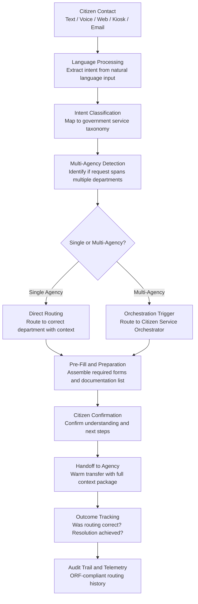

# Citizen Intent Router

Frankmax

NAICS 921110-928120

> **Governments & Ministries** — E-Government Intelligence

## Objective & Purpose

Citizens do not think in terms of government organizational charts. A parent whose child needs special education support does not know whether to contact the Ministry of Education, the disability services office, the local school board, or the social welfare department. A business owner applying for permits does not know which of the 30+ agencies handles their specific activity type. The result: citizens spend hours navigating phone trees, visiting wrong offices, submitting forms to wrong departments, and being told "that's not our department." Studies across OECD nations show that 35-45% of initial government service contacts are routed to the wrong agency, generating wasted citizen time, redundant processing, and delayed resolution.

The Citizen Intent Router uses natural language understanding to classify citizen requests and route them to the correct government agency on the first interaction. The system processes requests from any channel -- text, voice, web form, chatbot, email, or in-person kiosk -- and determines the citizen's actual need (not just the words they use), the correct agency or agencies responsible, the required forms and documentation, and the expected processing timeline. A parent saying "my kid needs help at school" is classified, enriched with relevant program information, and routed to the correct combination of education and disability services.

The impact is measurable at scale. Governments deploying intelligent intent routing reduce first-contact misrouting by 70-85%, cut average resolution time by 30-45%, and significantly improve citizen satisfaction scores. For a government handling 10 million citizen contacts per year, eliminating misrouting saves an estimated $20M-$50M annually in wasted processing and reduces citizen frustration that undermines trust in public institutions.

## Business Context

| Attribute | Value |
|---|---|
| **Business Process** | Service request classification |
| **Business Function** | Customer Service |
| **Category** | Operations |
| **Target Audience** | 1. Governments & Ministries |
| **Revenue Priority** | Governance layer (fries attach) |
| **Bundle** | Government Starter Pack ($2,500/mo) |
| **Monthly Cost of Inaction** | $50K-$500K (misrouted contacts, citizen frustration, redundant processing) |

## BPMN Workflow

## Features

1. **Multi-Channel Natural Language Understanding** — Processes citizen requests across all input channels: typed text (web, chat, email), spoken language (phone, voice assistant, kiosk), and structured forms. The NLU engine handles colloquial language, regional dialects, abbreviations, and emotionally charged expressions typical of citizens in distress.

2. **Government Service Taxonomy Mapping** — Maintains a comprehensive taxonomy of all government services, programs, and agencies. Citizen intents are mapped to this taxonomy rather than to keywords, enabling accurate routing even when citizens describe their needs in non-standard ways. "I need money for food" routes correctly to food assistance programs.

3. **Multi-Need Detection** — Recognizes when a citizen's request involves multiple government services. A request about "losing my job and needing help with rent" is identified as requiring both employment services and housing assistance, triggering parallel routing rather than forcing the citizen to make separate contacts.

4. **Contextual Enrichment** — Before routing, the system enriches the request with relevant context: applicable programs, eligibility requirements, required documentation, expected timelines, and nearby service locations. The receiving agency gets a complete context package rather than a raw transfer.

5. **Warm Handoff Protocol** — When routing to an agency, the system performs a warm handoff: the citizen's stated need, classified intent, relevant eligibility information, and any data already collected are transferred to the receiving agent or system. The citizen does not repeat themselves.

6. **Continuous Learning from Outcomes** — Tracks whether routing was correct by monitoring resolution outcomes. When a routed request is re-routed by the receiving agency, the system learns from the correction. Classification accuracy improves continuously with every interaction, targeting above 95% first-contact accuracy.

7. **Peak Load Management** — During crisis events (natural disasters, pandemics, economic shocks), citizen contact volumes surge and intent patterns shift. The router dynamically adapts to new intent categories, temporary programs, and surge routing rules without manual reconfiguration.

## Workflow & Automation

**Step 1: Contact Reception** — A citizen makes contact through any available channel. The system captures the raw input (text, voice transcript, or form data) and performs language detection to determine the processing language. No registration or account is required for initial contact.

**Step 2: Intent Extraction and Classification** — The NLU engine processes the citizen's input to extract the underlying need. The system distinguishes between the citizen's stated request ("I want to talk to someone about my tax") and their actual need (which may be a refund inquiry, a payment plan request, or a dispute resolution). Each extracted intent is mapped to the government service taxonomy.

**Step 3: Multi-Service Detection** — The system evaluates whether the citizen's needs span multiple agencies. Life events (job loss, birth, death, relocation, retirement) typically require coordination across 3-7 agencies. Multi-service requests are flagged for orchestration rather than single-point routing.

**Step 4: Contextual Enrichment** — Before routing, the system assembles a context package: the citizen's classified intent, applicable programs, eligibility prerequisites, required documentation, and processing expectations. This package enables the receiving agency to serve the citizen immediately rather than conducting their own intake.

**Step 5: Routing and Handoff** — The system routes the request to the appropriate agency with the full context package. For phone calls, this is a warm transfer with agent briefing. For digital channels, this is a queue assignment with pre-populated case data. For multi-agency requests, this triggers the Citizen Service Orchestrator.

**Step 6: Outcome Tracking and Learning** — The system tracks the routing outcome: was the citizen served by the routed agency, or were they re-routed? Resolution outcomes are fed back into the classification model to improve accuracy. Monthly routing accuracy reports identify persistent misrouting patterns for taxonomy updates.

## Input/Output Specifications

| Direction | Data | Format | Description |
|---|---|---|---|
| Input | Citizen contact | Text / audio / form data | Raw citizen request in any channel format |
| Input | Government service taxonomy | JSON / ontology | Complete catalog of services, programs, and responsible agencies |
| Input | Agency availability | API / real-time feed | Current wait times, capacity, and operating hours per agency |
| Input | Routing outcome data | JSON / feedback | Post-routing resolution data for model improvement |
| Output | Classified intent | JSON | Mapped intent with confidence score and taxonomy code |
| Output | Routing decision | JSON / API call | Target agency, context package, and handoff instructions |
| Output | Citizen guidance | Text / voice / UI | Plain-language explanation of next steps and expectations |
| Output | Audit trail | JSON (immutable log) | ORF-compliant routing and outcome history |

## Integration Points

| System | Integration Type | Data Flow |
|---|---|---|
| **Citizen Service Orchestrator** | Outbound trigger | Multi-agency requests routed to orchestration layer |
| **Public Document Simplifier** | Downstream | Citizen-facing guidance simplified before delivery |
| **Multi-Language Government Translator** | Bidirectional | Incoming contacts translated; responses delivered in citizen's language |
| **National Data Sovereignty Vault** | Data source | Citizen profile data accessed for contextual enrichment |
| **Citizen Privacy Impact Modeler** | Governance check | Data access during routing validated against privacy requirements |
| **Audit Trail and Traceability Engine** | Outbound log stream | Every classification, routing, and outcome event logged immutably |
| **Smart City Operations Platform** | Inbound feed | Urban service requests classified and routed through city systems |

## Pricing & Revenue Model

| Component | Pricing | Notes |
|---|---|---|
| **Government Starter Pack** | $2,500/month | Includes Citizen Intent Router + Service Orchestrator + Document Simplifier |
| **Standalone License** | $1,200/month | Up to 50,000 citizen contacts per month |
| **National Scale** | $3,500/month | Unlimited contacts, all channels, all agencies |
| **Voice Channel Integration** | +$600/month | Phone and voice assistant intent processing |
| **Crisis Surge Mode** | +$400/month | Dynamic intent adaptation for emergency events |
| **Outcome Analytics** | +$300/month | Routing accuracy reporting and taxonomy optimization |

**Revenue model**: The Citizen Intent Router is the front door for all government citizen interactions. Every contact passes through it, creating a natural attachment point for orchestration, simplification, and translation tools. The "fries" attach through voice integration ($600/mo), crisis mode ($400/mo), and outcome analytics ($300/mo) -- all at 85-90% margin. Routing patterns feed the marketplace's public sector service intelligence.

## NAICS/SIC Mapping

| NAICS Code | SIC Code | Industry | Relevance |
|---|---|---|---|
| 921190 | 9199 | Other General Government Support | Central service delivery and citizen contact management |
| 921110 | 9111 | Executive Offices | Executive oversight of citizen service quality |
| 923110 | 9431 | Administration of Education Programs | Education service request routing |
| 923120 | 9441 | Administration of Public Health Programs | Health service request routing |
| 923130 | 9451 | Administration of Human Resource Programs | Social services and welfare request routing |
| 924110 | 9511 | Administration of Air and Water Resource Programs | Environmental permit and service request routing |
| 925110 | 9611 | Administration of Housing Programs | Housing assistance request routing |
| 922190 | 9229 | Other Justice, Public Order Activities | Justice and public safety service routing |
