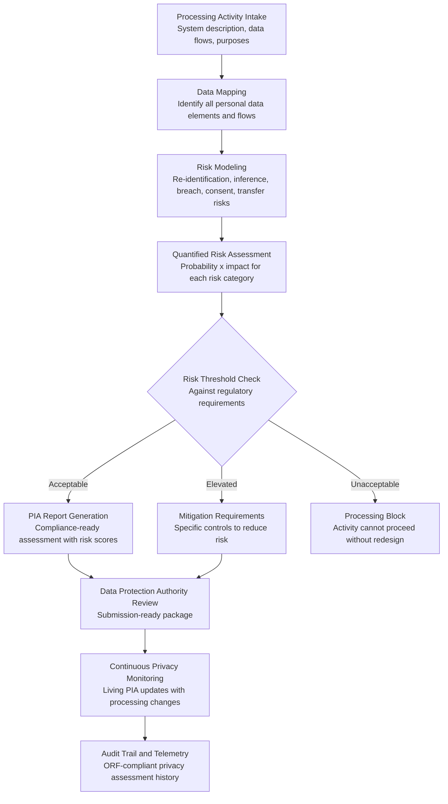

# Citizen Privacy Impact Modeler

Frankmax

NAICS 921110-928120

> **Governments & Ministries** — National AI Safety & Ethics

## Objective & Purpose

Privacy impact assessments (PIAs) are legally mandated in most developed nations whenever government systems process personal data -- yet the process is overwhelmingly manual, inconsistent, and performed after system design rather than during it. A typical PIA takes 4-8 weeks, costs $30K-$100K in consultant fees, and produces a static document that becomes outdated the moment the system changes. Worse, PIAs are often treated as compliance checkboxes rather than genuine risk assessments: they describe what the system does but fail to model what could go wrong. The result is a growing gap between privacy obligations and actual privacy protection -- a gap that becomes critical as governments deploy AI systems processing millions of citizen records.

The Citizen Privacy Impact Modeler transforms PIAs from static compliance documents into dynamic privacy risk simulations. The system ingests the proposed data processing activity -- data sources, processing purposes, data flows, retention periods, access controls, and third-party sharing -- and models privacy risks across multiple dimensions: re-identification risk, inference risk (what sensitive attributes can be inferred from non-sensitive data), data breach impact, consent validity, purpose limitation compliance, and cross-border transfer risks. Each risk is quantified with probability and impact scores, producing a privacy risk heat map rather than a narrative description.

The practical impact: governments using dynamic privacy modeling complete PIAs in days instead of months, catch privacy risks that narrative assessments miss (particularly inference and re-identification risks in AI systems), and maintain living privacy assessments that update automatically when data processing changes. At $2,500/month as part of the Government Starter Pack, the Modeler pays for itself by preventing a single data breach or privacy enforcement action -- events that typically cost $1M-$50M in fines, remediation, and reputational damage.

## Business Context

| Attribute | Value |
|---|---|
| **Business Process** | Privacy impact assessment |
| **Business Function** | Data Protection |
| **Category** | Privacy |
| **Target Audience** | 1. Governments & Ministries |
| **Revenue Priority** | Governance layer (fries attach) |
| **Bundle** | Government Starter Pack ($2,500/mo) |
| **Monthly Cost of Inaction** | $100K-$10M (data breaches, enforcement actions, citizen trust erosion) |

## BPMN Workflow

## Features

1. **Automated Data Flow Mapping** — Ingests system architecture documentation and automatically maps every personal data element: collection point, storage location, processing purpose, retention period, access permissions, and third-party recipients. Produces visual data flow diagrams that make complex processing activities comprehensible.

2. **Re-Identification Risk Scoring** — Quantifies the risk that anonymized or pseudonymized datasets can be re-identified through linkage attacks, inference, or auxiliary data. Uses k-anonymity, l-diversity, and t-closeness metrics to assess whether de-identification measures are sufficient for the data sensitivity level.

3. **Inference Risk Modeling** — Specifically designed for AI systems, this feature models what sensitive attributes can be inferred from non-sensitive data. An AI system processing zip codes and shopping patterns may effectively infer race and income -- creating a privacy risk that traditional PIAs miss entirely because no "sensitive data" was explicitly collected.

4. **Breach Impact Simulation** — Models the consequences of a data breach at each point in the processing chain. Calculates the number of affected citizens, the sensitivity of exposed data, the regulatory notification obligations, and the estimated financial impact. Enables security investment prioritization based on breach impact rather than threat likelihood alone.

5. **Regulatory Framework Mapping** — Maps processing activities against applicable privacy regulations: GDPR, national data protection laws, sector-specific rules (HIPAA equivalents, financial privacy), and constitutional privacy rights. Identifies specific compliance gaps and generates regulation-specific remediation guidance.

6. **Consent and Legal Basis Validation** — Evaluates whether the stated legal basis for processing is valid for each data element and purpose. Checks consent mechanisms for adequacy: freely given, specific, informed, and unambiguous. Flags processing activities where consent is relied upon but may not meet the legal standard.

7. **Living PIA with Change Detection** — Unlike static PIA documents, the Modeler maintains a living assessment that updates when the processing activity changes. New data sources, modified purposes, or additional third-party sharing trigger automatic reassessment of affected risk scores.

## Workflow & Automation

**Step 1: Processing Activity Description** — The system owner describes the data processing activity: system name, purpose, data sources, data elements collected, processing operations, storage locations, retention periods, access controls, and third-party sharing. The system validates completeness against regulatory requirements.

**Step 2: Automated Data Flow Construction** — The Modeler builds a comprehensive data flow map tracing every personal data element from collection through processing, storage, sharing, and deletion. The map identifies all cross-border transfers, third-party processors, and data aggregation points.

**Step 3: Multi-Dimensional Risk Assessment** — The system models privacy risks across all dimensions: re-identification, inference, breach impact, consent validity, purpose limitation, data minimization, retention compliance, and cross-border transfer legality. Each risk is scored with probability and impact.

**Step 4: Regulatory Compliance Mapping** — Processing activities are mapped against all applicable privacy regulations. The system identifies specific compliance gaps: missing consent mechanisms, excessive retention periods, inadequate security measures, or unlawful cross-border transfers.

**Step 5: Mitigation Strategy Generation** — For each elevated risk, the system generates specific mitigation strategies: technical measures (encryption, pseudonymization, access controls), organizational measures (training, policies, DPO review), and architectural measures (data minimization, purpose limitation, storage limitation).

**Step 6: Report Generation and Submission** — The complete PIA is compiled into a regulatory-compliant format suitable for data protection authority review. The report includes the data flow map, risk scores, compliance gaps, mitigation measures, and residual risk assessment.

## Input/Output Specifications

| Direction | Data | Format | Description |
|---|---|---|---|
| Input | Processing activity description | JSON / structured form | System, data flows, purposes, retention, sharing |
| Input | System architecture documentation | PDF / diagrams / API specs | Technical architecture for automated data flow mapping |
| Input | Regulatory requirements | JSON / rules engine | Applicable privacy laws, sector rules, constitutional provisions |
| Input | Population demographics | API / statistical data | Affected citizen profiles for impact estimation |
| Output | Privacy impact assessment | PDF / JSON / HTML | Quantified risk scores with regulatory compliance mapping |
| Output | Data flow diagrams | SVG / PNG / interactive UI | Visual representation of all personal data flows |
| Output | Mitigation plan | PDF / JSON | Specific technical and organizational risk reduction measures |
| Output | Audit trail | JSON (immutable log) | ORF-compliant privacy assessment and monitoring history |

## Integration Points

| System | Integration Type | Data Flow |
|---|---|---|
| **AI Deployment Authorization System** | Bidirectional | Privacy assessment required for AI authorization; results inform decision |
| **Algorithmic Bias Auditor** | Coordination | Privacy and bias assessments coordinated for same AI system |
| **National Data Sovereignty Vault** | Governance check | Data residency validated as part of privacy assessment |
| **Citizen Service Orchestrator** | Governance check | Cross-agency data sharing validated against privacy requirements |
| **Grant and Subsidy Fraud Detector** | Governance check | Cross-registry verification validated against privacy regulations |
| **Constitutional Compliance Checker** | Governance check | Privacy findings validated against constitutional privacy rights |
| **Audit Trail and Traceability Engine** | Outbound log stream | Every assessment, risk finding, and mitigation event logged immutably |

## Pricing & Revenue Model

| Component | Pricing | Notes |
|---|---|---|
| **Government Starter Pack** | $2,500/month | Includes Citizen Privacy Impact Modeler + AI Authorization + Bias Auditor |
| **Standalone License** | $1,400/month | Up to 25 privacy impact assessments per month |
| **National Data Protection Authority** | $3,500/month | Unlimited assessments, all agencies, regulatory reporting |
| **Inference Risk Module** | +$600/month | AI-specific inference and re-identification risk modeling |
| **Continuous Privacy Monitoring** | +$500/month | Living PIA with automatic reassessment on system changes |
| **Breach Simulation Engine** | +$400/month | Data breach impact modeling and notification planning |

**Revenue model**: The Citizen Privacy Impact Modeler replaces $30K-$100K PIA consulting engagements with a monthly subscription that produces faster, more rigorous assessments. As privacy regulation tightens globally, PIAs move from optional to mandatory for every government data processing activity. The "fries" attach through inference risk modeling ($600/mo), continuous monitoring ($500/mo), and breach simulation ($400/mo) -- all at 85-90% margin. Privacy patterns feed the marketplace's cross-sector privacy risk intelligence.

## NAICS/SIC Mapping

| NAICS Code | SIC Code | Industry | Relevance |
|---|---|---|---|
| 921190 | 9199 | Other General Government Support | Data protection offices and privacy commissioners |
| 921110 | 9111 | Executive Offices | Executive privacy policy and oversight |
| 923120 | 9441 | Administration of Public Health Programs | Health data privacy (patient records, epidemiological data) |
| 923130 | 9451 | Administration of Human Resource Programs | Social services data privacy (welfare, employment records) |
| 922120 | 9222 | Police Protection | Law enforcement data privacy (surveillance, criminal records) |
| 925110 | 9611 | Regulation of Banking and Securities | Financial data privacy regulations |
| 928120 | 9721 | International Affairs | Cross-border data transfer and international privacy frameworks |
| 925120 | 9621 | Regulation of Communications | Telecommunications and digital privacy regulation |
