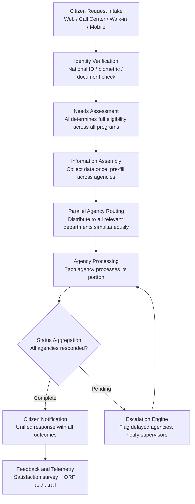

# Citizen Service Orchestrator

Frankmax

NAICS 921110-928120

> **Governments & Ministries** — Sovereign AI Governance Stack

## Objective & Purpose

Government services are fragmented across dozens of agencies, each with its own portal, forms, eligibility criteria, and processing timelines. A citizen applying for housing assistance may need to interact with the housing authority, social services, tax office, and local municipality -- filing redundant paperwork at each stop. Research across OECD nations shows the average citizen interacts with 7-12 separate government entities per year, with an average resolution time of 23 days per service request. The friction is not just inconvenient: it means eligible citizens fail to access benefits, vulnerable populations fall through cracks, and governments waste billions on duplicate processing.

The Citizen Service Orchestrator acts as an intelligent coordination layer across all government service delivery channels. It receives citizen requests from any entry point -- web portal, call center, walk-in office, or mobile app -- determines the full set of services the citizen may be eligible for, assembles the required information once, and routes the request to all relevant agencies simultaneously. Instead of the citizen navigating the bureaucracy, the orchestrator navigates it on their behalf.

The measurable impact: governments deploying service orchestration see 40-60% reduction in average resolution time, 25-35% increase in benefit uptake among eligible populations, and 30-50% reduction in redundant data entry across agencies. For a national government serving 10 million citizens, that translates to $50M-$200M annually in operational savings and recovered program efficiency. The orchestrator also generates telemetry on service delivery bottlenecks, feeding the marketplace's institutional knowledge base with patterns no single agency could identify alone.

## Business Context

| Attribute | Value |
|---|---|
| **Business Process** | Service delivery automation |
| **Business Function** | Public Services |
| **Category** | Operations |
| **Target Audience** | 1. Governments & Ministries |
| **Revenue Priority** | Governance layer (fries attach) |
| **Bundle** | Government Starter Pack ($2,500/mo) |
| **Monthly Cost of Inaction** | $200K-$2M (redundant processing, citizen churn, missed benefit delivery) |

## BPMN Workflow

## Features

1. **Omni-Channel Intake** — Receives citizen requests from any entry point: government web portals, call centers, physical service counters, mobile applications, and chatbots. All channels converge into a single orchestration queue with unified tracking, ensuring no request is lost regardless of how the citizen initiates contact.

2. **Proactive Eligibility Discovery** — When a citizen requests one service, the AI analyzes their profile against all available government programs to identify additional benefits they qualify for but have not claimed. This "tell me once" approach increases benefit uptake by 25-35% across eligible populations.

3. **Single Data Collection** — Collects citizen information once and pre-fills forms across all relevant agencies. Eliminates redundant data entry: the citizen provides their address, income, and household composition a single time, and the orchestrator distributes the data to housing, social services, tax, and any other agency that needs it.

4. **Parallel Multi-Agency Routing** — Routes service requests to all relevant agencies simultaneously rather than sequentially. A housing application that previously required serial visits to 4 agencies over 6 weeks is processed in parallel, reducing resolution time by 60-80%.

5. **SLA Monitoring and Escalation** — Tracks processing time at each agency against defined service level agreements. When an agency exceeds its SLA, the system automatically escalates to the supervising authority with a pre-assembled briefing on the delay cause and citizen impact.

6. **Unified Citizen Dashboard** — Provides citizens with a single view of all their active service requests, documents submitted, and processing status across every agency. Replaces the need to call multiple agencies for status updates.

7. **Service Delivery Analytics** — Generates real-time dashboards showing resolution times, bottleneck agencies, request volumes by type and geography, and citizen satisfaction scores. Enables data-driven decisions about staffing, process redesign, and resource allocation.

## Workflow & Automation

**Step 1: Request Intake and Identity Verification** — The citizen submits a service request through any available channel. The system verifies identity through national ID lookup, biometric verification, or document-based authentication. A unified case file is created regardless of entry point.

**Step 2: Needs Assessment and Eligibility Scan** — The AI analyzes the citizen's request alongside their profile data (demographics, income, location, household composition) to determine eligibility across all government programs. The citizen is informed of additional services they qualify for and can opt in with a single confirmation.

**Step 3: Information Collection and Pre-Fill** — The system collects any missing information through a single, streamlined questionnaire. Previously submitted data is pre-filled from the national identity register and prior interactions. Documents are uploaded once and digitally shared with all relevant agencies.

**Step 4: Multi-Agency Distribution** — The orchestrator packages each agency's required information and routes it through the appropriate API or intake system. Each agency receives a complete, correctly formatted submission with all required attachments -- eliminating rejection-for-incompleteness cycles.

**Step 5: Progress Monitoring and Escalation** — The system monitors processing status at each agency in real time. Citizens receive proactive notifications at key milestones. Agencies that exceed SLA thresholds trigger automatic escalation to supervising officials with root cause analysis.

**Step 6: Response Aggregation and Delivery** — When all agencies have completed processing, the orchestrator assembles a unified response for the citizen. Approved benefits, required next steps, and any denials with appeal instructions are presented in a single, clear communication.

## Input/Output Specifications

| Direction | Data | Format | Description |
|---|---|---|---|
| Input | Citizen service requests | JSON / web form / voice transcript | Multi-channel intake with standardized request structure |
| Input | Identity verification data | API (national ID register) | Biometric, document-based, or knowledge-based verification |
| Input | Citizen profile data | JSON / API | Demographics, income, household, prior interactions |
| Input | Agency eligibility rules | JSON / rules engine | Program-specific criteria for automated eligibility determination |
| Output | Routed agency packages | JSON / XML / API | Agency-specific submission with all required data and documents |
| Output | Citizen status dashboard | REST API / UI | Real-time tracking across all agencies and requests |
| Output | Escalation alerts | JSON / email / SMS | SLA breach notifications to supervisory officials |
| Output | Service delivery analytics | REST API / dashboard | Resolution times, volumes, satisfaction, bottleneck identification |

## Integration Points

| System | Integration Type | Data Flow |
|---|---|---|
| **Citizen Intent Router** | Inbound classification | Classified citizen intents feed orchestration queue |
| **National Data Sovereignty Vault** | Bidirectional | Citizen data stored and retrieved from sovereign infrastructure |
| **Inter-Ministry Coordination Platform** | Outbound routing | Cross-agency cases routed through coordination platform |
| **Public Document Simplifier** | Downstream | Citizen-facing responses simplified before delivery |
| **Multi-Language Government Translator** | Downstream | Responses translated to citizen's preferred language |
| **Audit Trail and Traceability Engine** | Outbound log stream | Every routing, processing, and escalation event logged immutably |
| **Citizen Privacy Impact Modeler** | Governance check | Data sharing across agencies validated against privacy rules |

## Pricing & Revenue Model

| Component | Pricing | Notes |
|---|---|---|
| **Government Starter Pack** | $2,500/month | Includes Citizen Service Orchestrator + Citizen Intent Router + Public Document Simplifier |
| **Standalone License** | $2,000/month | Up to 50,000 citizen interactions per month |
| **National Scale** | $5,500/month | Unlimited interactions, all channels, full agency integration |
| **Proactive Eligibility Module** | +$800/month | Cross-program benefit discovery engine |
| **Analytics Dashboard** | +$500/month | Real-time service delivery intelligence and bottleneck analysis |

**Revenue model**: The Citizen Service Orchestrator is the operations anchor for citizen-facing government AI. It delivers immediate, measurable savings through reduced processing time and eliminated redundancy. The "fries" attach through governance layers: privacy compliance validation ($600/mo), proactive eligibility discovery ($800/mo), and analytics dashboards ($500/mo) -- all at 75-85% margin. Service delivery telemetry feeds the marketplace's public sector operations intelligence.

## NAICS/SIC Mapping

| NAICS Code | SIC Code | Industry | Relevance |
|---|---|---|---|
| 921110 | 9111 | Executive Offices | Executive oversight of citizen service delivery performance |
| 921190 | 9199 | Other General Government Support | Cross-agency service coordination and shared services |
| 923110 | 9431 | Administration of Education Programs | Education benefit delivery and enrollment services |
| 923120 | 9441 | Administration of Public Health Programs | Health program enrollment and benefit distribution |
| 923130 | 9451 | Administration of Human Resource Programs | Social services, welfare, and employment programs |
| 924110 | 9511 | Administration of Air and Water Resource Programs | Environmental permit and license processing |
| 925110 | 9611 | Administration of Housing Programs | Housing assistance applications and benefit delivery |
| 928120 | 9721 | International Affairs | Consular services and citizen assistance abroad |
