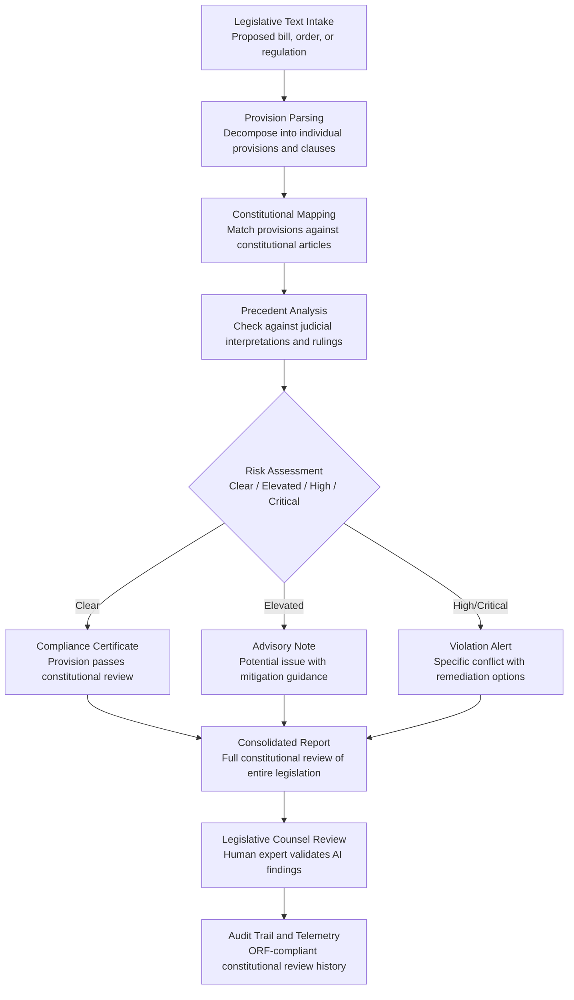

# Constitutional Compliance Checker

Frankmax

NAICS 921110-928120

> **Governments & Ministries** — Sovereign AI Governance Stack

## Objective & Purpose

Every piece of legislation, executive order, and administrative regulation must comply with the constitution -- yet constitutional review is typically performed late in the legislative process, often only after a law is challenged in court. Constitutional law is inherently complex: a single provision may implicate fundamental rights, separation of powers, federalism principles, and treaty obligations simultaneously. Senior constitutional counsel are scarce, expensive, and bottleneck the legislative process. The result: governments pass laws that are later struck down, wasting legislative effort, creating legal uncertainty, and eroding public trust. In the United States alone, federal courts struck down over 180 provisions of Congressional acts between 2000 and 2020.

The Constitutional Compliance Checker performs automated constitutional review of proposed legislation, executive orders, and administrative regulations at any stage of the drafting process -- not just at the end. The system ingests the full constitutional text, judicial interpretations, constitutional court precedents, and international human rights instruments. It then analyzes each provision of the proposed legislation against this constitutional corpus to identify potential violations: fundamental rights restrictions without sufficient justification, separation of powers infringements, federalism boundary violations, and inconsistencies with ratified treaties.

The value is both preventive and accelerative. Preventively, it catches constitutional defects before enactment, avoiding costly litigation and judicial embarrassment. Acceleratively, it enables legislative counsel to review drafts faster by front-loading the constitutional analysis that currently requires weeks of manual research. A provision that would have been challenged and struck down three years later is flagged and corrected in the drafting stage -- saving the government millions in litigation costs and preserving legislative credibility.

## Business Context

| Attribute | Value |
|---|---|
| **Business Process** | Legal review |
| **Business Function** | Constitutional Law |
| **Category** | Legal |
| **Target Audience** | 1. Governments & Ministries |
| **Revenue Priority** | Governance layer (fries attach) |
| **Bundle** | Government Starter Pack ($2,500/mo) |
| **Monthly Cost of Inaction** | $200K-$5M (struck-down legislation, litigation costs, legal uncertainty) |

## BPMN Workflow

## Features

1. **Full Constitutional Corpus Integration** — Ingests the complete constitutional text, all amendments, schedules, and annexes, along with judicial interpretations from constitutional courts, supreme courts, and relevant international tribunals. The system maintains a living constitutional knowledge base that updates with every new ruling.

2. **Provision-Level Analysis** — Decomposes proposed legislation into individual provisions and analyzes each against the constitutional corpus independently and in combination. A provision that is constitutional in isolation may create a constitutional problem when combined with other provisions in the same bill.

3. **Fundamental Rights Impact Assessment** — Specifically evaluates provisions that restrict fundamental rights (speech, assembly, privacy, due process, equal protection) against the applicable constitutional standard: proportionality, necessity, non-discrimination, and legitimate aim. Flags restrictions that lack sufficient justification.

4. **Separation of Powers Validation** — Checks whether the proposed legislation respects the constitutional division of authority between executive, legislative, and judicial branches. Flags provisions where the legislature delegates excessive authority to the executive, or where executive orders encroach on legislative prerogatives.

5. **Federalism Boundary Checker** — For federal systems, verifies that national legislation does not encroach on constitutionally reserved state/provincial powers, and vice versa. Maps the division of competences and flags provisions that operate outside the enacting body's constitutional authority.

6. **Treaty and International Law Compatibility** — Checks proposed legislation against ratified international treaties, human rights conventions, and binding international obligations. Flags provisions that would place the government in breach of its international commitments.

7. **Remediation Proposal Generator** — For each identified constitutional risk, the system generates one or more remediation proposals: alternative wording, narrowing provisions, adding safeguards (sunset clauses, judicial review mechanisms), or restructuring the legislation to achieve the same policy goal within constitutional bounds.

## Workflow & Automation

**Step 1: Legislative Text Ingestion** — Proposed legislation, executive orders, or administrative regulations are submitted for constitutional review at any stage of the drafting process. The system accepts full texts or individual provisions for targeted analysis.

**Step 2: Structural Decomposition** — The system parses the legislation into individual provisions, definitions, enforcement mechanisms, and transitional arrangements. Each element is classified by type (rights restriction, delegation of authority, jurisdictional claim, penalty, procedure) to determine which constitutional tests apply.

**Step 3: Constitutional Mapping** — Each provision is mapped against relevant constitutional articles, amendments, and judicial precedents. The system identifies which constitutional principles are engaged and applies the appropriate standard of review (strict scrutiny, proportionality, reasonableness).

**Step 4: Precedent and Jurisprudence Analysis** — The AI analyzes relevant constitutional court decisions to determine how similar provisions have been treated in the past. It identifies cases where analogous provisions were upheld, struck down, or upheld with conditions, providing legislative counsel with a predictive assessment.

**Step 5: Risk Classification and Reporting** — Each provision receives a risk classification: Clear (no constitutional concerns), Elevated (potential issues that merit attention), High (likely constitutional challenge), or Critical (probable violation). A consolidated report presents all findings with evidence and remediation proposals.

**Step 6: Legislative Counsel Validation** — Human constitutional experts review the AI findings, validate or override risk classifications, and approve remediation proposals. The system learns from expert feedback to improve future accuracy.

## Input/Output Specifications

| Direction | Data | Format | Description |
|---|---|---|---|
| Input | Proposed legislative text | XML (Akoma Ntoso) / DOCX / PDF | Bills, executive orders, administrative regulations |
| Input | Constitutional text | XML / structured document | Full constitution with amendments and schedules |
| Input | Judicial precedents | JSON / legal database API | Constitutional court and supreme court decisions |
| Input | International treaties | XML / PDF | Ratified treaties and human rights instruments |
| Output | Constitutional review report | PDF / JSON / HTML | Provision-level analysis with risk ratings |
| Output | Remediation proposals | DOCX / PDF | Alternative wording and structural recommendations |
| Output | Compliance certificate | PDF / JSON | Clean bill of constitutional health for cleared legislation |
| Output | Audit trail | JSON (immutable log) | ORF-compliant constitutional review history |

## Integration Points

| System | Integration Type | Data Flow |
|---|---|---|
| **Policy Compiler Engine** | Inbound feed | Draft legislation automatically submitted for constitutional review |
| **Legislative Language Harmonizer** | Bidirectional | Constitutional boundaries inform harmonization proposals |
| **Regulatory Impact Analyzer** | Governance check | Constitutional constraints define impact modeling boundaries |
| **Inter-Ministry Coordination Platform** | Outbound advisory | Constitutional findings shared with affected ministries |
| **AI Deployment Authorization System** | Governance check | AI system authorization validated against constitutional rights |
| **National Data Sovereignty Vault** | Outbound storage | All review records stored in sovereign infrastructure |
| **Audit Trail and Traceability Engine** | Outbound log stream | Every review, finding, and remediation event logged immutably |

## Pricing & Revenue Model

| Component | Pricing | Notes |
|---|---|---|
| **Government Starter Pack** | $2,500/month | Includes Constitutional Compliance Checker + Policy Compiler + Regulatory Impact Analyzer |
| **Standalone License** | $1,500/month | Up to 30 legislative reviews per month |
| **National Legislature Scale** | $3,800/month | Unlimited reviews, full precedent library, multi-branch access |
| **International Treaty Module** | +$600/month | Treaty compatibility checking across all ratified instruments |
| **Precedent Intelligence Upgrade** | +$500/month | AI-powered predictive analysis of constitutional challenge outcomes |

**Revenue model**: The Constitutional Compliance Checker prevents the costliest legal mistake a government can make: passing unconstitutional legislation. A single struck-down law costs $2M-$20M in litigation, legislative time, and institutional credibility. The "fries" attach through treaty compatibility ($600/mo), precedent intelligence ($500/mo), and audit trail compliance -- all at 85-90% margin. Constitutional review patterns feed the marketplace's comparative constitutional law intelligence.

## NAICS/SIC Mapping

| NAICS Code | SIC Code | Industry | Relevance |
|---|---|---|---|
| 921120 | 9121 | Legislative Bodies | Primary users: legislative counsel and drafting offices |
| 921110 | 9111 | Executive Offices | Executive order and administrative regulation review |
| 922110 | 9221 | Courts | Constitutional court and judicial review processes |
| 921190 | 9199 | Other General Government Support | Attorney general and solicitor general offices |
| 922130 | 9223 | Legal Counsel and Prosecution | Government legal advisors and prosecutors |
| 928110 | 9711 | National Security | National security legislation constitutional review |
| 928120 | 9721 | International Affairs | Treaty ratification and international obligation compliance |
| 926150 | 9651 | Regulation of Miscellaneous Activities | Administrative regulation constitutional compliance |
