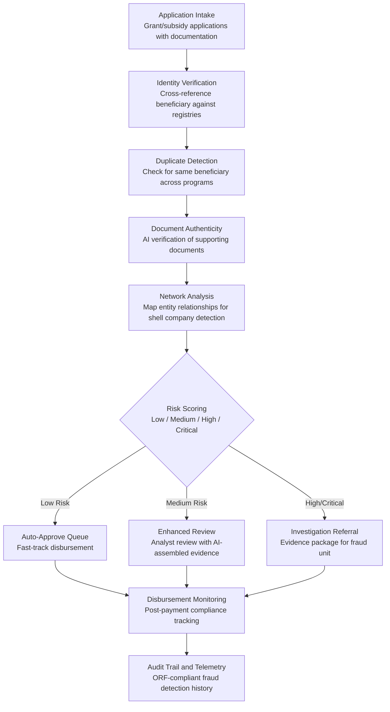

# Grant & Subsidy Fraud Detector

Frankmax

NAICS 921110-928120

> **Governments & Ministries** — Sovereign AI Governance Stack

## Objective & Purpose

Government grant and subsidy programs distribute hundreds of billions of dollars annually -- and a significant portion is lost to fraud. The U.S. Government Accountability Office estimates improper payments across federal programs at $175B per year. EU member states report fraud and error rates of 2-7% across structural funds. In developing nations, subsidy leakage rates can exceed 30%. The fraud takes many forms: fictitious beneficiaries, duplicate claims across programs, false documentation, shell company networks, and collusion between applicants and program administrators. Manual audit processes catch only a fraction -- typically reviewing under 5% of applications.

The Grant and Subsidy Fraud Detector applies AI-driven cross-referencing and pattern detection across the full disbursement lifecycle. It ingests grant applications, beneficiary registries, corporate registries, tax records, banking data, and program compliance reports to build a unified graph of all grant-related entities and transactions. The system then applies over 150 fraud detection rules -- from simple duplicate-check logic to complex network analysis identifying shell company structures and beneficial ownership rings -- to flag suspicious disbursements before money leaves government accounts.

The business case is direct: for every dollar spent on the Fraud Detector, governments typically recover $15-$50 in prevented or recouped fraudulent disbursements. A government administering $10B in grant programs with a 5% fraud rate loses $500M annually. The Fraud Detector, catching even 30% of that fraud, recovers $150M -- against a tool cost of under $100K per year. Every fraud pattern detected feeds the marketplace's Failure Intelligence Library, creating a cross-jurisdictional fraud pattern database that becomes more valuable with each deployment.

## Business Context

| Attribute | Value |
|---|---|
| **Business Process** | Disbursement verification |
| **Business Function** | Fraud Prevention |
| **Category** | Audit |
| **Target Audience** | 1. Governments & Ministries |
| **Revenue Priority** | Governance layer (fries attach) |
| **Bundle** | Government Starter Pack ($2,500/mo) |
| **Monthly Cost of Inaction** | $500K-$50M (fraudulent disbursements, program integrity loss) |

## BPMN Workflow

## Features

1. **Cross-Registry Beneficiary Verification** — Verifies every grant applicant against national identity registers, corporate registries, tax databases, and beneficial ownership records. Detects fictitious entities, deceased individuals claiming benefits, and applicants using multiple identities across programs.

2. **Duplicate Claim Detection** — Scans applications across all government grant and subsidy programs simultaneously. Catches applicants claiming the same benefit from multiple programs, the same expense being reimbursed by multiple agencies, and family members or related entities filing overlapping claims.

3. **Document Authenticity Analysis** — AI-powered analysis of supporting documentation: invoices, receipts, certificates, and compliance reports. Detects altered documents, recycled invoices (same document submitted to multiple programs), template-generated fake receipts, and metadata anomalies indicating document fabrication.

4. **Beneficial Ownership Network Analysis** — Maps corporate structures behind grant applicants to reveal hidden ownership networks. Detects shell companies (minimal operations, circular ownership), politically exposed persons hidden behind corporate layers, and coordinated application networks where multiple apparently independent applicants share common beneficial owners.

5. **Behavioral Pattern Detection** — Identifies anomalous patterns that indicate systematic fraud: applications consistently filed just under review thresholds, clusters of applications from the same geographic area with identical supporting documents, and timing patterns suggesting insider knowledge of approval criteria.

6. **Real-Time Risk Scoring** — Every application receives a risk score (0-100) based on over 150 weighted indicators. Low-risk applications are fast-tracked for disbursement; medium-risk applications require enhanced review; high-risk applications are routed to investigation units with pre-assembled evidence packages.

7. **Recovery Case Management** — When fraud is confirmed, the system generates recovery cases with: total disbursement amount, fraudulent portion, evidence chain, affected programs, and recommended recovery actions (clawback, offset against future payments, legal referral). Tracks recovery through to completion.

## Workflow & Automation

**Step 1: Application Intake and Parsing** — Grant and subsidy applications are ingested from all program portals. The system extracts applicant identity, requested amount, stated purpose, supporting documentation, and compliance declarations. Applications are normalized across programs for unified analysis.

**Step 2: Identity and Eligibility Verification** — Each applicant is verified against national identity registers, corporate registries, and program eligibility criteria. The system flags deceased applicants, non-existent entities, blacklisted organizations, and applicants who have exhausted their benefit limits.

**Step 3: Cross-Program Duplicate Scanning** — Applications are checked against all active and historical claims across every government grant and subsidy program. The system detects identical claims, overlapping expense reimbursements, and coordinated applications from related entities.

**Step 4: Document and Evidence Analysis** — Supporting documents are analyzed for authenticity: metadata examination, visual consistency checks, cross-reference against known document templates, and comparison against previously submitted documents across all programs.

**Step 5: Network and Behavioral Analysis** — Entity relationships are mapped to reveal ownership networks, application coordination, and systemic fraud patterns. The AI identifies clusters of related applications that appear independent but share common beneficial owners, addresses, bank accounts, or document sources.

**Step 6: Risk Scoring and Routing** — Each application receives a composite risk score. Low-risk applications proceed to disbursement. Medium-risk applications enter an analyst review queue with all flagged indicators and supporting evidence pre-assembled. High-risk applications are referred to investigation units.

## Input/Output Specifications

| Direction | Data | Format | Description |
|---|---|---|---|
| Input | Grant/subsidy applications | JSON / XML / form data | Applicant details, requested amounts, supporting documentation |
| Input | National identity register | API | Citizen and entity verification data |
| Input | Corporate registry | API / JSON | Company registration, ownership, financial statements |
| Input | Tax records | API (authorized access) | Income declarations, tax compliance status |
| Input | Historical disbursement data | API / database | Past grants awarded across all programs |
| Output | Risk-scored applications | JSON + dashboard | Applications ranked by fraud risk with indicator breakdown |
| Output | Investigation referrals | JSON + PDF | Evidence packages for high-risk cases |
| Output | Recovery cases | JSON + tracking dashboard | Confirmed fraud with recovery actions and progress |
| Output | Audit trail | JSON (immutable log) | ORF-compliant fraud detection and disposition history |

## Integration Points

| System | Integration Type | Data Flow |
|---|---|---|
| **Budget Allocation Optimizer** | Outbound intelligence | Fraud recovery data informs program efficiency calculations |
| **Public Procurement Intelligence** | Bidirectional | Shared fraud networks across grants and procurement |
| **National Data Sovereignty Vault** | Bidirectional | Beneficiary and disbursement data stored in sovereign infrastructure |
| **Citizen Privacy Impact Modeler** | Governance check | Cross-registry verification validated against privacy regulations |
| **Constitutional Compliance Checker** | Governance check | Fraud detection methods validated against due process requirements |
| **Audit Trail and Traceability Engine** | Outbound log stream | Every detection, review, and recovery event logged immutably |
| **Failure Intelligence Library** | Outbound anonymized patterns | Fraud patterns feed cross-jurisdictional intelligence |

## Pricing & Revenue Model

| Component | Pricing | Notes |
|---|---|---|
| **Government Starter Pack** | $2,500/month | Includes Grant Fraud Detector + Budget Optimizer + Procurement Intelligence |
| **Standalone License** | $2,000/month | Up to 50,000 applications per month across all programs |
| **National Scale** | $5,800/month | Unlimited applications, all programs, full registry integration |
| **Network Analysis Module** | +$900/month | Beneficial ownership mapping and shell company detection |
| **Recovery Case Management** | +$600/month | End-to-end fraud recovery tracking and clawback management |
| **Revenue-Share Option** | 5-10% of recovered fraud | Minimum $1,500/month floor; aligned incentive model |

**Revenue model**: The Grant and Subsidy Fraud Detector is a self-funding tool -- it recovers more than it costs within the first month of operation. The revenue-share option ($0 risk to the buyer) aligns incentives perfectly. The "fries" attach through network analysis ($900/mo), recovery management ($600/mo), and cross-program analytics -- all at 80-90% margin. Every fraud pattern enriches the marketplace's cross-jurisdictional fraud intelligence library.

## NAICS/SIC Mapping

| NAICS Code | SIC Code | Industry | Relevance |
|---|---|---|---|
| 921130 | 9131 | Public Finance Activities | Grant disbursement oversight and fiscal integrity |
| 921110 | 9111 | Executive Offices | Executive oversight of program integrity |
| 921190 | 9199 | Other General Government Support | Central audit and inspection functions |
| 922190 | 9229 | Other Justice, Public Order Activities | Fraud investigation and enforcement |
| 923110 | 9431 | Administration of Education Programs | Education grant and scholarship fraud detection |
| 923120 | 9441 | Administration of Public Health Programs | Health subsidy and reimbursement fraud |
| 923130 | 9451 | Administration of Human Resource Programs | Social welfare and employment program fraud |
| 924120 | 9512 | Administration of Conservation Programs | Environmental grant and subsidy verification |
