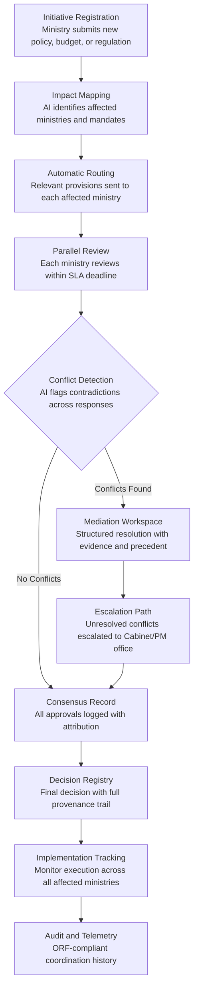

# Inter-Ministry Coordination Platform

Frankmax

NAICS 921110-928120

> **Governments & Ministries** — Sovereign AI Governance Stack

## Objective & Purpose

Government ministries operate in silos. The Ministry of Health does not know what the Ministry of Education is funding. The Ministry of Finance sets budget ceilings without visibility into cross-cutting programs. The Ministry of Trade negotiates agreements that conflict with environmental regulations. This fragmentation is not a technology problem -- it is an institutional design problem that technology has failed to solve because existing tools (email, shared drives, committee meetings) cannot scale to the complexity of modern government coordination. Studies of OECD governments estimate that 15-25% of government spending is wasted due to duplicated efforts, contradictory policies, and coordination failures across ministries.

The Inter-Ministry Coordination Platform creates a shared decision surface where every ministry can see, track, and respond to cross-cutting policy initiatives, budget proposals, and regulatory actions. The AI layer does the heavy lifting: it identifies when a proposal from one ministry affects another's mandate, automatically routes relevant documents for review, tracks response deadlines, and surfaces conflicts before they become crises. The platform replaces the committee-meeting-and-email approach with structured, auditable, real-time coordination.

The measurable outcome: governments using structured cross-agency coordination reduce policy conflict rates by 40-60%, cut inter-ministry decision latency from weeks to days, and eliminate the information asymmetry that enables accountability diffusion. For a national government with 20+ ministries, the platform prevents an estimated $10M-$100M annually in duplicated programs, contradictory investments, and coordination-failure-driven policy reversals.

## Business Context

| Attribute | Value |
|---|---|
| **Business Process** | Cross-agency coordination |
| **Business Function** | Administrative Coordination |
| **Category** | Coordination |
| **Target Audience** | 1. Governments & Ministries |
| **Revenue Priority** | Governance layer (fries attach) |
| **Bundle** | Government Starter Pack ($2,500/mo) |
| **Monthly Cost of Inaction** | $500K-$5M (duplicated programs, policy contradictions, decision delays) |

## BPMN Workflow

## Features

1. **Automatic Stakeholder Identification** — When a ministry registers a new initiative, the AI maps it against all ministry mandates, existing programs, and active regulatory proposals to identify every affected stakeholder. Eliminates the "we didn't know about it" problem that plagues intergovernmental coordination.

2. **Structured Conflict Detection** — Compares incoming proposals against existing policies, active initiatives, and budget commitments across all ministries. Flags specific contradictions: "Ministry of Health's proposed nutrition mandate conflicts with Ministry of Agriculture's subsidy program for processed foods."

3. **SLA-Driven Review Cycles** — Each routed review has a defined deadline with automatic escalation. Ministries that do not respond within the SLA window are flagged to the Cabinet Secretary or coordinating authority. No more indefinite delays disguised as "under review."

4. **Mediation Workspace** — When conflicts are identified, the platform creates a structured mediation environment with: the specific provisions in conflict, relevant precedents, budgetary implications, and a negotiation interface. Both ministries can propose amendments and counter-proposals within a documented framework.

5. **Decision Registry with Provenance** — Every inter-ministry decision is recorded with full attribution: who proposed, who reviewed, who objected, how conflicts were resolved, and what the final decision was. This institutional memory survives personnel turnover and political transitions.

6. **Cross-Cutting Program Tracker** — Visualizes programs that span multiple ministries (e.g., national digitization, climate adaptation, pandemic preparedness) with consolidated budget, timeline, and milestone tracking. Prevents the duplication that occurs when multiple ministries independently fund similar initiatives.

7. **Cabinet Briefing Generator** — Automatically produces structured briefing documents for Cabinet meetings and permanent secretary convenings. Each briefing includes: items requiring decision, items for information, unresolved conflicts requiring escalation, and cross-ministry program status.

## Workflow & Automation

**Step 1: Initiative Registration** — A ministry registers a new initiative (policy proposal, budget request, regulatory action, or program launch) through a structured intake form. The system captures objectives, affected populations, budget requirements, timeline, and implementation plan.

**Step 2: Stakeholder Mapping and Routing** — The AI analyzes the initiative against all ministry mandates, existing programs, and active proposals to identify affected stakeholders. Relevant provisions are extracted and routed to each affected ministry with context explaining why their review is required.

**Step 3: Parallel Review and Response** — Each affected ministry reviews the relevant provisions within a defined SLA window. Reviewers can approve, approve with conditions, object with rationale, or request additional information. All responses are captured in a structured format for automated conflict analysis.

**Step 4: Conflict Analysis and Resolution** — The AI compares all ministry responses to identify conflicts: budgetary competition, policy contradictions, jurisdictional overlaps, and timeline incompatibilities. Conflicts are categorized by severity and routed to the mediation workspace or escalation path.

**Step 5: Decision Recording and Communication** — Once all conflicts are resolved and approvals obtained, the final decision is recorded in the Decision Registry with complete provenance. All affected ministries receive notification of the outcome with specific action items for implementation.

**Step 6: Implementation Monitoring** — The platform tracks implementation of coordinated decisions across all responsible ministries. Milestone completion, budget execution, and deliverable status are aggregated into cross-cutting dashboards visible to coordinating authorities.

## Input/Output Specifications

| Direction | Data | Format | Description |
|---|---|---|---|
| Input | Initiative proposals | JSON / structured form | Policy, budget, or regulatory proposals with metadata |
| Input | Ministry mandates | JSON / document index | Jurisdiction definitions, program inventories, legal authorities |
| Input | Review responses | JSON / inline annotations | Ministry feedback, approvals, objections, conditions |
| Input | Existing policy corpus | API / document store | Current policies, programs, and regulations across all ministries |
| Output | Stakeholder routing packages | JSON / notification | Targeted review requests with relevant context |
| Output | Conflict reports | JSON + PDF | Identified contradictions with severity and resolution options |
| Output | Decision records | JSON (immutable) | ORF-compliant decision provenance with full attribution |
| Output | Cabinet briefing documents | PDF / DOCX / API | Structured briefings with decision items and status updates |

## Integration Points

| System | Integration Type | Data Flow |
|---|---|---|
| **Policy Compiler Engine** | Inbound trigger | New legislative drafts trigger cross-ministry coordination |
| **Budget Allocation Optimizer** | Bidirectional | Budget proposals reviewed for cross-ministry fiscal impact |
| **Regulatory Impact Analyzer** | Inbound feed | Impact findings distributed to affected ministries |
| **Constitutional Compliance Checker** | Governance check | Coordinated decisions validated against constitutional boundaries |
| **National Data Sovereignty Vault** | Outbound storage | All coordination records stored in sovereign infrastructure |
| **Audit Trail and Traceability Engine** | Outbound log stream | Every routing, review, and decision event logged immutably |
| **Citizen Service Orchestrator** | Downstream coordination | Multi-agency service delivery routed through coordination layer |

## Pricing & Revenue Model

| Component | Pricing | Notes |
|---|---|---|
| **Government Starter Pack** | $2,500/month | Includes Inter-Ministry Coordination + Policy Compiler + Constitutional Checker |
| **Standalone License** | $1,900/month | Up to 10 ministries, 100 active initiatives |
| **National Scale** | $4,800/month | Unlimited ministries and initiatives, Cabinet integration |
| **Cabinet Briefing Module** | +$600/month | Automated briefing generation for executive decision-making |
| **Implementation Tracker** | +$700/month | Cross-ministry milestone and budget execution monitoring |

**Revenue model**: The Inter-Ministry Coordination Platform monetizes the coordination gap that costs governments billions annually. The base subscription eliminates decision latency and policy conflicts. The "fries" attach through Cabinet briefing automation ($600/mo), implementation tracking ($700/mo), and decision provenance auditing -- delivering 75-90% margin governance layers. Every coordination pattern feeds the marketplace's institutional coordination intelligence.

## NAICS/SIC Mapping

| NAICS Code | SIC Code | Industry | Relevance |
|---|---|---|---|
| 921110 | 9111 | Executive Offices | Cabinet-level coordination and executive decision-making |
| 921120 | 9121 | Legislative Bodies | Legislative coordination across committee jurisdictions |
| 921130 | 9131 | Public Finance Activities | Cross-ministry budget coordination and fiscal planning |
| 921190 | 9199 | Other General Government Support | Administrative coordination and shared services |
| 922110 | 9221 | Courts | Judicial coordination on cross-jurisdictional matters |
| 922120 | 9222 | Police Protection | Multi-agency law enforcement coordination |
| 923110 | 9431 | Administration of Education Programs | Cross-ministry education and workforce program alignment |
| 928110 | 9711 | National Security | National security coordination across defense and intelligence |
