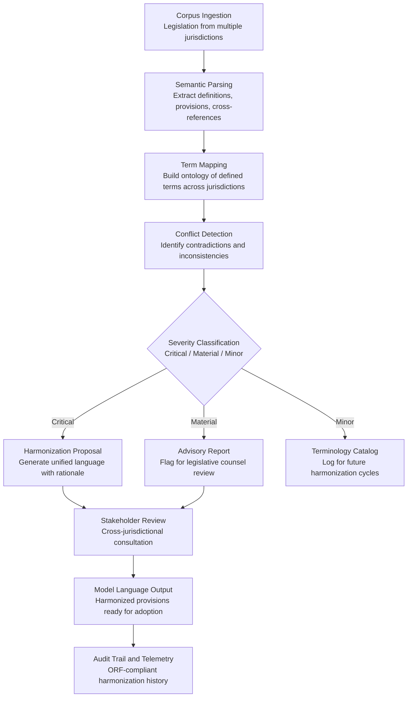

# Legislative Language Harmonizer

Frankmax

NAICS 921110-928120

> **Governments & Ministries** — Sovereign AI Governance Stack

## Objective & Purpose

Legal systems accumulate contradictions. A federal government passes a data protection law using one definition of "personal information" while a state government uses a different definition in its consumer protection statute. Trade agreements reference "originating goods" with criteria that conflict across bilateral and multilateral instruments. Over decades, legislative corpora become tangled webs of inconsistent terminology, conflicting provisions, and ambiguous cross-references. In nations with federal structures, the problem multiplies: Canada has 14 jurisdictions, India has 28 states, and the EU has 27 member states -- each producing legislation that must coexist.

The Legislative Language Harmonizer uses AI to identify and resolve linguistic and substantive conflicts across legislative corpora at any scale -- municipal to international. The system ingests legislation from multiple jurisdictions, builds a semantic map of defined terms, regulatory standards, and procedural requirements, and identifies every instance where the same concept is defined differently, where provisions contradict, or where cross-references are broken. It then generates harmonization proposals: unified definitions, reconciled standards, and model language that achieves consistency without requiring wholesale legislative reform.

The practical value is enormous. Legal harmonization failures cost governments billions in enforcement confusion, trade friction, and litigation. The EU alone spends over EUR 2B annually on legal harmonization efforts across member states. At the national level, inconsistent legislation between federal and state governments creates compliance nightmares for businesses and enforcement gaps for regulators. The Harmonizer compresses what was previously a multi-year, multi-million-dollar exercise into weeks of AI-assisted analysis.

## Business Context

| Attribute | Value |
|---|---|
| **Business Process** | Cross-jurisdictional alignment |
| **Business Function** | Legal Harmonization |
| **Category** | Legal |
| **Target Audience** | 1. Governments & Ministries |
| **Revenue Priority** | Governance layer (fries attach) |
| **Bundle** | Government Starter Pack ($2,500/mo) |
| **Monthly Cost of Inaction** | $200K-$5M (enforcement gaps, trade friction, litigation costs) |

## BPMN Workflow

## Features

1. **Multi-Jurisdiction Corpus Ingestion** — Processes legislation from any number of jurisdictions simultaneously: federal, state, provincial, municipal, and international. Supports legislative formats from common law, civil law, and hybrid systems. Handles multiple languages through integration with the Multi-Language Government Translator.

2. **Semantic Term Ontology** — Builds a comprehensive ontology mapping every defined term across all ingested jurisdictions. When "personal data" is defined in 15 different ways across 15 jurisdictions, the system maps every definition, identifies the semantic differences, and categorizes the divergence as substantive or cosmetic.

3. **Automated Conflict Detection** — Identifies three categories of conflict: definitional (same term, different meaning), substantive (contradictory provisions), and procedural (incompatible processes). Each conflict is tagged with affected jurisdictions, severity rating, and the specific provisions involved.

4. **Harmonization Proposal Generator** — For each identified conflict, the system generates one or more harmonization proposals: unified definitions, reconciled provisions, and model language. Each proposal includes a rationale explaining how it resolves the conflict while preserving each jurisdiction's legislative intent.

5. **Trade Agreement Compatibility Checker** — Specifically designed for international trade contexts where harmonization failures create trade barriers. Maps domestic legislation against trade agreement obligations (WTO, bilateral FTAs, regional blocs) to identify non-compliance and harmonization opportunities.

6. **Impact Propagation Analysis** — When a harmonization change is proposed, the system traces its impact through all affected legislation: "Changing the definition of 'personal data' in the Data Protection Act affects 47 provisions across 12 statutes." Decision-makers see the full cascade before approving changes.

7. **Historical Harmonization Library** — Maintains a library of past harmonization efforts across jurisdictions, including what worked, what failed, and why. New harmonization proposals are benchmarked against historical precedents to avoid repeating known pitfalls.

## Workflow & Automation

**Step 1: Legislative Corpus Collection** — Legislation is ingested from all target jurisdictions through APIs, document feeds, or bulk upload. The system normalizes formatting across legislative traditions: numbered articles (civil law), sections and subsections (common law), and directive/regulation structures (supranational).

**Step 2: Semantic Parsing and Term Extraction** — The AI parses every ingested document to extract defined terms, substantive provisions, procedural requirements, penalties, and cross-references. Each extracted element is tagged with its jurisdiction, enactment date, and legislative context.

**Step 3: Cross-Jurisdictional Mapping** — The system builds a comparison matrix linking equivalent concepts across jurisdictions. It identifies where the same concept exists under different names, where the same name covers different concepts, and where concepts exist in one jurisdiction but not another.

**Step 4: Conflict Identification and Classification** — Every mismatch is analyzed for severity: critical conflicts (direct contradictions that prevent cross-jurisdictional enforcement), material conflicts (significant differences that create compliance burdens), and minor conflicts (cosmetic differences with no practical impact).

**Step 5: Harmonization Proposal Development** — For critical and material conflicts, the system generates harmonization proposals with model language, affected provisions, and adoption rationale. Proposals are designed to achieve maximum harmonization with minimum legislative disruption.

**Step 6: Stakeholder Consultation and Adoption** — Harmonization proposals are routed to affected jurisdictions for review through the Inter-Ministry Coordination Platform. Feedback is tracked, and proposals are refined through iterative consultation until consensus or escalation.

## Input/Output Specifications

| Direction | Data | Format | Description |
|---|---|---|---|
| Input | Legislative texts | XML (Akoma Ntoso) / PDF / HTML | Full legislation from multiple jurisdictions |
| Input | Trade agreements | XML / PDF | International treaties and trade instruments |
| Input | Terminology databases | JSON / CSV | Existing legal glossaries and term catalogs |
| Input | Harmonization history | JSON / database | Past harmonization efforts and outcomes |
| Output | Conflict reports | JSON + PDF | Identified inconsistencies with severity and affected provisions |
| Output | Harmonization proposals | DOCX / PDF / Akoma Ntoso | Model language with rationale and adoption guidance |
| Output | Term ontology | JSON / RDF | Cross-jurisdictional terminology map |
| Output | Audit trail | JSON (immutable log) | ORF-compliant harmonization analysis history |

## Integration Points

| System | Integration Type | Data Flow |
|---|---|---|
| **Policy Compiler Engine** | Bidirectional | New legislation checked for harmonization compliance during drafting |
| **Constitutional Compliance Checker** | Inbound governance | Constitutional boundaries constrain harmonization proposals |
| **Multi-Language Government Translator** | Inbound translation | Multi-language corpus translated before semantic analysis |
| **Inter-Ministry Coordination Platform** | Outbound routing | Harmonization proposals routed for cross-jurisdictional consultation |
| **National Data Sovereignty Vault** | Outbound storage | All legislative corpora and analysis stored in sovereign infrastructure |
| **Audit Trail and Traceability Engine** | Outbound log stream | Every conflict detection and proposal event logged immutably |
| **Regulatory Impact Analyzer** | Downstream trigger | Harmonization proposals trigger impact assessment |

## Pricing & Revenue Model

| Component | Pricing | Notes |
|---|---|---|
| **Government Starter Pack** | $2,500/month | Includes Legislative Language Harmonizer + Policy Compiler + Constitutional Checker |
| **Standalone License** | $1,700/month | Up to 5 jurisdictions, 10,000 legislative provisions |
| **Federal/Multi-State Scale** | $4,500/month | Unlimited jurisdictions, trade agreement integration |
| **Trade Agreement Module** | +$800/month | WTO, FTA, and regional bloc compatibility checking |
| **Historical Precedent Library** | +$500/month | Cross-jurisdictional harmonization outcome database |

**Revenue model**: The Legislative Language Harmonizer replaces multi-year, multi-million-dollar harmonization consulting engagements with a monthly subscription. For federal nations and regional blocs, the tool is essential infrastructure. The "fries" attach through trade agreement compatibility ($800/mo), historical precedent access ($500/mo), and multi-language support -- all at 80-90% margin. Harmonization patterns feed the marketplace's cross-jurisdictional legal intelligence library.

## NAICS/SIC Mapping

| NAICS Code | SIC Code | Industry | Relevance |
|---|---|---|---|
| 921120 | 9121 | Legislative Bodies | Primary users: legislative drafting offices across jurisdictions |
| 921110 | 9111 | Executive Offices | Executive branch coordination on harmonization |
| 922110 | 9221 | Courts | Judicial interpretation informed by harmonization analysis |
| 921190 | 9199 | Other General Government Support | Cross-jurisdictional administrative alignment |
| 926150 | 9651 | Regulation of Miscellaneous Activities | Regulatory harmonization across sectors |
| 928110 | 9711 | National Security | International treaty and defense agreement harmonization |
| 928120 | 9721 | International Affairs | Trade agreement and international law harmonization |
| 925120 | 9621 | Regulation of Communications | Telecommunications standards harmonization |
