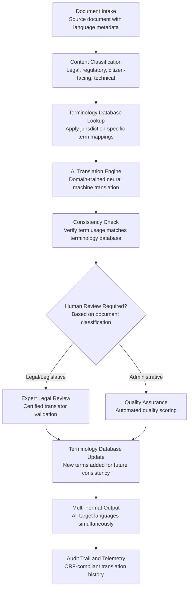

# Multi-Language Government Translator

Frankmax

NAICS 921110-928120

> **Governments & Ministries** — E-Government Intelligence

## Objective & Purpose

Multilingual governance is not optional -- it is a constitutional or legal requirement in most nations. Canada mandates English and French; India recognizes 22 official languages; Switzerland operates in four languages; the EU legislates in 24 languages. Yet government translation remains one of the most expensive and slowest bottlenecks in public administration. The European Commission spends over EUR 300M annually on translation services. National governments routinely delay legislative enactment, policy implementation, and citizen communications by weeks or months waiting for translations. The problem compounds with AI: as governments digitize services, every chatbot response, form, notification, and document must exist in all official languages simultaneously.

The Multi-Language Government Translator provides AI-powered translation specifically trained for government and legal language. Unlike general-purpose translation tools, this system understands legislative syntax, legal terminology, government-specific jargon, and the critical distinction between terms that must be translated consistently across all documents (defined legal terms) and terms that require contextual adaptation. The system maintains terminology databases for each language pair, enforces consistency across all government translations, and handles the structural differences between legal traditions (common law in English, civil law in French, etc.).

The practical impact: governments deploying AI-powered legal translation reduce translation costs by 60-80%, compress translation timelines from weeks to hours, and achieve higher consistency than human-only translation through enforced terminology databases. For a government spending $20M annually on translation, the tool saves $12M-$16M while delivering faster, more consistent results. Every translation contributes to the marketplace's government terminology intelligence, building cross-language legal translation models that improve with each document processed.

## Business Context

| Attribute | Value |
|---|---|
| **Business Process** | Translation and localization |
| **Business Function** | Communications |
| **Category** | Language |
| **Target Audience** | 1. Governments & Ministries |
| **Revenue Priority** | Governance layer (fries attach) |
| **Bundle** | Government Starter Pack ($2,500/mo) |
| **Monthly Cost of Inaction** | $100K-$2M (translation delays, inconsistency, constitutional non-compliance) |

## BPMN Workflow

## Features

1. **Legal Domain-Trained Translation** — Translation models are specifically trained on government and legal corpora: legislation, treaties, judicial decisions, administrative regulations, and government communications. The system understands that "consideration" in a contract means something different from "consideration" in common usage, and translates accordingly.

2. **Enforced Terminology Consistency** — Maintains jurisdiction-specific terminology databases that ensure defined legal terms are translated identically every time they appear across all government documents. When "data controller" is defined in the data protection law, every subsequent reference across all translated documents uses the exact same translation.

3. **Multi-Language Simultaneous Output** — Translates a single source document into all target languages simultaneously rather than sequentially. A parliamentary bill can be translated into all official languages in hours, enabling simultaneous enactment in all language versions -- a constitutional requirement in many multilingual nations.

4. **Legislative Structure Preservation** — Maintains the structural integrity of legislative documents across languages: article numbering, section references, cross-references, and amendment formatting. The translated document is not just linguistically accurate -- it is structurally identical to the source, enabling parallel reading and legal comparison.

5. **Cultural and Legal Adaptation** — Goes beyond word-for-word translation to adapt content for cultural and legal context. Legal concepts that exist in one tradition but not another are explained rather than literally translated. Measurement units, date formats, and naming conventions are localized appropriately.

6. **Translation Memory and Leverage** — Maintains a comprehensive translation memory of all previously translated government content. When a new document contains paragraphs identical or similar to previously translated content, the system leverages existing translations for consistency and speed -- reducing translation effort by 40-60% for documents with high similarity to prior work.

7. **Quality Scoring and Confidence Metrics** — Every translated segment receives a confidence score. High-confidence segments (above 95%) can proceed without human review. Low-confidence segments are flagged for expert translator review with specific concerns noted: ambiguous source, multiple valid translations, or new terminology not in the database.

## Workflow & Automation

**Step 1: Document Intake and Classification** — The source document is submitted with language metadata: source language, target languages, document type (legislative, regulatory, citizen-facing, technical), and urgency level. The system classifies the document to determine the appropriate translation workflow and quality requirements.

**Step 2: Pre-Translation Analysis** — The system analyzes the source document for terminology density, translation memory leverage potential, and complexity markers. It identifies defined terms, cross-references, and structural elements that require special handling during translation.

**Step 3: Terminology-Governed Translation** — The AI translation engine processes the document with enforced terminology consistency. Every defined term is translated according to the jurisdiction's terminology database. New terms not in the database are flagged and translated with multiple options for expert selection.

**Step 4: Quality and Consistency Verification** — The translated document undergoes automated quality checks: terminology consistency across the document, grammar and fluency scoring, structural integrity verification, and cross-reference accuracy. Segments below the quality threshold are flagged for review.

**Step 5: Expert Review (When Required)** — Legislative and legal documents require certified translator review. The system presents flagged segments with the source text, proposed translation, alternative options, and relevant terminology context. Reviewers validate or correct through an efficient inline interface.

**Step 6: Finalization and Distribution** — Approved translations are finalized in all required formats. The terminology database is updated with any new terms or corrections. Translated documents are distributed to publication channels and linked to the source document for version tracking.

## Input/Output Specifications

| Direction | Data | Format | Description |
|---|---|---|---|
| Input | Source documents | DOCX / PDF / HTML / XML (Akoma Ntoso) | Government documents in source language |
| Input | Terminology databases | JSON / TBX (TermBase eXchange) | Jurisdiction-specific legal term mappings per language pair |
| Input | Translation memory | TMX (Translation Memory eXchange) | Previously translated segment pairs for leverage |
| Input | Expert reviewer feedback | JSON / inline annotations | Certified translator corrections and approvals |
| Output | Translated documents | DOCX / PDF / HTML / XML | Target language versions with preserved structure |
| Output | Quality reports | JSON / PDF | Confidence scores, flagged segments, and consistency metrics |
| Output | Updated terminology database | JSON / TBX | New terms and corrections from current translation |
| Output | Audit trail | JSON (immutable log) | ORF-compliant translation and review history |

## Integration Points

| System | Integration Type | Data Flow |
|---|---|---|
| **Policy Compiler Engine** | Downstream consumer | Enacted legislation translated into all official languages |
| **Public Document Simplifier** | Bidirectional | Documents simplified before translation for better output quality |
| **Citizen Service Orchestrator** | Downstream | Citizen responses translated to citizen's preferred language |
| **Citizen Intent Router** | Bidirectional | Incoming citizen contacts translated; responses delivered in citizen language |
| **Legislative Language Harmonizer** | Inbound feed | Multi-language legislative corpora translated for harmonization analysis |
| **National Data Sovereignty Vault** | Outbound storage | All translations stored in sovereign infrastructure |
| **Audit Trail and Traceability Engine** | Outbound log stream | Every translation, review, and publication event logged immutably |

## Pricing & Revenue Model

| Component | Pricing | Notes |
|---|---|---|
| **Government Starter Pack** | $2,500/month | Includes Multi-Language Translator + Document Simplifier + Intent Router |
| **Standalone License** | $1,400/month | Up to 500,000 words per month, 5 language pairs |
| **National Scale** | $3,800/month | Unlimited words, all language pairs, certified review workflow |
| **Legal Translation Premium** | +$700/month | Legislative and treaty translation with enforced terminology |
| **Real-Time Channel Translation** | +$500/month | Live translation for chatbots, phone, and kiosk interactions |
| **Translation Memory Build** | +$400/month | Automated translation memory construction from legacy documents |

**Revenue model**: The Multi-Language Government Translator replaces the most expensive per-word service in government communications. At $3,800/month for unlimited translation, it replaces $500K-$2M annual translation budgets. The "fries" attach through legal translation premium ($700/mo), real-time channel translation ($500/mo), and memory construction ($400/mo) -- all at 80-90% margin. Translation patterns and terminology feed the marketplace's multilingual government intelligence.

## NAICS/SIC Mapping

| NAICS Code | SIC Code | Industry | Relevance |
|---|---|---|---|
| 921190 | 9199 | Other General Government Support | Central translation and communications services |
| 921120 | 9121 | Legislative Bodies | Parliamentary translation for multilingual legislation |
| 921110 | 9111 | Executive Offices | Executive communications in multiple official languages |
| 928120 | 9721 | International Affairs | Diplomatic and treaty translation services |
| 923110 | 9431 | Administration of Education Programs | Education materials translation for multilingual populations |
| 923120 | 9441 | Administration of Public Health Programs | Public health communications in all official languages |
| 922110 | 9221 | Courts | Judicial translation for multilingual court proceedings |
| 928110 | 9711 | National Security | Defense and intelligence translation requirements |
