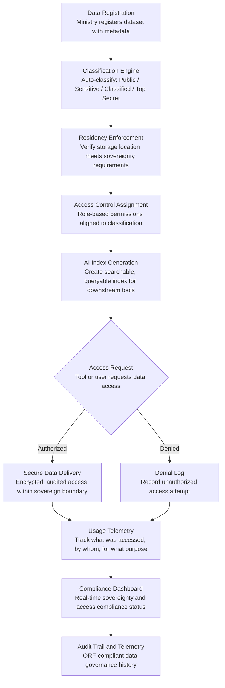

# National Data Sovereignty Vault

Frankmax

NAICS 921110-928120

> **Governments & Ministries** — Sovereign AI Governance Stack

## Objective & Purpose

Government data is the crown jewel of national sovereignty, yet most governments store critical data -- citizen records, tax filings, health data, intelligence assessments, and defense information -- across a patchwork of foreign-owned cloud providers, legacy on-premises systems, and ministry-specific databases with inconsistent security controls. A single nation's government data may traverse data centers in 5-10 countries, subject to foreign intelligence laws (CLOUD Act, national security letters) that the host government cannot control. The result: governments cannot guarantee their citizens that sensitive data stays within national borders, and they cannot enforce consistent access controls across fragmented storage.

The National Data Sovereignty Vault provides a unified, sovereign data infrastructure layer for all government AI and analytics workloads. It enforces data residency requirements (data never leaves national borders), applies consistent classification and access controls across all stored data, and provides AI-ready indexing so that every government tool in the marketplace can query the vault without moving data to foreign processing environments. The vault is not a replacement for existing storage -- it is a governance wrapper that ensures all government data, wherever physically stored, is subject to sovereign control, consistent classification, and auditable access.

The strategic value extends beyond security. Without sovereign data infrastructure, every AI initiative in government faces the same bottleneck: "Where is the data, who controls it, and can we legally use it?" The Vault answers these questions once, enabling every downstream tool -- from the Policy Compiler Engine to the National Statistics Accelerator -- to operate on governed, classified, accessible data without relitigating sovereignty and privacy questions for each project.

## Business Context

| Attribute | Value |
|---|---|
| **Business Process** | Data governance |
| **Business Function** | Information Security |
| **Category** | Infrastructure |
| **Target Audience** | 1. Governments & Ministries |
| **Revenue Priority** | Kitchen (moat infrastructure) |
| **Bundle** | Government Starter Pack ($2,500/mo) |
| **Monthly Cost of Inaction** | $500K-$10M (data breaches, sovereignty violations, AI project delays) |

## BPMN Workflow

## Features

1. **Automated Data Classification** — Every dataset registered in the vault is automatically classified using a multi-tier scheme: Public, Sensitive, Classified, and Top Secret. Classification is based on content analysis, metadata, source ministry, and applicable regulations. Manual override is available with justification logging.

2. **Data Residency Enforcement** — Enforces that all data storage and processing occurs within defined geographic boundaries. The vault monitors data movement across all connected systems and blocks any operation that would transfer sovereign data outside approved jurisdictions, including transient processing.

3. **Unified Access Control Framework** — Applies consistent role-based access controls across all government data regardless of storage location. Permissions are tied to classification level, ministry affiliation, purpose of access, and clearance level. Every access decision is logged and auditable.

4. **AI-Ready Data Indexing** — Creates semantic indices across all registered datasets, enabling downstream AI tools to discover and query data without full dataset transfers. The index includes data dictionaries, schema mappings, quality scores, and lineage information so tools can assess data fitness before requesting access.

5. **Cross-Ministry Data Catalog** — Provides a searchable catalog of all government datasets with metadata: owner, classification, freshness, schema, quality score, and usage history. Eliminates the "we didn't know that data existed" problem that blocks inter-ministry data sharing.

6. **Encryption and Key Management** — All data at rest and in transit is encrypted with sovereign key management -- encryption keys are held within national infrastructure, never by foreign cloud providers. Supports hardware security module (HSM) integration for classified and top-secret data.

7. **Data Lineage and Provenance Tracking** — Tracks the complete lifecycle of every dataset: origin, transformations, copies, access events, and downstream usage. When a data quality issue is discovered, the vault traces every system and decision that consumed the affected data.

8. **Compliance Reporting Engine** — Generates compliance reports against national data protection laws, international frameworks (GDPR equivalents), and sector-specific regulations. Reports are pre-formatted for data protection authority review and parliamentary oversight committees.

## Workflow & Automation

**Step 1: Dataset Registration** — A ministry registers a dataset in the vault with metadata: source system, data owner, update frequency, retention requirements, and applicable regulations. The system validates the registration against the national data management policy.

**Step 2: Automated Classification** — The classification engine analyzes the dataset content and metadata to assign a security classification. Personal data triggers privacy protections; financial data triggers fiscal controls; health data triggers medical confidentiality rules. The classification drives all subsequent access control decisions.

**Step 3: Residency Verification** — The vault verifies that the dataset's physical storage location meets sovereignty requirements for its classification level. Data stored on foreign infrastructure is flagged for migration. New data ingestion is blocked unless it routes through approved sovereign storage.

**Step 4: Access Control Configuration** — Role-based access policies are applied based on the dataset's classification, the requesting ministry's mandate, and the stated purpose of access. Access patterns are defined: read-only analytics, full extraction, aggregated-only (no individual records), and time-limited access windows.

**Step 5: Index Generation and Catalog Update** — The vault generates a semantic index of the dataset including field descriptions, statistical profiles, quality scores, and relationship mappings to other datasets. The cross-ministry data catalog is updated so all authorized users can discover the dataset.

**Step 6: Ongoing Monitoring and Compliance** — The vault continuously monitors data access, movement, and usage. Anomalous access patterns trigger security alerts. Compliance dashboards show real-time status against data residency, classification, and access control policies.

## Input/Output Specifications

| Direction | Data | Format | Description |
|---|---|---|---|
| Input | Government datasets | Any (structured, unstructured, binary) | Citizen records, financial data, health data, intelligence |
| Input | Dataset metadata | JSON / structured form | Owner, classification, residency, retention, regulations |
| Input | Access requests | API / OAuth / SAML | Authenticated requests from tools and users |
| Input | National data policy | JSON / rules engine | Classification scheme, residency rules, access policies |
| Output | Classified data catalog | REST API / UI | Searchable index of all government datasets with metadata |
| Output | Secure data access | Encrypted API / VPN tunnel | Governed data delivery within sovereign boundary |
| Output | Compliance reports | PDF / JSON / dashboard | Sovereignty, classification, and access compliance status |
| Output | Audit trail | JSON (immutable log) | ORF-compliant data access and governance history |

## Integration Points

| System | Integration Type | Data Flow |
|---|---|---|
| **All Government Marketplace Tools** | Bidirectional | Every tool reads from and writes to the vault for sovereign data access |
| **Citizen Privacy Impact Modeler** | Governance check | Privacy impact validated before data access is granted |
| **AI Deployment Authorization System** | Governance check | AI system data access approved through authorization workflow |
| **National Statistics Accelerator** | Data source | Statistical analysis operates on vault-indexed data |
| **Policy Compiler Engine** | Data source | Legislative corpus and policy data served from sovereign storage |
| **Audit Trail and Traceability Engine** | Outbound log stream | Every access, classification, and governance event logged immutably |
| **Sovereign AI Registry** | Bidirectional | Registry tracks which AI systems access which datasets |

## Pricing & Revenue Model

| Component | Pricing | Notes |
|---|---|---|
| **Government Starter Pack** | $2,500/month | Includes National Data Sovereignty Vault + core governance tools |
| **Standalone License** | $2,400/month | Up to 100 datasets, 10TB indexed storage, 5 ministries |
| **National Scale** | $6,500/month | Unlimited datasets, all ministries, HSM integration |
| **Classification Engine Upgrade** | +$700/month | ML-powered auto-classification with continuous learning |
| **Cross-Ministry Catalog** | +$500/month | Full data discovery and sharing governance layer |
| **HSM Key Management** | +$1,200/month | Hardware security module integration for classified data |

**Revenue model**: The National Data Sovereignty Vault is kitchen infrastructure -- the foundational moat that every other government tool depends on. It creates vendor lock-in through data gravity: once government data is indexed and governed through the vault, switching costs are enormous. The "fries" attach through classification upgrades ($700/mo), cross-ministry catalog ($500/mo), and HSM key management ($1,200/mo) -- all at 75-85% margin. Data governance patterns feed the marketplace's sovereign infrastructure intelligence.

## NAICS/SIC Mapping

| NAICS Code | SIC Code | Industry | Relevance |
|---|---|---|---|
| 921190 | 9199 | Other General Government Support | Central IT and data governance offices |
| 921110 | 9111 | Executive Offices | Executive oversight of national data policy |
| 928110 | 9711 | National Security | Classified data storage and sovereignty enforcement |
| 922120 | 9222 | Police Protection | Law enforcement data with strict sovereignty requirements |
| 923120 | 9441 | Administration of Public Health Programs | Health data sovereignty and cross-border restrictions |
| 921130 | 9131 | Public Finance Activities | Financial data governance and fiscal confidentiality |
| 925110 | 9611 | Regulation of Banking and Securities | Financial regulatory data sovereignty |
| 928120 | 9721 | International Affairs | Diplomatic and consular data protection |
