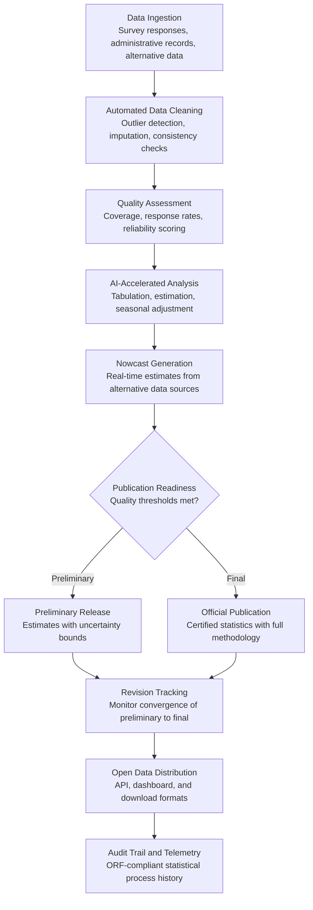

# National Statistics Accelerator

Frankmax

NAICS 921110-928120

> **Governments & Ministries** — E-Government Intelligence

## Objective & Purpose

National statistics are the foundation of evidence-based governance -- yet the process of collecting, cleaning, analyzing, and publishing official statistics is among the slowest functions in government. A national census takes 2-3 years from data collection to final publication. Quarterly economic statistics are published 60-90 days after the reference period. Labor force surveys, health statistics, and education metrics follow similar timelines. By the time the data reaches decision-makers, the economy has already shifted, the pandemic wave has already peaked, and the policy window has closed. The lag is not just an inconvenience: it means governments make billion-dollar allocation decisions based on data that is months or years old.

The National Statistics Accelerator uses AI to compress the statistical pipeline: automating data cleaning and imputation, detecting anomalies in survey responses, generating preliminary estimates from partial data, producing nowcasts (real-time estimates) from alternative data sources, and automating report generation. The system does not replace the statistical rigor of national statistics offices -- it accelerates it. Preliminary AI-generated estimates are published with appropriate uncertainty bounds while final official statistics follow the traditional methodology. Decision-makers get directional intelligence in days while the official numbers mature over weeks.

The practical impact: national statistics offices deploying AI acceleration reduce time-to-publication by 50-70% for standard releases, produce real-time nowcasts for critical indicators (GDP, unemployment, inflation), and redirect 30-40% of staff time from data processing to analytical work. For a government making monthly allocation decisions based on quarterly data, the acceleration closes a $100M-$1B gap between what they know and what they spend. Every statistical pattern processed feeds the marketplace's analytical intelligence, building cross-national statistical methodology that improves with each deployment.

## Business Context

| Attribute | Value |
|---|---|
| **Business Process** | Statistical analysis and reporting |
| **Business Function** | Research & Analysis |
| **Category** | Analytics |
| **Target Audience** | 1. Governments & Ministries |
| **Revenue Priority** | Governance layer (fries attach) |
| **Bundle** | Government Starter Pack ($2,500/mo) |
| **Monthly Cost of Inaction** | $200K-$5M (delayed data, uninformed decisions, publication backlogs) |

## BPMN Workflow

## Features

1. **Automated Data Cleaning and Imputation** — Processes raw survey and administrative data through AI-driven cleaning pipelines: outlier detection, duplicate identification, logical consistency checks, and missing data imputation. The system applies statistical best practices (multiple imputation, hot-deck methods) while flagging cases where imputation uncertainty is high.

2. **Real-Time Nowcasting** — Generates real-time estimates of key economic and social indicators using alternative data sources: satellite imagery (economic activity), mobile phone data (population movement), web scraping (price indices), payment transaction data (consumer spending), and social media signals (sentiment). Nowcasts provide directional intelligence weeks before official statistics are available.

3. **Anomaly Detection in Survey Data** — Identifies suspicious patterns in survey responses: fabricated data (interviewer fraud), systematic non-response bias, and response patterns inconsistent with known demographic profiles. Catches data quality issues that would otherwise contaminate official statistics.

4. **Automated Tabulation and Estimation** — Generates standard statistical tables, cross-tabulations, and weighted estimates from cleaned data. Applies complex sample designs (stratification, clustering, post-stratification weighting) automatically, producing estimates with standard errors and confidence intervals.

5. **Seasonal Adjustment Engine** — Applies X-13 ARIMA-SEATS and other seasonal adjustment methods to time series data automatically. Detects structural breaks, outliers, and calendar effects. Produces seasonally adjusted and trend-cycle estimates for all major economic indicators.

6. **Automated Report Generation** — Produces publication-ready statistical reports with narrative analysis, tables, charts, and methodology notes. The system generates the standard sections: key findings, detailed tables, technical notes, and revision history. Analysts review and augment rather than write from scratch.

7. **Open Data API and Distribution** — Publishes all statistics through a standardized API (SDMX compliant) with machine-readable formats, interactive dashboards, and downloadable datasets. Supports the open government data mandates that most nations have adopted.

8. **Revision Analysis and Transparency** — Tracks the difference between preliminary and final statistics, building a revision history that quantifies the reliability of preliminary releases. Over time, the system learns which indicators have stable preliminaries and which require more caution.

## Workflow & Automation

**Step 1: Data Collection and Ingestion** — Survey responses, administrative records, and alternative data sources are ingested into the statistical pipeline. The system normalizes data from multiple sources into a unified analytical framework while preserving source metadata and quality indicators.

**Step 2: Automated Cleaning and Quality Control** — AI-driven cleaning identifies and handles outliers, duplicates, logical inconsistencies, and missing values. Each cleaning action is logged with the rule applied and the original value preserved. A quality assessment report summarizes coverage, response rates, and data reliability.

**Step 3: Statistical Estimation** — The system applies the appropriate estimation methodology: direct estimation for large samples, small area estimation for sub-national statistics, and model-based estimation for complex indicators. All estimates include standard errors and confidence intervals.

**Step 4: Nowcast and Preliminary Estimate Generation** — For time-sensitive indicators, the system generates nowcasts using alternative data and preliminary estimates using partial survey data. Each estimate is accompanied by explicit uncertainty bounds and historical revision patterns to inform decision-maker confidence.

**Step 5: Report Compilation and Review** — Statistical reports are auto-generated with all standard components: executive summary, key findings, detailed tables, methodology notes, and revision history. Statisticians review for accuracy, add analytical commentary, and approve for publication.

**Step 6: Publication and Distribution** — Approved statistics are published simultaneously through the API, interactive dashboards, downloadable datasets, and PDF reports. Embargo management ensures all formats are released at the scheduled time. Usage analytics track which statistics are most accessed.

## Input/Output Specifications

| Direction | Data | Format | Description |
|---|---|---|---|
| Input | Survey microdata | CSV / Parquet / SAS / SPSS | Individual-level survey responses with sample design metadata |
| Input | Administrative records | API / CSV / database | Tax, employment, health, education administrative data |
| Input | Alternative data sources | API / web scraping | Satellite, mobile, transaction, web data for nowcasting |
| Input | Statistical methodology | JSON / documentation | Estimation methods, weighting schemes, seasonal adjustment parameters |
| Output | Statistical tables | SDMX / CSV / JSON / Excel | Standard tabulations with estimates and standard errors |
| Output | Nowcasts and preliminaries | JSON / API / dashboard | Real-time estimates with uncertainty bounds |
| Output | Publication reports | PDF / HTML | Publication-ready statistical releases with analysis |
| Output | Audit trail | JSON (immutable log) | ORF-compliant statistical process and methodology history |

## Integration Points

| System | Integration Type | Data Flow |
|---|---|---|
| **Budget Allocation Optimizer** | Outbound feed | Economic and social statistics inform budget modeling |
| **Regulatory Impact Analyzer** | Outbound feed | Current statistical data feeds regulatory impact models |
| **National Data Sovereignty Vault** | Bidirectional | Statistical microdata stored and accessed from sovereign infrastructure |
| **Citizen Privacy Impact Modeler** | Governance check | Statistical data access validated against confidentiality requirements |
| **Policy Compiler Engine** | Outbound feed | Statistical evidence cited in legislative impact statements |
| **Smart City Operations Platform** | Bidirectional | Urban statistics feed city planning; city sensor data feeds national statistics |
| **Audit Trail and Traceability Engine** | Outbound log stream | Every data processing, estimation, and publication event logged immutably |

## Pricing & Revenue Model

| Component | Pricing | Notes |
|---|---|---|
| **Government Starter Pack** | $2,500/month | Includes National Statistics Accelerator + core governance tools |
| **Standalone License** | $2,000/month | Up to 10 statistical domains, standard release acceleration |
| **National Statistics Office Scale** | $5,200/month | Unlimited domains, nowcasting, automated reporting |
| **Nowcasting Module** | +$800/month | Real-time estimates from alternative data sources |
| **Open Data API** | +$500/month | SDMX-compliant API with interactive dashboard |
| **Automated Report Generation** | +$400/month | Publication-ready statistical releases with narrative |

**Revenue model**: The National Statistics Accelerator targets the most data-intensive function in government. It replaces manual statistical processing that costs $5M-$20M annually in staff time with automated pipelines. The "fries" attach through nowcasting ($800/mo), open data API ($500/mo), and automated reporting ($400/mo) -- all at 80-90% margin. Statistical methodology patterns feed the marketplace's analytical intelligence library.

## NAICS/SIC Mapping

| NAICS Code | SIC Code | Industry | Relevance |
|---|---|---|---|
| 921190 | 9199 | Other General Government Support | National statistics offices and data agencies |
| 921130 | 9131 | Public Finance Activities | Economic statistics for fiscal policy |
| 921110 | 9111 | Executive Offices | Executive reliance on statistical indicators for policy |
| 923120 | 9441 | Administration of Public Health Programs | Health statistics and epidemiological surveillance |
| 923110 | 9431 | Administration of Education Programs | Education statistics and student outcome measurement |
| 923130 | 9451 | Administration of Human Resource Programs | Labor force and employment statistics |
| 924110 | 9511 | Administration of Air and Water Resource Programs | Environmental statistics and monitoring data |
| 926110 | 9631 | Administration of Environmental Quality | Environmental quality measurement and reporting |
