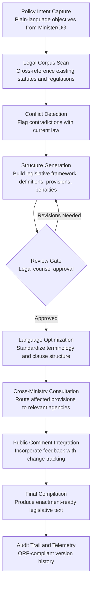

# Policy Compiler Engine

Frankmax

NAICS 921110-928120

> **Governments & Ministries** — Sovereign AI Governance Stack

## Objective & Purpose

Policy development in government is one of the most labor-intensive and error-prone processes in public administration. A single piece of legislation can take 12-18 months to draft, requiring dozens of subject-matter experts, legal counsel, cross-ministry consultations, and public comment periods. During that time, the policy intent drifts, language becomes inconsistent, and provisions conflict with existing statutes. The result: legislation that is ambiguous, difficult to enforce, and expensive to amend -- costing governments millions in post-enactment corrections and judicial challenges.

The Policy Compiler Engine transforms policy intent statements into draft legislation in hours instead of months. Ministers and permanent secretaries input plain-language policy objectives -- "reduce carbon emissions from industrial sources by 30% within 5 years" -- and the engine generates structured legislative text with defined terms, enforcement mechanisms, penalty schedules, transitional provisions, and sunset clauses. The system cross-references the entire national legal corpus to flag conflicts, gaps, and redundancies before a single committee meeting occurs.

The business impact is measured in both speed and quality. Governments that adopt AI-assisted drafting reduce time-to-legislation by 60-80%, cut post-enactment amendment rates by 40%, and free senior legal counsel to focus on constitutional review rather than boilerplate construction. Every compiled policy feeds the marketplace's institutional knowledge base, building a cross-jurisdictional library of legislative patterns that no single government could assemble alone.

## Business Context

| Attribute | Value |
|---|---|
| **Business Process** | Legislative drafting and review |
| **Business Function** | Policy Development |
| **Category** | Governance |
| **Target Audience** | 1. Governments & Ministries |
| **Revenue Priority** | Governance layer (fries attach) |
| **Bundle** | Government Starter Pack ($2,500/mo) |
| **Monthly Cost of Inaction** | $50K-$500K (delayed legislation, legal challenges, amendment cycles) |

## BPMN Workflow

## Features

1. **Intent-to-Legislation Translation** — Converts plain-language policy objectives into structured legislative text with proper legal syntax, defined terms, and enforcement provisions. Supports multiple legislative traditions including common law, civil law, and hybrid systems used across 190+ jurisdictions.

2. **Full Legal Corpus Cross-Reference** — Scans the entire national legal corpus -- statutes, regulations, executive orders, and judicial interpretations -- to identify conflicts, redundancies, and gaps before drafting begins. Reduces post-enactment legal challenges by catching contradictions early.

3. **Multi-Stakeholder Collaboration Engine** — Routes specific provisions to affected ministries and agencies for parallel review. Tracks comments, suggested edits, and approval status across all stakeholders with real-time conflict resolution when multiple agencies propose contradictory amendments.

4. **Penalty and Enforcement Scaffolding** — Automatically generates enforcement mechanisms, penalty schedules, and compliance timelines calibrated to the severity of the regulated activity. References existing penalty structures across related legislation to maintain proportionality.

5. **Version Control with Legal Provenance** — Every change to the draft is tracked with full attribution: who proposed it, which consultation round, what the justification was. Produces a complete legislative history document suitable for judicial interpretation and parliamentary debate.

6. **Regulatory Impact Pre-Screening** — Before final compilation, the engine runs a preliminary impact assessment estimating compliance costs, affected populations, and economic consequences. This pre-screening feeds directly into the Regulatory Impact Analyzer for full analysis.

7. **Sunset and Transitional Clause Generator** — Automatically inserts sunset provisions, grandfathering clauses, and phased implementation schedules based on the complexity and scope of the legislation. Ensures every new law has a built-in review mechanism.

## Workflow & Automation

**Step 1: Policy Intent Capture** — The sponsoring minister or director-general inputs policy objectives in plain language through a structured intake form. The system captures the intended outcomes, target populations, timelines, and constraints. Multiple intent statements can be combined into a single legislative package.

**Step 2: Legal Landscape Analysis** — The engine scans the full national legal corpus to map all existing legislation, regulations, and judicial precedents related to the policy area. It produces a landscape report showing what already exists, what conflicts, and where gaps require new provisions.

**Step 3: Draft Structure Generation** — Based on the intent and landscape analysis, the engine generates a legislative structure: title, preamble, definitions, substantive provisions, enforcement mechanisms, transitional arrangements, and commencement dates. Each section is tagged with its legal basis and policy justification.

**Step 4: Iterative Legal Review** — Legal counsel reviews the generated draft through an inline annotation interface. The system highlights provisions that deviate from standard legislative patterns and flags clauses with elevated constitutional risk. Approved sections lock; flagged sections cycle back for revision.

**Step 5: Cross-Ministry Consultation** — The engine automatically identifies affected agencies based on subject matter taxonomy and routes relevant provisions for review. Each agency receives only the sections within their jurisdiction, with a deadline and escalation path for non-response.

**Step 6: Compilation and Quality Assurance** — All approved provisions, consultation feedback, and legal counsel revisions are compiled into the final legislative text. The system runs a final consistency check: defined terms used correctly, cross-references valid, penalty schedules proportional, and no orphaned provisions.

## Input/Output Specifications

| Direction | Data | Format | Description |
|---|---|---|---|
| Input | Policy intent statements | JSON / structured form | Plain-language objectives, timelines, constraints |
| Input | National legal corpus | API / document index | Existing statutes, regulations, judicial decisions |
| Input | Stakeholder comments | JSON / inline annotations | Cross-ministry feedback and public submissions |
| Input | Legislative templates | XML / Akoma Ntoso | Jurisdiction-specific formatting standards |
| Output | Draft legislation | XML (Akoma Ntoso) / PDF / DOCX | Structured legislative text with metadata |
| Output | Conflict report | JSON + PDF | Identified contradictions with existing law |
| Output | Consultation tracker | REST API / UI dashboard | Status of all stakeholder reviews |
| Output | Legislative history | JSON (immutable log) | ORF-compliant change and provenance record |

## Integration Points

| System | Integration Type | Data Flow |
|---|---|---|
| **Constitutional Compliance Checker** | Outbound feed | Draft provisions sent for constitutional review before finalization |
| **Legislative Language Harmonizer** | Bidirectional | Cross-jurisdictional terminology alignment during drafting |
| **Regulatory Impact Analyzer** | Outbound trigger | Completed drafts trigger full regulatory impact assessment |
| **Inter-Ministry Coordination Platform** | Bidirectional API | Consultation routing and response tracking |
| **National Data Sovereignty Vault** | Outbound storage | All drafts and legislative history stored in sovereign infrastructure |
| **Audit Trail and Traceability Engine** | Outbound log stream | Every edit, approval, and compilation event logged immutably |
| **Public Document Simplifier** | Downstream consumer | Final legislation sent for plain-language summary generation |

## Pricing & Revenue Model

| Component | Pricing | Notes |
|---|---|---|
| **Government Starter Pack** | $2,500/month | Includes Policy Compiler Engine + Constitutional Compliance Checker + Regulatory Impact Analyzer |
| **Standalone License** | $1,800/month | Up to 50 active legislative drafts per month |
| **Enterprise (Federal/National)** | $4,200/month | Unlimited drafts, multi-ministry routing, priority support |
| **Governance Add-on** | +$600/month | ORF audit trail, compliance reporting, judicial export format |
| **Cross-Jurisdiction Module** | +$900/month | Multi-jurisdiction harmonization (federal/state/local) |

**Revenue model**: The Policy Compiler Engine is the anchor product for the Government Starter Pack. It delivers immediate value by compressing legislative timelines from months to days. The "fries" attach through governance layers: audit trail compliance ($600/mo), cross-jurisdiction harmonization ($900/mo), and constitutional review integration -- all at 75-90% margin. Every policy compiled enriches the marketplace's cross-jurisdictional legislative pattern library.

## NAICS/SIC Mapping

| NAICS Code | SIC Code | Industry | Relevance |
|---|---|---|---|
| 921110 | 9111 | Executive Offices | Executive branch policy directives and legislative priorities |
| 921120 | 9121 | Legislative Bodies | Primary users: parliamentary drafting offices and legislative counsel |
| 921130 | 9131 | Public Finance Activities | Budget-related legislation and fiscal policy drafting |
| 921190 | 9199 | Other General Government Support | Cross-cutting policy coordination and administrative reform |
| 923110 | 9431 | Administration of Education Programs | Education policy and regulatory framework development |
| 923120 | 9441 | Administration of Public Health Programs | Health policy legislation and pandemic response frameworks |
| 924110 | 9511 | Administration of Air and Water Resource Programs | Environmental regulation and compliance frameworks |
| 925120 | 9621 | Regulation of Communications | Technology and telecommunications policy drafting |
