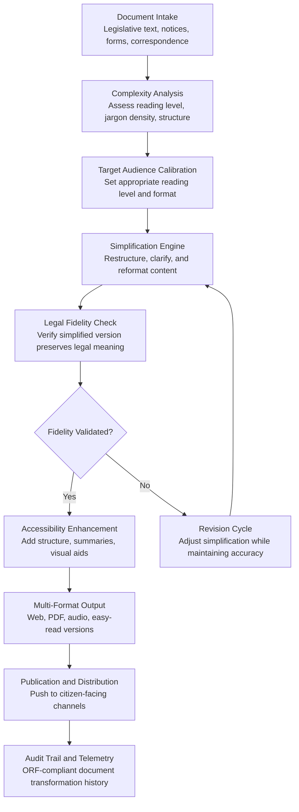

# Public Document Simplifier

Frankmax

NAICS 921110-928120

> **Governments & Ministries** — E-Government Intelligence

## Objective & Purpose

Government documents are written by lawyers for lawyers. The average government notice, form instruction, or policy document is written at a university reading level, yet the average citizen reads at a 7th-8th grade level. The gap is not merely inconvenient -- it is a barrier to democratic participation. Citizens who cannot understand government documents cannot exercise their rights, claim their benefits, comply with regulations, or participate in public consultations. Studies consistently show that document complexity disproportionately affects low-income populations, non-native speakers, elderly citizens, and people with cognitive disabilities -- the very populations that rely most on government services.

The Public Document Simplifier transforms government documents into plain-language versions calibrated to the target audience's reading level -- without altering the legal meaning. The system ingests legislative text, regulatory notices, form instructions, policy documents, and citizen correspondence, then produces simplified versions at configurable reading levels (5th grade through 12th grade). It does not just swap complex words for simple ones: it restructures sentences, replaces passive voice with active voice, eliminates unnecessary jargon, adds contextual explanations for technical terms, and converts dense paragraphs into structured formats (numbered steps, bullet points, tables).

The impact is direct and measurable. Plain-language government documents increase citizen compliance rates by 15-25%, reduce call center inquiries by 20-30%, increase benefit uptake among eligible populations by 10-20%, and improve public consultation participation by 30-50%. For a government spending $50M annually on citizen communications, simplification generates $10M-$25M in downstream savings through reduced confusion, fewer errors, and less remediation.

## Business Context

| Attribute | Value |
|---|---|
| **Business Process** | Document transformation |
| **Business Function** | Communications |
| **Category** | Content |
| **Target Audience** | 1. Governments & Ministries |
| **Revenue Priority** | Governance layer (fries attach) |
| **Bundle** | Government Starter Pack ($2,500/mo) |
| **Monthly Cost of Inaction** | $50K-$500K (citizen confusion, non-compliance, call center overload) |

## BPMN Workflow

## Features

1. **Reading Level Calibration** — Analyzes the input document's reading level using validated readability metrics (Flesch-Kincaid, SMOG, Coleman-Liau) and transforms it to the target level. Default targets: citizen-facing documents at 6th-8th grade level, professional notices at 10th-12th grade level. Each output includes the measured reading level.

2. **Legal Fidelity Preservation** — The critical constraint: simplified documents must preserve the legal meaning of the original. The system tracks every transformation and flags instances where simplification risks altering legal obligations, rights, or deadlines. Legal counsel can review and approve flagged sections through an inline validation interface.

3. **Structural Transformation** — Converts dense paragraphs into accessible formats: numbered step-by-step instructions for procedures, bullet-point lists for requirements, tables for comparison information, and highlighted callout boxes for critical deadlines and warnings. Structure is as important as vocabulary in comprehension.

4. **Jargon Translation Engine** — Maintains a government jargon dictionary that maps technical terms to plain-language equivalents with context. "Adjudication" becomes "review and decision," "disbursement" becomes "payment," and "promulgate" becomes "officially announce." Each translation preserves the precise government meaning.

5. **Multi-Format Output Generation** — Produces simplified documents in multiple formats for different channels: web-optimized HTML, accessible PDF (WCAG 2.1 AA compliant), audio narration script, easy-read format (for cognitive disabilities), and mobile-responsive versions. One simplification produces all formats.

6. **Batch Processing for Legacy Documents** — Processes thousands of existing government documents through the simplification pipeline. Governments can retroactively simplify entire document libraries rather than only simplifying new documents, closing the accessibility gap for existing content.

7. **Comprehension Testing** — Generates reading comprehension questions for simplified documents and runs them against a simulated reader model to verify that the simplified version is genuinely understandable. Catches simplifications that are technically readable but practically confusing.

## Workflow & Automation

**Step 1: Document Intake and Analysis** — Government documents are submitted individually or in batch. The system analyzes each document's current reading level, jargon density, structural complexity, and document type (legislative, regulatory, procedural, correspondence). Analysis results determine the simplification strategy.

**Step 2: Target Audience Configuration** — The document owner specifies the target audience: general public, specific demographic group (elderly, non-native speakers, business owners), or accessibility category. The system selects the appropriate reading level target and structural format.

**Step 3: AI-Powered Simplification** — The engine transforms the document: simplifying vocabulary, restructuring sentences from passive to active voice, breaking complex paragraphs into digestible sections, adding step-by-step formatting for procedures, and inserting plain-language definitions for unavoidable technical terms.

**Step 4: Legal Fidelity Validation** — The system compares the simplified version against the original to verify that all legal obligations, rights, deadlines, and conditions are preserved. Sections where simplification risks altering legal meaning are flagged for human review with specific concerns noted.

**Step 5: Accessibility Enhancement** — The validated simplified document is enhanced with accessibility features: heading structure for screen readers, alt text for visual elements, high-contrast formatting, and easy-read markers. The result meets WCAG 2.1 AA accessibility standards.

**Step 6: Multi-Format Production and Distribution** — The final simplified document is produced in all required formats: web HTML, accessible PDF, audio script, easy-read version, and mobile-responsive layout. Documents are pushed to citizen-facing publication channels through API integration.

## Input/Output Specifications

| Direction | Data | Format | Description |
|---|---|---|---|
| Input | Government documents | DOCX / PDF / HTML / XML | Legislative text, notices, forms, correspondence |
| Input | Target audience specification | JSON / configuration | Reading level target, audience type, accessibility requirements |
| Input | Government jargon dictionary | JSON / CSV | Custom terminology mappings for jurisdiction-specific language |
| Input | Legal fidelity review | JSON / inline annotations | Human validation of flagged simplification concerns |
| Output | Simplified documents | HTML / PDF / DOCX / audio script | Plain-language versions at target reading level |
| Output | Accessibility-compliant documents | PDF (WCAG 2.1 AA) / HTML | Screen reader compatible, high contrast, structured |
| Output | Readability metrics | JSON | Before/after reading level scores and complexity analysis |
| Output | Audit trail | JSON (immutable log) | ORF-compliant document transformation history |

## Integration Points

| System | Integration Type | Data Flow |
|---|---|---|
| **Policy Compiler Engine** | Downstream consumer | Enacted legislation sent for plain-language summary generation |
| **Citizen Service Orchestrator** | Downstream | Citizen-facing responses simplified before delivery |
| **Citizen Intent Router** | Downstream | Routing guidance simplified for citizen comprehension |
| **Multi-Language Government Translator** | Bidirectional | Simplification before translation improves translation quality |
| **National Data Sovereignty Vault** | Outbound storage | All document versions stored in sovereign infrastructure |
| **Audit Trail and Traceability Engine** | Outbound log stream | Every transformation, validation, and publication event logged |
| **Constitutional Compliance Checker** | Governance check | Simplified versions validated to not misrepresent legal requirements |

## Pricing & Revenue Model

| Component | Pricing | Notes |
|---|---|---|
| **Government Starter Pack** | $2,500/month | Includes Public Document Simplifier + Intent Router + Service Orchestrator |
| **Standalone License** | $1,000/month | Up to 500 documents per month |
| **National Communications Scale** | $2,800/month | Unlimited documents, all ministries, batch processing |
| **Accessibility Compliance Module** | +$400/month | WCAG 2.1 AA compliant output across all formats |
| **Audio Narration Output** | +$300/month | Automated audio script generation for visually impaired citizens |
| **Legacy Batch Processing** | +$500/month | Bulk simplification of existing document libraries |

**Revenue model**: The Public Document Simplifier drives value through improved citizen outcomes: higher compliance, reduced confusion, increased benefit uptake. It is a natural attachment for every citizen-facing tool in the stack. The "fries" attach through accessibility compliance ($400/mo), audio narration ($300/mo), and legacy batch processing ($500/mo) -- all at 85-90% margin. Document simplification patterns feed the marketplace's government communications intelligence.

## NAICS/SIC Mapping

| NAICS Code | SIC Code | Industry | Relevance |
|---|---|---|---|
| 921190 | 9199 | Other General Government Support | Central communications and citizen engagement offices |
| 921110 | 9111 | Executive Offices | Executive communications and public affairs |
| 921120 | 9121 | Legislative Bodies | Legislative text simplification for public understanding |
| 923110 | 9431 | Administration of Education Programs | Education-related notices and enrollment documents |
| 923120 | 9441 | Administration of Public Health Programs | Health advisories and public health communications |
| 923130 | 9451 | Administration of Human Resource Programs | Benefits guidance and social services documentation |
| 926110 | 9631 | Administration of Environmental Quality | Environmental notices and public consultations |
| 925110 | 9611 | Administration of Housing Programs | Housing program documentation and application guidance |
