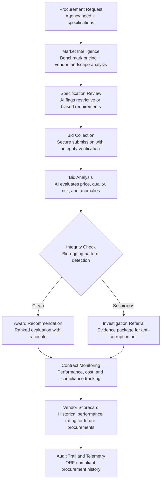

# Public Procurement Intelligence

Frankmax

NAICS 921110-928120

> **Governments & Ministries** — Sovereign AI Governance Stack

## Objective & Purpose

Public procurement is the single largest expenditure category for most governments, accounting for 12-20% of GDP in OECD nations and up to 30% in developing economies. It is also the most corruption-prone government function: Transparency International estimates that 10-25% of public procurement spending is lost to fraud, bid-rigging, favoritism, and vendor lock-in. Beyond corruption, procurement inefficiency manifests as overpriced contracts, underperforming vendors, inadequate competition, and specifications written to favor incumbents.

The Public Procurement Intelligence system applies AI to the entire procurement lifecycle: from needs assessment and specification drafting to bid evaluation, vendor performance tracking, and contract compliance monitoring. The system analyzes historical procurement data to identify bid-rigging patterns (suspicious pricing clusters, rotating winners, complementary bidding), evaluates vendor bids against market benchmarks rather than just against each other, and monitors contract execution to flag cost overruns, scope creep, and performance shortfalls before they compound.

The ROI is immediate and measurable. Governments deploying procurement intelligence typically reduce procurement costs by 8-15% through better competition and market-rate benchmarking, while recovering an additional 5-10% through fraud detection and contract compliance enforcement. For a government spending $5B annually on procurement, that translates to $650M-$1.25B in savings. Every procurement pattern detected feeds the marketplace's cross-sector intelligence library, building a vendor performance and pricing database that no single government could assemble alone.

## Business Context

| Attribute | Value |
|---|---|
| **Business Process** | Procurement and tendering |
| **Business Function** | Supply Chain |
| **Category** | Procurement |
| **Target Audience** | 1. Governments & Ministries |
| **Revenue Priority** | Governance layer (fries attach) |
| **Bundle** | Government Starter Pack ($2,500/mo) |
| **Monthly Cost of Inaction** | $500K-$10M (overpayment, fraud losses, vendor underperformance) |

## BPMN Workflow

## Features

1. **Market Price Benchmarking** — For every procurement category, the system maintains current market pricing benchmarks drawn from public contract databases, commercial price indices, and cross-jurisdictional procurement data. Bids are evaluated not just against each other but against what the market should charge, catching cartel pricing that competition-only evaluation misses.

2. **Bid-Rigging Pattern Detection** — Analyzes bidding patterns across procurements to detect collusion signals: cover bidding (artificially high bids designed to lose), bid rotation (vendors taking turns winning), market allocation (geographic or category division), and suspicious pricing clusters. Produces evidence packages suitable for anti-corruption investigation.

3. **Specification Bias Detection** — Reviews procurement specifications to identify requirements that unnecessarily restrict competition: brand-name references, overly specific technical requirements that only one vendor can meet, and qualification criteria disproportionate to the contract value. Flags biased specs before publication.

4. **Vendor Risk Profiling** — Builds comprehensive vendor risk profiles drawing from financial health data, past performance records, litigation history, beneficial ownership registries, and politically exposed person (PEP) databases. Each bidding vendor receives a risk score that informs evaluation.

5. **Contract Performance Monitoring** — Tracks vendor performance against contract terms throughout the execution period: delivery timelines, quality metrics, cost control, and scope adherence. Flags deviations early enough for corrective action rather than discovering problems at contract close.

6. **Spend Analytics Dashboard** — Provides real-time visibility into government spending by category, agency, vendor, and geography. Identifies concentration risks (too much spending with one vendor), maverick spending (purchases outside established contracts), and volume consolidation opportunities.

7. **Predictive Demand Planning** — Uses historical procurement patterns and program activity data to forecast upcoming procurement needs. Enables strategic sourcing, framework agreements, and bulk purchasing that reduce per-unit costs by 10-20%.

## Workflow & Automation

**Step 1: Procurement Need Registration** — An agency registers a procurement need with specifications, estimated value, timeline, and justification. The system checks for existing framework agreements, recent similar procurements, and potential consolidation opportunities before approving a new procurement process.

**Step 2: Market Intelligence and Specification Review** — The AI benchmarks the estimated value against market data and flags specifications that appear biased or restrictive. Procurement officers receive recommendations for broadening competition and adjusting price expectations to market reality.

**Step 3: Bid Collection and Integrity Verification** — Bids are collected through a secure portal with tamper-proof submission timestamps. The system verifies that each bid is independent: checking for shared IP addresses, document metadata similarities, and pricing pattern anomalies that indicate coordination.

**Step 4: Multi-Criteria Bid Evaluation** — Bids are evaluated across price, technical quality, vendor risk, past performance, and value-for-money metrics. The AI produces a ranked evaluation with detailed scoring rationale for each criterion, eliminating subjective evaluation that favors relationships over value.

**Step 5: Anomaly Investigation and Award** — Any flagged anomalies (bid-rigging signals, vendor risk flags, pricing outliers) are reviewed by procurement oversight before award. Clean procurements proceed to award with a comprehensive evaluation record. Suspicious cases are referred with an evidence package.

**Step 6: Contract Execution Monitoring** — Once awarded, the system monitors contract performance against agreed deliverables, timelines, costs, and quality metrics. Deviations trigger alerts to contract managers with severity ratings and recommended interventions.

## Input/Output Specifications

| Direction | Data | Format | Description |
|---|---|---|---|
| Input | Procurement specifications | JSON / DOCX / PDF | Requirements, evaluation criteria, and estimated values |
| Input | Vendor bids | JSON / PDF / structured form | Pricing, technical proposals, and qualification documents |
| Input | Market pricing data | API / CSV | Category benchmarks from public and commercial sources |
| Input | Vendor registry data | API / JSON | Financial health, performance history, ownership, PEP status |
| Output | Bid evaluation reports | JSON + PDF | Ranked evaluations with scoring rationale and anomaly flags |
| Output | Fraud detection alerts | JSON / notification | Evidence packages for bid-rigging and corruption patterns |
| Output | Vendor scorecards | REST API / dashboard | Historical performance ratings and risk profiles |
| Output | Spend analytics | REST API / dashboard | Category, vendor, and agency spending patterns |

## Integration Points

| System | Integration Type | Data Flow |
|---|---|---|
| **Budget Allocation Optimizer** | Inbound feed | Budget ceilings and program priorities inform procurement planning |
| **Grant and Subsidy Fraud Detector** | Bidirectional intelligence | Shared fraud pattern detection across grants and procurement |
| **Inter-Ministry Coordination Platform** | Outbound routing | Cross-agency procurements coordinated through shared platform |
| **National Data Sovereignty Vault** | Outbound storage | All procurement data stored in sovereign infrastructure |
| **Constitutional Compliance Checker** | Governance check | Procurement processes validated against legal requirements |
| **Audit Trail and Traceability Engine** | Outbound log stream | Every bid, evaluation, and award event logged immutably |
| **Failure Intelligence Library** | Outbound anonymized patterns | Procurement fraud patterns feed cross-sector intelligence |

## Pricing & Revenue Model

| Component | Pricing | Notes |
|---|---|---|
| **Government Starter Pack** | $2,500/month | Includes Procurement Intelligence + Budget Optimizer + Grant Fraud Detector |
| **Standalone License** | $2,000/month | Up to 200 active procurements per month |
| **National Procurement Authority** | $5,200/month | Unlimited procurements, all agencies, vendor registry integration |
| **Fraud Detection Module** | +$900/month | Bid-rigging detection, PEP screening, beneficial ownership analysis |
| **Spend Analytics Dashboard** | +$600/month | Real-time spending visibility and consolidation recommendations |

**Revenue model**: Public Procurement Intelligence targets the largest and most corruption-prone spending category in government. An 8-15% cost reduction on procurement spending delivers massive ROI. The "fries" attach through fraud detection ($900/mo), spend analytics ($600/mo), and vendor performance tracking -- all at 80-90% margin. Procurement patterns feed the marketplace's cross-sector vendor intelligence database.

## NAICS/SIC Mapping

| NAICS Code | SIC Code | Industry | Relevance |
|---|---|---|---|
| 921130 | 9131 | Public Finance Activities | Procurement budget management and fiscal oversight |
| 921110 | 9111 | Executive Offices | Executive oversight of national procurement policy |
| 921190 | 9199 | Other General Government Support | Central procurement agencies and shared services |
| 922190 | 9229 | Other Justice, Public Order Activities | Anti-corruption and procurement integrity enforcement |
| 926110 | 9631 | Administration of Environmental Quality | Environmental procurement standards and green purchasing |
| 928110 | 9711 | National Security | Defense procurement and classified acquisitions |
| 923120 | 9441 | Administration of Public Health Programs | Health sector procurement (pharmaceuticals, equipment) |
| 924110 | 9511 | Administration of Air and Water Resource Programs | Infrastructure procurement for environmental programs |
