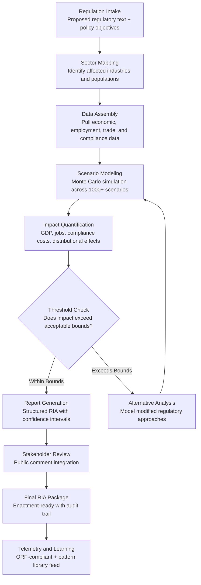

# Regulatory Impact Analyzer

Frankmax

NAICS 921110-928120

> **Governments & Ministries** — Sovereign AI Governance Stack

## Objective & Purpose

Regulatory impact assessments (RIAs) are mandatory in most OECD nations and increasingly required across developing economies, yet the process remains largely manual, subjective, and slow. A typical RIA takes 3-6 months, relies on consultants charging $200K-$500K per study, and produces a static PDF that is outdated before the regulation is enacted. The result: regulations with unintended economic consequences, disproportionate compliance burdens on small businesses, and policy reversals that erode public trust.

The Regulatory Impact Analyzer uses AI to model the downstream consequences of proposed regulations across economic sectors, demographic groups, and government operations -- in days rather than months. The system ingests the proposed regulatory text, maps it against industry data (employment, revenue, trade flows, compliance costs), and runs Monte Carlo simulations across thousands of scenarios to quantify probable outcomes: GDP impact, job creation or displacement, compliance cost distribution, and second-order effects on adjacent sectors.

The tool transforms regulatory impact assessment from a checkbox exercise into a genuine decision-support instrument. Governments gain quantified confidence intervals around each regulatory outcome, enabling evidence-based tradeoff decisions. At $2,500/month as part of the Government Starter Pack, the Analyzer pays for itself by preventing a single costly regulatory miscalculation -- the kind that typically costs $5M-$50M in post-enactment corrections, legal challenges, and economic damage.

## Business Context

| Attribute | Value |
|---|---|
| **Business Process** | Regulatory impact assessment |
| **Business Function** | Policy Analysis |
| **Category** | Compliance |
| **Target Audience** | 1. Governments & Ministries |
| **Revenue Priority** | Governance layer (fries attach) |
| **Bundle** | Government Starter Pack ($2,500/mo) |
| **Monthly Cost of Inaction** | $100K-$2M (flawed regulations, legal challenges, economic damage) |

## BPMN Workflow

## Features

1. **Multi-Sector Economic Modeling** — Models regulatory impact across all affected NAICS sectors simultaneously. Captures direct compliance costs, indirect supply chain effects, and induced economic impacts using input-output analysis calibrated to national economic accounts.

2. **Monte Carlo Scenario Engine** — Runs 1,000+ probabilistic scenarios for each proposed regulation, producing confidence intervals rather than point estimates. Decision-makers see the range of probable outcomes -- best case, worst case, and most likely -- with explicit uncertainty quantification.

3. **Distributional Impact Analysis** — Breaks down regulatory burden by business size (micro, small, medium, large), geographic region, demographic group, and income quintile. Identifies whether the regulation disproportionately affects vulnerable populations or specific communities.

4. **Compliance Cost Calculator** — Estimates per-entity compliance costs including paperwork burden (hours), technology requirements, training needs, and ongoing monitoring obligations. Maps costs against the regulated entity's typical revenue to calculate compliance-as-percentage-of-revenue.

5. **Alternative Regulation Modeler** — When a proposed regulation exceeds acceptable impact thresholds, the system automatically generates and models 3-5 alternative regulatory approaches: lighter-touch options, phased implementations, exemption frameworks, and market-based mechanisms.

6. **Historical Precedent Engine** — References a library of past regulatory outcomes across jurisdictions. When a proposed regulation resembles a previously enacted one, the system surfaces actual measured impacts vs. predicted impacts, improving forecast accuracy through empirical grounding.

7. **Real-Time Data Integration** — Connects to national statistics agencies, central banks, and trade databases for current economic data rather than relying on stale datasets. Ensures impact models reflect the actual economic environment at the time of analysis.

## Workflow & Automation

**Step 1: Regulation Intake and Parsing** — The proposed regulatory text is ingested along with the stated policy objectives, target population, and implementation timeline. The system parses the regulation into discrete provisions, each tagged with its regulatory mechanism (prohibition, requirement, disclosure, licensing, fee, standard).

**Step 2: Affected Sector Identification** — The Analyzer maps each provision to affected NAICS sectors, business size categories, and geographic regions using an industry ontology trained on regulatory compliance data from 40+ countries. The mapping produces a comprehensive scope document showing who is affected and how.

**Step 3: Economic Data Assembly** — The system pulls current data from connected sources: national accounts, labor force surveys, business registries, trade statistics, and sector-specific databases. Data gaps are flagged with uncertainty ranges rather than hidden behind assumptions.

**Step 4: Impact Simulation** — Monte Carlo simulations model each provision's effects across the identified sectors. The engine calculates direct costs (compliance), indirect costs (supply chain), and induced effects (consumer behavior changes). Results include confidence intervals at 50%, 75%, and 95% levels.

**Step 5: Distributional and Equity Analysis** — Impact results are disaggregated by business size, geography, and demographic factors. The system flags provisions where regulatory burden falls disproportionately on small enterprises, rural communities, or specific population groups.

**Step 6: Report Generation and Review** — The complete RIA is compiled into a structured report with executive summary, methodology, findings, sensitivity analysis, and recommendations. Stakeholders review through an annotation interface; feedback is tracked and integrated.

## Input/Output Specifications

| Direction | Data | Format | Description |
|---|---|---|---|
| Input | Proposed regulatory text | XML (Akoma Ntoso) / DOCX / PDF | Full text of proposed regulation with provision structure |
| Input | Economic baseline data | API / CSV | National accounts, employment, trade, business registry data |
| Input | Historical regulatory outcomes | JSON / database | Past RIA predictions vs. actual measured impacts |
| Input | Stakeholder submissions | JSON / form data | Public comment period responses and industry feedback |
| Output | Full RIA report | PDF / HTML / JSON | Structured impact assessment with confidence intervals |
| Output | Executive summary | PDF / API | Decision-maker briefing with key findings and tradeoffs |
| Output | Alternative scenarios | JSON + visualization | Comparative analysis of regulatory alternatives |
| Output | Audit trail | JSON (immutable log) | ORF-compliant methodology and data provenance record |

## Integration Points

| System | Integration Type | Data Flow |
|---|---|---|
| **Policy Compiler Engine** | Inbound trigger | Completed legislation drafts trigger impact assessment automatically |
| **Constitutional Compliance Checker** | Bidirectional | Constitutional constraints inform impact modeling boundaries |
| **Budget Allocation Optimizer** | Outbound feed | Fiscal impact estimates feed national budget planning |
| **National Statistics Accelerator** | Inbound data | Current statistical data feeds impact models |
| **Inter-Ministry Coordination Platform** | Outbound routing | Sector-specific impact findings routed to responsible ministries |
| **National Data Sovereignty Vault** | Outbound storage | All RIA data and models stored in sovereign infrastructure |
| **Failure Intelligence Library** | Outbound anonymized patterns | Regulatory outcome patterns feed cross-jurisdictional learning |

## Pricing & Revenue Model

| Component | Pricing | Notes |
|---|---|---|
| **Government Starter Pack** | $2,500/month | Includes Regulatory Impact Analyzer + Policy Compiler + Constitutional Checker |
| **Standalone License** | $1,600/month | Up to 20 regulatory impact assessments per month |
| **Enterprise (National Regulator)** | $3,800/month | Unlimited assessments, multi-sector modeling, priority support |
| **Historical Precedent Module** | +$500/month | Access to cross-jurisdictional regulatory outcome library |
| **Real-Time Data Integration** | +$700/month | Live feeds from national statistics and economic databases |

**Revenue model**: The Regulatory Impact Analyzer is the compliance anchor of the Government Starter Pack. It replaces $200K-$500K consulting engagements with a $2,500/month subscription that produces faster, more rigorous assessments. The governance "fries" attach through historical precedent access, real-time data integration, and cross-jurisdictional benchmarking -- all at 80-90% margin. Every completed RIA enriches the marketplace's regulatory outcome library.

## NAICS/SIC Mapping

| NAICS Code | SIC Code | Industry | Relevance |
|---|---|---|---|
| 921110 | 9111 | Executive Offices | Executive branch regulatory review and approval |
| 921120 | 9121 | Legislative Bodies | Legislative oversight of regulatory impact |
| 921130 | 9131 | Public Finance Activities | Fiscal impact of regulatory compliance costs |
| 925110 | 9611 | Regulation of Banking and Securities | Financial sector regulatory impact modeling |
| 925120 | 9621 | Regulation of Communications | Telecommunications and technology regulation |
| 926110 | 9631 | Regulation of Environmental Quality | Environmental regulation cost-benefit analysis |
| 926150 | 9651 | Regulation of Miscellaneous Activities | Cross-sector regulatory coordination |
| 923120 | 9441 | Administration of Public Health Programs | Health regulation impact on care delivery and costs |
