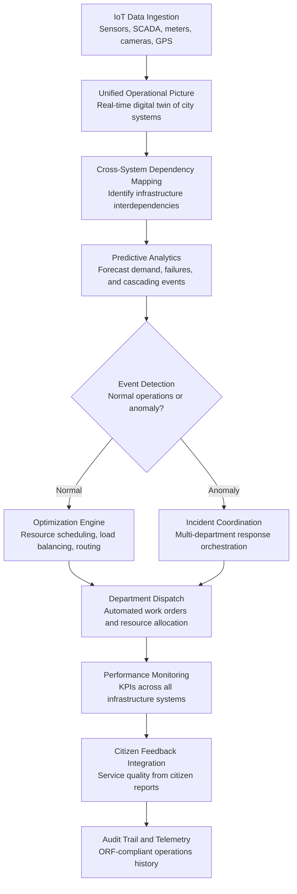

# Smart City Operations Platform

Frankmax

NAICS 921110-928120

> **Governments & Ministries** — E-Government Intelligence

## Objective & Purpose

Modern cities operate dozens of infrastructure systems -- traffic management, water distribution, electrical grid, waste collection, public transit, street lighting, emergency services, air quality monitoring -- each managed by a different department with its own data systems, dashboards, and response protocols. These systems are deeply interdependent (a power outage affects traffic lights, which affects emergency response times, which affects hospital admissions) but managed independently. The result: cities react to cascading failures instead of preventing them, waste resources through uncoordinated scheduling, and miss optimization opportunities that are only visible when systems are viewed as a whole.

The Smart City Operations Platform provides an AI-powered coordination layer across all urban infrastructure systems. It ingests real-time data from IoT sensors, SCADA systems, transit operations, emergency dispatch, utility meters, environmental monitors, and citizen reports to build a unified operational picture of the city. The AI layer identifies cross-system dependencies, predicts cascading failures before they happen, optimizes resource allocation across departments, and coordinates responses to events that span multiple systems.

The measurable impact: cities deploying integrated operations platforms reduce energy consumption by 10-20%, cut emergency response times by 15-25%, reduce traffic congestion by 8-15%, and achieve 20-30% improvement in waste collection efficiency. For a city of 1 million residents spending $500M annually on infrastructure operations, that translates to $50M-$100M in operational savings. The platform also generates the most granular urban operations telemetry available, feeding the marketplace's smart city intelligence library with patterns that become more valuable as more cities deploy.

## Business Context

| Attribute | Value |
|---|---|
| **Business Process** | Urban infrastructure management |
| **Business Function** | Infrastructure Ops |
| **Category** | IoT/Operations |
| **Target Audience** | 1. Governments & Ministries |
| **Revenue Priority** | Governance layer (fries attach) |
| **Bundle** | Government Starter Pack ($2,500/mo) |
| **Monthly Cost of Inaction** | $500K-$5M (uncoordinated operations, energy waste, slow emergency response) |

## BPMN Workflow

## Features

1. **Unified Digital Twin** — Creates a real-time digital representation of the entire city's infrastructure: traffic flow, energy consumption, water pressure, waste container fill levels, public transit positions, air quality readings, and emergency unit locations. The digital twin enables city operators to see the whole picture rather than individual system silos.

2. **Cross-System Dependency Analysis** — Maps the interdependencies between urban systems: how a water main break affects traffic patterns, how a heatwave increases energy load which stresses the grid which affects transit operations. These dependency maps enable proactive coordination rather than reactive scrambling.

3. **Predictive Failure Detection** — Uses sensor data patterns to predict infrastructure failures 24-72 hours before they occur: water main deterioration, transformer overload, traffic signal malfunction, and waste system congestion. Predictive maintenance reduces emergency repairs by 40-60% and extends infrastructure lifespan.

4. **Multi-Department Event Coordination** — When an event spans multiple departments (a major accident requiring traffic rerouting, emergency medical services, utility shutoffs, and public transit adjustments), the platform coordinates all responses through a single command interface with real-time status tracking.

5. **Demand-Responsive Resource Optimization** — Optimizes resource deployment based on real-time demand: adjusting traffic signal timing based on current flow, routing waste collection trucks based on container fill levels, scheduling street lighting based on ambient light and pedestrian activity, and dispatching transit vehicles based on ridership patterns.

6. **Environmental Monitoring and Response** — Integrates air quality sensors, noise monitors, and water quality data into the operations picture. When environmental thresholds are exceeded, the platform can trigger automated responses: activating air quality advisories, rerouting traffic away from pollution hotspots, or adjusting industrial operation schedules.

7. **Citizen Engagement Layer** — Integrates citizen reports (potholes, broken streetlights, illegal dumping, noise complaints) into the operational picture. Citizen reports are classified, geolocated, prioritized, and routed to the responsible department with automated status updates back to the reporting citizen.

8. **Energy Optimization Engine** — Specifically targets the largest municipal cost: energy. Optimizes building HVAC schedules, street lighting intensity, water pumping schedules, and transit operations to minimize energy consumption while maintaining service levels. Typical savings: 10-20% of municipal energy spend.

## Workflow & Automation

**Step 1: Data Ingestion and Integration** — The platform ingests real-time data from all connected urban systems: IoT sensors (traffic, environmental, infrastructure), SCADA systems (water, energy), transit AVL (automatic vehicle location), emergency CAD (computer-aided dispatch), utility meters, and citizen reporting channels. Data is normalized into a unified schema.

**Step 2: Digital Twin Construction** — Ingested data populates a real-time digital twin of the city. The twin shows current state across all systems: traffic flow rates, energy consumption by zone, water pressure by district, waste container fill levels, transit vehicle positions, and emergency unit availability.

**Step 3: Predictive Analytics and Anomaly Detection** — The AI layer analyzes real-time data against historical patterns to predict upcoming events: traffic congestion buildup, energy demand spikes, infrastructure failure precursors, and weather-related impacts. Anomalies that deviate from expected patterns trigger investigation alerts.

**Step 4: Optimization and Resource Allocation** — For normal operations, the optimization engine adjusts resource deployment in real time: traffic signal timing, waste collection routing, transit dispatching, street lighting intensity, and maintenance crew scheduling. Each optimization action includes an estimated impact and cost saving.

**Step 5: Event Response Coordination** — When anomalies or incidents are detected, the platform activates coordinated response protocols. All affected departments receive simultaneous alerts with their specific responsibilities. Response progress is tracked in real time through the command interface.

**Step 6: Performance Reporting and Continuous Improvement** — The platform generates daily, weekly, and monthly performance reports across all systems: response times, resource utilization, energy consumption, citizen satisfaction, and KPI achievement. Trend analysis identifies systemic improvement opportunities.

## Input/Output Specifications

| Direction | Data | Format | Description |
|---|---|---|---|
| Input | IoT sensor data | MQTT / REST API / streaming | Traffic, environmental, infrastructure sensor readings |
| Input | SCADA system data | OPC-UA / Modbus / API | Water, energy, and utility operational data |
| Input | Transit operations | GTFS-RT / API | Real-time vehicle positions, ridership, and schedule adherence |
| Input | Emergency dispatch | CAD API / JSON | Incident reports, unit positions, and response status |
| Input | Citizen reports | JSON / form data / API | Service requests, complaints, and feedback |
| Output | Unified operations dashboard | REST API / UI | Real-time city-wide operational status |
| Output | Optimization commands | API / SCADA / control systems | Automated adjustments to traffic, lighting, routing |
| Output | Performance reports | PDF / JSON / dashboard | KPIs, trends, and improvement recommendations |
| Output | Audit trail | JSON (immutable log) | ORF-compliant operations and decision history |

## Integration Points

| System | Integration Type | Data Flow |
|---|---|---|
| **National Statistics Accelerator** | Bidirectional | Urban statistics feed national data; national indicators inform city planning |
| **Citizen Intent Router** | Inbound feed | Urban service requests classified and routed through city systems |
| **Citizen Service Orchestrator** | Bidirectional | City service delivery coordinated with national service layer |
| **National Data Sovereignty Vault** | Outbound storage | All urban operations data stored in sovereign infrastructure |
| **Budget Allocation Optimizer** | Outbound feed | Infrastructure performance data informs municipal budget decisions |
| **Citizen Privacy Impact Modeler** | Governance check | Sensor data collection validated against privacy requirements |
| **Audit Trail and Traceability Engine** | Outbound log stream | Every operational decision and system command logged immutably |

## Pricing & Revenue Model

| Component | Pricing | Notes |
|---|---|---|
| **Government Starter Pack** | $2,500/month | Includes Smart City Operations Platform + core governance tools |
| **Standalone (Small City, under 250K population)** | $2,200/month | Core platform, up to 5,000 sensor integrations |
| **Medium City (250K-1M)** | $4,500/month | Full platform, 50,000 sensors, predictive analytics |
| **Large City (over 1M)** | $7,500/month | Enterprise scale, unlimited sensors, custom dashboards |
| **Energy Optimization Module** | +$800/month | HVAC, lighting, pumping, and transit energy optimization |
| **Predictive Maintenance Module** | +$600/month | Infrastructure failure prediction and maintenance scheduling |
| **Citizen Engagement Layer** | +$400/month | Citizen reporting integration with automated response tracking |

**Revenue model**: The Smart City Operations Platform targets the largest operational budget in local government: urban infrastructure. A 10-15% efficiency improvement on a $500M operations budget saves $50M-$75M annually. The "fries" attach through energy optimization ($800/mo), predictive maintenance ($600/mo), and citizen engagement ($400/mo) -- all at 75-85% margin. Urban operations telemetry feeds the marketplace's smart city intelligence library, becoming more valuable with each city deployed.

## NAICS/SIC Mapping

| NAICS Code | SIC Code | Industry | Relevance |
|---|---|---|---|
| 921190 | 9199 | Other General Government Support | Municipal operations and city management offices |
| 921110 | 9111 | Executive Offices | Mayoral and city council operations oversight |
| 924110 | 9511 | Administration of Air and Water Resource Programs | Water distribution and air quality management |
| 926110 | 9631 | Administration of Environmental Quality | Urban environmental monitoring and compliance |
| 922120 | 9222 | Police Protection | Public safety integration and emergency response |
| 922160 | 9224 | Fire Protection | Fire service coordination and emergency dispatch |
| 485110 | 4111 | Urban Transit Systems | Public transit operations and optimization |
| 221310 | 4941 | Water Supply and Irrigation Systems | Municipal water infrastructure management |
