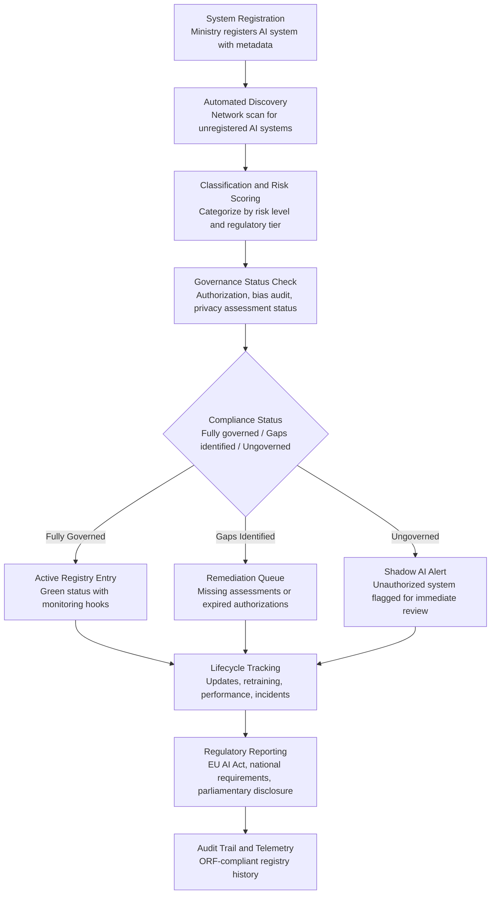

# Sovereign AI Registry

Frankmax

NAICS 921110-928120

> **Governments & Ministries** — National AI Safety & Ethics

## Objective & Purpose

Most governments do not know what AI systems they are running. A 2024 survey of OECD nations found that only 12% of governments maintain a comprehensive inventory of AI systems deployed across their agencies. Ministries procure and deploy AI independently, often from different vendors, with no central visibility into what systems exist, what data they access, what decisions they make, or what risks they carry. When a regulation like the EU AI Act requires governments to register high-risk AI systems, they cannot comply because they do not have an inventory to start from.

The Sovereign AI Registry creates a centralized, authoritative inventory of every AI system deployed across government. Each registered system is cataloged with: owning ministry, vendor, model type, training data sources, deployment date, risk classification, authorization status, bias audit results, privacy assessment status, performance metrics, and incident history. The registry is not just a list -- it is a living governance instrument that tracks the full lifecycle of every AI system from procurement through deployment, monitoring, and decommissioning.

The strategic value is foundational. Without a registry, every other governance function is impossible: you cannot authorize what you do not know exists, you cannot audit what you cannot find, and you cannot respond to incidents in systems you are unaware of. The Sovereign AI Registry is the backbone of national AI governance -- the single source of truth that enables authorization, auditing, monitoring, incident response, and regulatory compliance. For nations implementing AI regulation, the registry is not optional; it is the minimum viable governance infrastructure.

## Business Context

| Attribute | Value |
|---|---|
| **Business Process** | National AI inventory |
| **Business Function** | Asset Management |
| **Category** | Registry |
| **Target Audience** | 1. Governments & Ministries |
| **Revenue Priority** | Kitchen (moat infrastructure) |
| **Bundle** | Government Starter Pack ($2,500/mo) |
| **Monthly Cost of Inaction** | $100K-$2M (regulatory non-compliance, ungoverned systems, shadow AI) |

## BPMN Workflow

## Features

1. **Comprehensive System Cataloging** — Each AI system is registered with a standardized metadata set: system name, owning ministry, vendor/developer, model type, training data sources, deployment date, affected population, decision impact level, risk classification, and current governance status. The catalog supports both self-registration and automated discovery.

2. **Shadow AI Detection** — Automated network scanning identifies AI systems deployed across government infrastructure that have not been registered. Shadow AI -- systems procured and deployed without central visibility -- is one of the largest governance risks. The registry converts unknown unknowns into known, governed assets.

3. **Governance Status Dashboard** — For each registered system, the registry tracks: authorization status (authorized/pending/expired), bias audit status (passed/failed/due), privacy assessment status (completed/outstanding), incident history, and performance metrics. A red/amber/green dashboard gives national AI officers immediate visibility into governance gaps.

4. **Lifecycle Management** — Tracks every system through its full lifecycle: procurement, development/customization, testing, authorization, deployment, monitoring, retraining events, version updates, and eventual decommissioning. Each lifecycle event is logged with metadata and triggering conditions.

5. **Regulatory Compliance Reporting** — Generates reports formatted for specific regulatory requirements: EU AI Act high-risk system registration, national AI strategy reporting, parliamentary disclosure requirements, and international AI governance commitments. Reports are auto-generated from registry data with no manual assembly required.

6. **Risk Aggregation and Portfolio View** — Aggregates risk across all registered AI systems to show the government's total AI risk exposure: how many high-risk systems are deployed, which ministries carry the most AI risk, where governance gaps are concentrated, and how risk trends change over time.

7. **Vendor and Technology Concentration Analysis** — Identifies vendor lock-in and technology concentration risks: how many systems depend on a single vendor, which vendors have the most government AI deployments, and where single points of failure exist in the government's AI supply chain.

## Workflow & Automation

**Step 1: System Registration** — Ministries register AI systems through a structured intake form. Mandatory fields include: system name, owning ministry, description, vendor, model type, data sources, deployment scope, affected population, and risk self-assessment. The registry validates completeness and assigns a unique identifier.

**Step 2: Automated Discovery Scan** — The registry periodically scans government network infrastructure for AI system signatures: model serving endpoints, GPU utilization patterns, ML framework deployments, and API patterns indicating AI processing. Discovered systems not in the registry are flagged as shadow AI for investigation.

**Step 3: Risk Classification** — Each registered system is classified by risk level based on: affected population size, decision impact (advisory vs. deterministic), data sensitivity, autonomy level, and reversibility. Classification aligns with applicable regulatory frameworks (EU AI Act tiers, national risk categories).

**Step 4: Governance Status Assessment** — The registry checks each system against governance requirements for its risk level: does it have current authorization, a recent bias audit, a valid privacy assessment, active monitoring, and an incident response plan. Gaps are flagged with remediation timelines.

**Step 5: Lifecycle Monitoring** — Registered systems are continuously monitored for lifecycle events: version updates, retraining, data source changes, performance metric changes, and incident occurrences. Events that affect the system's risk profile or governance status trigger automatic reassessment workflows.

**Step 6: Reporting and Disclosure** — The registry generates regulatory compliance reports, parliamentary disclosure documents, and executive dashboards on demand. Reports aggregate across all registered systems to show the government's AI landscape, risk profile, and governance maturity.

## Input/Output Specifications

| Direction | Data | Format | Description |
|---|---|---|---|
| Input | System registration data | JSON / structured form | AI system metadata and governance documentation |
| Input | Network scan results | JSON / API | Automated discovery of unregistered AI systems |
| Input | Governance assessment results | JSON / API | Authorization, bias audit, and privacy status from linked tools |
| Input | Lifecycle events | JSON / webhook | Updates, retraining, incidents, decommissioning |
| Output | Registry database | REST API / UI | Searchable inventory of all government AI systems |
| Output | Governance dashboard | REST API / dashboard | Red/amber/green status across all registered systems |
| Output | Regulatory reports | PDF / JSON / XML | Formatted for EU AI Act, national requirements, parliamentary review |
| Output | Audit trail | JSON (immutable log) | ORF-compliant registry and lifecycle history |

## Integration Points

| System | Integration Type | Data Flow |
|---|---|---|
| **AI Deployment Authorization System** | Bidirectional | Authorized systems auto-register; registry status informs authorization |
| **Algorithmic Bias Auditor** | Inbound feed | Bias audit results update registry governance status |
| **Citizen Privacy Impact Modeler** | Inbound feed | Privacy assessment results update registry governance status |
| **AI Incident Response Coordinator** | Bidirectional | Incident status updates registry; registry data informs response |
| **National Data Sovereignty Vault** | Bidirectional | Registry tracks which AI systems access which datasets |
| **Constitutional Compliance Checker** | Governance check | High-risk AI systems validated against constitutional requirements |
| **Audit Trail and Traceability Engine** | Outbound log stream | Every registration, status change, and lifecycle event logged immutably |

## Pricing & Revenue Model

| Component | Pricing | Notes |
|---|---|---|
| **Government Starter Pack** | $2,500/month | Includes Sovereign AI Registry + Authorization + Incident Response |
| **Standalone License** | $1,500/month | Up to 200 registered AI systems |
| **National AI Authority Scale** | $4,000/month | Unlimited systems, all agencies, shadow AI detection |
| **Shadow AI Detection Module** | +$700/month | Automated network scanning and unregistered system discovery |
| **Regulatory Reporting Module** | +$500/month | Auto-generated compliance reports for EU AI Act and national frameworks |
| **Vendor Concentration Analysis** | +$400/month | Supply chain risk assessment across AI vendors |

**Revenue model**: The Sovereign AI Registry is kitchen infrastructure -- the foundational data layer that every other AI governance tool depends on. You cannot authorize, audit, monitor, or respond to AI systems you have not inventoried. The registry creates natural lock-in through data gravity. The "fries" attach through shadow AI detection ($700/mo), regulatory reporting ($500/mo), and vendor analysis ($400/mo) -- all at 80-90% margin. Registry data feeds the marketplace's national AI governance intelligence.

## NAICS/SIC Mapping

| NAICS Code | SIC Code | Industry | Relevance |
|---|---|---|---|
| 921190 | 9199 | Other General Government Support | Central AI governance and chief AI officer functions |
| 921110 | 9111 | Executive Offices | Executive oversight of national AI inventory |
| 925120 | 9621 | Regulation of Communications | AI and technology regulatory bodies |
| 926150 | 9651 | Regulation of Miscellaneous Activities | Cross-sector AI system registration and oversight |
| 928110 | 9711 | National Security | Defense AI system inventory and classification |
| 922120 | 9222 | Police Protection | Law enforcement AI system registry |
| 923120 | 9441 | Administration of Public Health Programs | Healthcare AI system inventory |
| 923110 | 9431 | Administration of Education Programs | Education AI system registry and oversight |
