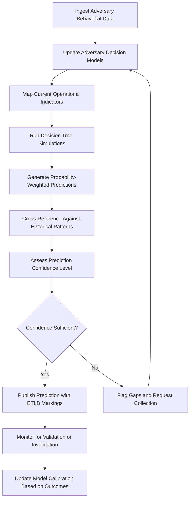

# Adversary Behavior Predictor

Frankmax

NAICS 541715

> **Defense / Security / Intelligence** — Adversary Behavior Predictor Module

## Objective & Purpose

Defense and intelligence organizations have historically operated in a reactive posture, responding to adversary actions after they occur rather than anticipating them. While intelligence analysis attempts to forecast adversary intentions, the process relies heavily on individual analyst expertise, is vulnerable to cognitive biases like mirror-imaging and anchoring, and struggles to integrate the full range of behavioral data available across collection disciplines. The result is assessments that are often vague, hedged, and delivered too late to shape operational decisions.

The Adversary Behavior Predictor applies computational behavioral modeling to construct dynamic adversary decision frameworks that predict next moves with quantified probability distributions. The system ingests adversary doctrine, historical decision patterns, leadership psychology profiles, organizational culture data, and current operational indicators to build multi-factor prediction models. Unlike simple trend extrapolation, the system models adversary decision-making processes — including internal political dynamics, resource constraints, and risk tolerance — to generate predictions grounded in how adversaries actually make decisions rather than how analysts assume they think.

Predictions are governed by ETLB protocols that explicitly mark confidence levels and model limitations, preventing downstream consumers from treating probabilistic predictions as certainties. The ORF framework tracks prediction accuracy over time, building a feedback loop that continuously improves model calibration and provides organizational accountability for prediction-based decisions.

## Business Context

| Attribute | Value |
|---|---|
| **Business Process** | Predictive intelligence |
| **Business Function** | Threat Intelligence |
| **Category** | Analytics |
| **Target Audience** | 2. Defense / Security / Intelligence |
| **Bundle** | Defense and Intelligence Pack ($25,000/mo) |
| **Monthly Cost of Inaction** | $350,000 in strategic surprise costs and reactive posture penalties |

## BPMN Workflow

## Features

1. **Adversary Decision Framework Modeling** — Constructs computational models of adversary decision-making processes incorporating doctrine, leadership psychology, organizational dynamics, resource constraints, and historical precedent.

2. **Multi-Factor Prediction Engine** — Generates probability-weighted predictions across multiple possible adversary courses of action, providing decision-makers with a distribution of outcomes rather than single-point forecasts.

3. **Cognitive Bias Mitigation** — Systematically tests predictions against common analytical biases including mirror-imaging, anchoring, confirmation bias, and groupthink, flagging predictions that may be distorted by analyst assumptions.

4. **Red Team Automation** — Generates adversary perspectives automatically, challenging blue-force assumptions and identifying vulnerabilities that adversaries are most likely to exploit based on their decision models.

5. **Prediction Accuracy Tracking** — Maintains a rigorous record of all predictions and their outcomes, providing calibration metrics that measure model accuracy over time and identify systematic prediction errors.

6. **Collection Gap Identification** — When prediction confidence is low due to insufficient data, the system automatically identifies specific intelligence gaps and generates prioritized collection requirements.

7. **Leadership Change Impact Analysis** — Models how changes in adversary leadership, political dynamics, or organizational structure are likely to shift decision-making patterns and strategic priorities.

8. **Deception Detection** — Analyzes whether observed adversary behavior is consistent with genuine decision-making or suggests deliberate deception operations designed to mislead intelligence assessments.

## Workflow & Automation

**Step 1: Data Aggregation** — Behavioral data about target adversaries is continuously aggregated from intelligence reports, open-source monitoring, diplomatic communications, and military activity indicators.

**Step 2: Model Update** — Adversary decision models are updated with new behavioral data. The system adjusts model parameters based on recent adversary actions and validated predictions.

**Step 3: Indicator Mapping** — Current operational indicators are mapped against adversary decision models to identify which decision pathways are currently active or being prepared.

**Step 4: Simulation Execution** — Decision tree simulations are run across multiple scenarios, generating probability distributions for each possible adversary course of action.

**Step 5: Confidence Assessment** — Each prediction is assessed for confidence based on data quality, model calibration history, and the number of corroborating indicators. Low-confidence predictions trigger collection requests.

**Step 6: Publication and Monitoring** — Validated predictions are published with explicit confidence markings and ETLB liability bindings. Active predictions are continuously monitored for confirming or disconfirming evidence.

## Input/Output Specifications

| Direction | Data | Format | Description |
|---|---|---|---|
| Input | Adversary doctrine and strategy | PDF/JSON | Published doctrine, speeches, strategic documents |
| Input | Historical decision records | JSON/CSV | Past adversary actions and contexts |
| Input | Leadership profiles | JSON | Psychological and behavioral profiles |
| Input | Current operational indicators | STIX 2.1/JSON | Real-time adversary activity data |
| Output | Prediction reports | PDF/JSON | Probability-weighted adversary course of action forecasts |
| Output | Confidence calibration data | CSV/JSON | Model accuracy metrics and calibration history |
| Output | Collection requirements | JSON | Identified intelligence gaps and collection priorities |

## Integration Points

| System | Integration Type | Data Flow |
|---|---|---|
| Threat Pattern Recognition Engine | Internal API | Inbound detected threat patterns |
| Multi-Source Intelligence Fusion | Internal API | Inbound fused intelligence for model inputs |
| Strategic Scenario Modeler | Internal API | Outbound adversary models for scenario simulation |
| Collection Management Systems | Secure API | Outbound collection requirements |
| Joint Intelligence Platforms | Secure file exchange | Outbound prediction products |
| ORF Compliance Layer | Event-driven | Outbound prediction lifecycle tracking |

## Pricing & Revenue Model

| Component | Price |
|---|---|
| **Bundle** | Defense and Intelligence Pack |
| **Bundle Price** | $25,000/mo |
| **Standalone Module** | $5,000/mo |
| **Custom Adversary Profile Development** | $15,000 one-time per adversary |
| **Implementation** | $38,000 one-time |

Revenue flows primarily through the bundled Defense and Intelligence Pack. Custom adversary profile development commands premium one-time fees, while the ongoing prediction accuracy tracking and bias mitigation features represent high-margin "fries" revenue at 92% margin. The prediction accuracy feedback loop creates strong retention as model calibration improves with accumulated usage, making switching costs substantial.

## NAICS/SIC Mapping

| NAICS | SIC | Industry | Relevance |
|---|---|---|---|
| 541715 | 8711 | R&D in Physical, Engineering, and Life Sciences | Primary — predictive intelligence research |
| 928110 | 9711 | National Security | Adversary prediction for national defense |
| 541611 | 8742 | Administrative Management Consulting | Strategic intelligence advisory |
| 541990 | 7389 | All Other Professional, Scientific, and Technical Services | Behavioral analysis services |
