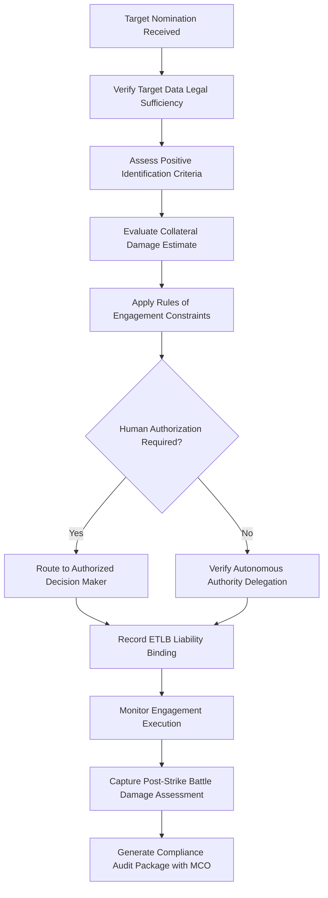

# Autonomous System Kill-Chain Auditor

Frankmax

NAICS 928110

> **Defense / Security / Intelligence** — Autonomous System Kill-Chain Auditor Module

## Objective & Purpose

The proliferation of autonomous and semi-autonomous weapons systems introduces unprecedented governance challenges. International humanitarian law, rules of engagement, and national policy directives require meaningful human control over lethal force decisions, but the increasing speed of autonomous targeting cycles threatens to compress human decision windows below the threshold of meaningful oversight. Without rigorous, automated compliance verification, organizations risk deploying autonomous systems that violate legal obligations, rules of engagement, or ethical standards — with consequences measured in civilian casualties, war crimes liability, and strategic legitimacy erosion.

The Autonomous System Kill-Chain Auditor provides real-time compliance verification across every stage of the autonomous weapons kill chain, from target identification through engagement authorization and post-strike assessment. The system enforces human-in-the-loop requirements at configurable decision points, verifies that targeting data meets legal sufficiency thresholds, audits proportionality and distinction assessments, and ensures that rules of engagement constraints are applied before any engagement authorization. Every kill-chain decision is recorded with tamper-evident audit trails that support post-engagement legal review and accountability determinations.

This module is the flagship application of the ETLB (Execution-Time Liability Binding) protocol, which binds explicit liability to every decision in the kill chain at the moment of execution. The MCO (Mortality Compliance Object) framework governs all lethal force decisions, ensuring that autonomous systems cannot bypass human authorization requirements regardless of operational tempo. ORF protocols maintain complete obligation and responsibility chains from initial target nomination through post-strike battle damage assessment.

## Business Context

| Attribute | Value |
|---|---|
| **Business Process** | Autonomous weapons oversight |
| **Business Function** | Weapons Governance |
| **Category** | Compliance |
| **Target Audience** | 2. Defense / Security / Intelligence |
| **Bundle** | Defense and Intelligence Pack ($25,000/mo) |
| **Monthly Cost of Inaction** | $1,000,000+ in legal liability, war crimes risk, and strategic credibility |

## BPMN Workflow

## Features

1. **Kill-Chain Compliance Gate** — Enforces mandatory compliance checks at each stage of the kill chain (find, fix, track, target, engage, assess) with configurable gate criteria that must be satisfied before progression to the next stage.

2. **Human-in-the-Loop Enforcement** — Verifies that human authorization is obtained at all legally and policy-required decision points, preventing autonomous engagement without meaningful human control regardless of system tempo.

3. **Proportionality Assessment Engine** — Evaluates collateral damage estimates against military advantage calculations to verify that proposed engagements satisfy the proportionality requirement under international humanitarian law.

4. **Distinction Verification** — Audits target identification data to verify that positive identification criteria are met and that distinction between combatants and civilians is established to the standard required by applicable legal frameworks.

5. **Rules of Engagement Compiler** — Ingests current ROE in structured format and automatically applies engagement constraints to every targeting decision, flagging violations before engagement authorization can be granted.

6. **ETLB Liability Chain** — Creates immutable liability records that bind specific individuals to specific decisions at specific times, establishing a clear chain of responsibility from target nomination through engagement execution.

7. **MCO Mortality Compliance** — Implements the Mortality Compliance Object protocol for all lethal force decisions, ensuring that life-or-death determinations by autonomous systems meet the highest standards of accountability and documentation.

8. **Post-Engagement Audit Package** — Automatically generates comprehensive audit packages after every engagement including targeting data, authorization chain, compliance gate results, and battle damage assessment for legal review.

## Workflow & Automation

**Step 1: Target Nomination** — Target nominations are received from intelligence, surveillance, and reconnaissance (ISR) systems or human operators. The system captures all supporting data and initiates the compliance verification sequence.

**Step 2: Legal Sufficiency Review** — Target data is evaluated against legal sufficiency criteria including intelligence reliability, source corroboration, and temporal validity to ensure the targeting basis meets applicable legal standards.

**Step 3: Distinction and Identification** — Positive identification criteria are verified against available intelligence. The system assesses whether available data supports distinction between the target and protected persons or objects.

**Step 4: Proportionality Assessment** — Collateral damage estimates are evaluated against anticipated military advantage. The system calculates proportionality ratios and flags engagements where collateral risk exceeds configurable thresholds.

**Step 5: ROE Application** — Current rules of engagement are applied to the proposed engagement. Geographic, temporal, weapons, and authority constraints are verified with automated checking against all applicable ROE provisions.

**Step 6: Authorization and Liability Binding** — Human authorization is obtained where required. ETLB protocols bind the authorizing individual to the decision with timestamp, context, and supporting data permanently recorded.

**Step 7: Execution Monitoring and BDA** — Engagement execution is monitored in real-time. Post-strike battle damage assessment is captured and compared against pre-strike estimates to close the compliance loop.

## Input/Output Specifications

| Direction | Data | Format | Description |
|---|---|---|---|
| Input | Target nominations | JSON/XML | Target data from ISR and intelligence systems |
| Input | Rules of engagement | Structured JSON | Current ROE provisions and authority delegations |
| Input | Collateral damage estimates | JSON | CDE calculations from targeting systems |
| Input | ISR sensor feeds | Video/JSON metadata | Real-time surveillance data for verification |
| Output | Compliance gate results | JSON/PDF | Pass/fail results for each kill-chain gate |
| Output | ETLB liability records | JSON (immutable) | Tamper-evident decision and authorization records |
| Output | Post-engagement audit packages | PDF/JSON | Comprehensive legal review documentation |

## Integration Points

| System | Integration Type | Data Flow |
|---|---|---|
| Autonomous Weapons Platforms | Secure API | Bidirectional targeting data and compliance gates |
| Command and Control Systems | API | Inbound ROE and authority delegations |
| ISR Systems | Streaming API | Inbound sensor data for target verification |
| Legal Review Systems | Secure file exchange | Outbound audit packages for JAG review |
| Inspector General Reporting | Secure file exchange | Outbound compliance statistics and incident reports |
| ORF/ETLB/MCO Compliance Layer | Event-driven | Bidirectional obligation, liability, and mortality compliance |

## Pricing & Revenue Model

| Component | Price |
|---|---|
| **Bundle** | Defense and Intelligence Pack |
| **Bundle Price** | $25,000/mo |
| **Standalone Module** | $6,500/mo |
| **Per-Platform Integration** | $20,000 one-time per weapons platform |
| **Implementation** | $50,000 one-time |

Revenue is anchored in the Defense and Intelligence Pack bundle with significant one-time revenue from per-platform integrations. This module commands the highest standalone price in the bundle because the cost of non-compliance (war crimes liability, strategic credibility damage) dwarfs the subscription cost. The ETLB liability chain and MCO mortality compliance features represent pure "fries" revenue at 95% margin — governance that customers cannot operate without once adopted. Switching costs are near-infinite given the legal and operational dependency on accumulated audit records.

## NAICS/SIC Mapping

| NAICS | SIC | Industry | Relevance |
|---|---|---|---|
| 928110 | 9711 | National Security | Primary — weapons governance for national defense |
| 541715 | 8711 | R&D in Physical, Engineering, and Life Sciences | Autonomous systems research and compliance |
| 334511 | 3812 | Search, Detection, and Navigation Instruments | Autonomous targeting and detection systems |
| 541611 | 8742 | Administrative Management Consulting | Defense governance and compliance consulting |
