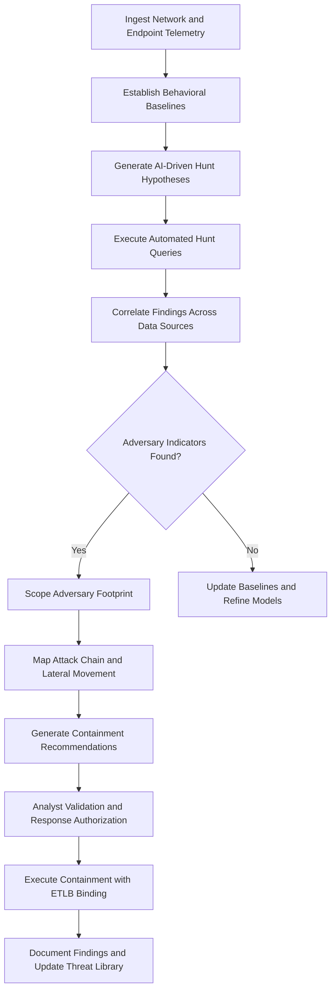

# Cyber Threat Hunting Platform

Frankmax

NAICS 334511

> **Defense / Security / Intelligence** — Cyber Threat Hunting Platform Module

## Objective & Purpose

Advanced persistent threats (APTs) targeting defense networks maintain average dwell times of 150-280 days before detection. During this period, adversaries conduct reconnaissance, establish persistence, move laterally, and exfiltrate data while evading conventional signature-based security tools. Traditional security operations centers are overwhelmed by alert volumes exceeding 10,000 per day, of which over 95% are false positives, making manual threat hunting impractical at the scale required to defend classified and mission-critical networks.

The Cyber Threat Hunting Platform provides AI-driven proactive threat detection that continuously searches for adversary presence across defense networks without relying on known signatures. The system analyzes network traffic baselines, endpoint behavior patterns, authentication anomalies, and lateral movement indicators to identify threat actors who have bypassed perimeter defenses. Machine learning models trained on APT tradecraft generate hunt hypotheses automatically, directing analyst attention to the most promising areas of investigation rather than requiring manual hypothesis generation.

All hunting activities and findings are governed by ETLB protocols that bind liability for response actions to specific authorization chains. The ORF framework provides complete audit trails from initial detection through containment and remediation, supporting both incident response and post-incident forensic review. MCO (Mortality Compliance Object) protocols ensure that any defensive actions with potential kinetic effects in cyber-physical systems follow appropriate escalation paths.

## Business Context

| Attribute | Value |
|---|---|
| **Business Process** | Threat detection and response |
| **Business Function** | Cybersecurity |
| **Category** | Security |
| **Target Audience** | 2. Defense / Security / Intelligence |
| **Bundle** | Defense and Intelligence Pack ($25,000/mo) |
| **Monthly Cost of Inaction** | $400,000 in undetected breach costs and data exfiltration losses |

## BPMN Workflow

## Features

1. **Automated Hunt Hypothesis Generation** — Machine learning models analyze current threat intelligence, network architecture, and adversary tradecraft patterns to generate prioritized hunt hypotheses that direct analyst effort toward the highest-probability threat areas.

2. **Behavioral Baseline Engine** — Continuously builds and updates behavioral baselines for users, endpoints, services, and network segments, detecting deviations that indicate compromise even when adversaries use legitimate credentials and tools.

3. **Lateral Movement Detection** — Specializes in identifying adversary lateral movement through techniques including pass-the-hash, Kerberos ticket manipulation, remote service exploitation, and living-off-the-land binary usage.

4. **APT Tradecraft Library** — Maintains a continuously updated library of nation-state and advanced adversary techniques mapped to MITRE ATT&CK, enabling pattern matching against known APT campaigns and their variants.

5. **Forensic Evidence Preservation** — Automatically preserves forensic evidence when adversary activity is detected, maintaining chain-of-custody documentation that supports legal proceedings and counterintelligence investigations.

6. **Containment Orchestration** — Provides automated containment playbooks that can isolate compromised systems, revoke credentials, and block adversary infrastructure while maintaining mission-critical service continuity.

7. **Cross-Domain Hunting** — Hunts across classified and unclassified network segments simultaneously using cross-domain solutions, identifying adversaries who exploit network boundary transitions.

8. **Deception Integration** — Deploys and monitors honeypots, honey tokens, and deceptive network artifacts to detect adversary reconnaissance and lateral movement with near-zero false positive rates.

## Workflow & Automation

**Step 1: Telemetry Collection** — Network flow data, endpoint detection logs, authentication events, DNS queries, and proxy logs are continuously ingested from across the defense network environment.

**Step 2: Baseline Establishment** — The system builds behavioral baselines for all network entities over a configurable learning period, establishing normal patterns for user behavior, service communications, and data flows.

**Step 3: Hypothesis Generation** — Current threat intelligence, recent vulnerability disclosures, and adversary tradecraft patterns are analyzed to generate hunt hypotheses ranked by likelihood and potential impact.

**Step 4: Hunt Execution** — Automated queries execute against collected telemetry to test each hypothesis. Results are correlated across data sources to reduce false positives and build comprehensive detection pictures.

**Step 5: Scoping and Mapping** — When adversary indicators are confirmed, the system automatically scopes the full extent of adversary presence including all compromised accounts, systems, and data access.

**Step 6: Response Coordination** — Containment recommendations are generated with ETLB-compliant authorization chains. Analyst-approved containment actions are executed with full audit logging.

**Step 7: Post-Hunt Documentation** — All findings, response actions, and lessons learned are documented and fed back into the threat library and baseline models to improve future hunting effectiveness.

## Input/Output Specifications

| Direction | Data | Format | Description |
|---|---|---|---|
| Input | Network flow data | NetFlow v9/IPFIX | Traffic metadata from network sensors |
| Input | Endpoint telemetry | JSON/CEF | Process execution, file access, registry changes |
| Input | Authentication logs | Syslog/JSON | Login events, privilege escalation, ticket requests |
| Input | Threat intelligence | STIX/TAXII 2.1 | Current adversary indicators and TTPs |
| Output | Hunt findings | STIX 2.1/JSON | Confirmed adversary activity and indicators |
| Output | Incident reports | PDF/JSON | Comprehensive attack chain documentation |
| Output | Containment playbooks | YAML/JSON | Automated response action sequences |

## Integration Points

| System | Integration Type | Data Flow |
|---|---|---|
| SIEM/SOAR Platforms | REST API/Syslog | Bidirectional alert and telemetry exchange |
| Endpoint Detection and Response (EDR) | API | Inbound endpoint telemetry, outbound containment |
| Threat Pattern Recognition Engine | Internal API | Inbound threat patterns for hypothesis generation |
| Network Defense Systems | API | Outbound containment actions and block lists |
| Forensic Analysis Tools | File exchange | Outbound preserved evidence packages |
| ORF Compliance Layer | Event-driven | Outbound incident lifecycle and response audit |

## Pricing & Revenue Model

| Component | Price |
|---|---|
| **Bundle** | Defense and Intelligence Pack |
| **Bundle Price** | $25,000/mo |
| **Standalone Module** | $5,200/mo |
| **Managed Hunt Service Add-on** | $8,000/mo |
| **Implementation** | $45,000 one-time |

Revenue is driven by the bundled Defense and Intelligence Pack with significant upside from the managed hunt service add-on for organizations lacking internal threat hunting expertise. The forensic evidence preservation, containment orchestration, and ETLB-compliant response authorization represent high-margin "fries" at 88% margin. The deception integration and APT tradecraft library create "kitchen" moat value that compounds as the system accumulates adversary behavioral data across deployments.

## NAICS/SIC Mapping

| NAICS | SIC | Industry | Relevance |
|---|---|---|---|
| 334511 | 3812 | Search, Detection, and Navigation Instruments | Primary — threat detection systems |
| 928110 | 9711 | National Security | Cyber defense for national security networks |
| 541512 | 7372 | Computer Systems Design Services | Cybersecurity system integration |
| 541715 | 8711 | R&D in Physical, Engineering, and Life Sciences | Cyber threat research and development |
