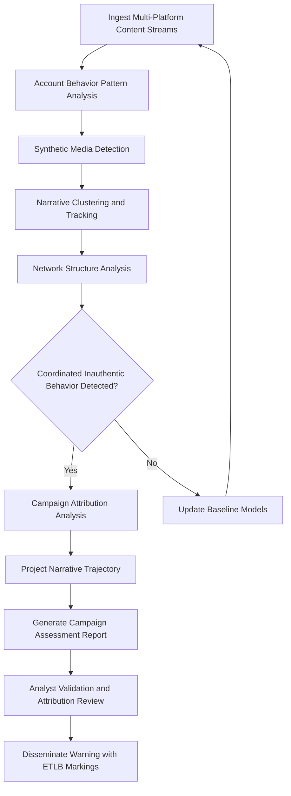

# Disinformation Detection Engine

Frankmax

NAICS 928110

> **Defense / Security / Intelligence** — Disinformation Detection Engine Module

## Objective & Purpose

State-sponsored disinformation campaigns represent one of the most significant asymmetric threats facing democratic nations and allied coalitions. These campaigns operate at machine speed, deploying coordinated networks of inauthentic accounts, AI-generated content, manipulated media, and amplification bots to shape public perception, undermine institutional trust, and influence strategic decision-making. Traditional counter-disinformation efforts rely on manual analysis that cannot keep pace with the volume, velocity, and sophistication of modern information operations.

The Disinformation Detection Engine applies AI-driven analysis across social media platforms, news outlets, messaging applications, and dark web forums to identify coordinated inauthentic behavior (CIB), AI-generated synthetic media, narrative manipulation campaigns, and amplification networks. The system distinguishes organic discourse from manufactured narratives by analyzing account behavior patterns, content propagation dynamics, network structures, and linguistic fingerprints. Analysts receive real-time dashboards showing active campaigns, attribution indicators, target audiences, and projected narrative trajectories.

All detection activities are governed by ORF protocols ensuring full provenance documentation from initial detection through validated assessment and attribution. ETLB bindings prevent automated attribution assertions from being published without human validation, recognizing the geopolitical consequences of false attribution. The system maintains strict boundaries between foreign-targeted detection (authorized) and domestic content monitoring (restricted), with configurable compliance controls reflecting national legal frameworks.

## Business Context

| Attribute | Value |
|---|---|
| **Business Process** | Information warfare defense |
| **Business Function** | Information Ops |
| **Category** | Security |
| **Target Audience** | 2. Defense / Security / Intelligence |
| **Bundle** | Defense and Intelligence Pack ($25,000/mo) |
| **Monthly Cost of Inaction** | $280,000 in narrative damage and counter-messaging response costs |

## BPMN Workflow

## Features

1. **Coordinated Inauthentic Behavior Detection** — Identifies networks of accounts exhibiting coordinated posting patterns, shared infrastructure indicators, and synchronized amplification behavior that distinguish manufactured campaigns from organic discourse.

2. **Synthetic Media Identification** — Detects AI-generated text, deepfake video, manipulated images, and cloned audio using forensic analysis techniques including artifact detection, provenance verification, and statistical anomaly identification.

3. **Narrative Tracking and Clustering** — Maps the evolution and propagation of narratives across platforms, identifying origin points, amplification vectors, mutation patterns, and target audience segments.

4. **Attribution Indicator Analysis** — Correlates technical indicators (infrastructure, timing, language patterns), tactical indicators (tradecraft signatures), and strategic indicators (narrative alignment) to assess campaign attribution with quantified confidence levels.

5. **Cross-Platform Monitoring** — Monitors content across social media platforms, news websites, messaging applications, forums, and dark web channels simultaneously, detecting campaigns that operate across multiple platforms to avoid single-platform detection.

6. **Narrative Trajectory Projection** — Models the likely evolution of detected narratives based on current momentum, amplification patterns, and historical campaign lifecycle data, enabling proactive counter-narrative planning.

7. **Legal Compliance Controls** — Implements configurable compliance boundaries that restrict monitoring based on national legal frameworks, distinguishing between foreign-targeted and domestic content with automated enforcement of jurisdictional restrictions.

8. **Counter-Narrative Effectiveness Measurement** — Measures the impact of counter-disinformation responses by tracking narrative reach decay, audience disengagement, and sentiment shifts following defensive actions.

## Workflow & Automation

**Step 1: Content Ingestion** — Multi-platform content streams are continuously ingested from social media APIs, web scrapers, RSS feeds, and messaging platform monitors with metadata preservation and source classification.

**Step 2: Behavior Analysis** — Account behavior patterns are analyzed for indicators of inauthenticity including posting cadence anomalies, account age vs. activity volume mismatches, and coordinated action timing.

**Step 3: Content Analysis** — Content is analyzed for synthetic generation indicators, narrative framing patterns, emotional manipulation techniques, and factual accuracy against verified information databases.

**Step 4: Network Mapping** — Amplification networks are mapped by tracing content sharing patterns, follower network overlaps, and cross-platform coordination to identify the infrastructure supporting detected campaigns.

**Step 5: Campaign Assessment** — When coordinated inauthentic behavior is confirmed, the system generates comprehensive campaign assessments including scope, attribution indicators, target audience analysis, and projected trajectory.

**Step 6: Attribution Review** — All attribution assessments undergo mandatory human review before publication, with ETLB bindings documenting the confidence level and limitations of each attribution judgment.

## Input/Output Specifications

| Direction | Data | Format | Description |
|---|---|---|---|
| Input | Social media content | JSON/API streams | Posts, comments, shares, account metadata |
| Input | News and media content | RSS/HTML | Published articles and multimedia content |
| Input | Messaging platform data | JSON | Public channel content and metadata |
| Input | Known campaign signatures | STIX 2.1/JSON | Historical campaign indicators and TTPs |
| Output | Campaign assessment reports | PDF/JSON | Comprehensive disinformation campaign analysis |
| Output | Attribution analyses | PDF/JSON | Confidence-weighted attribution assessments |
| Output | Real-time dashboards | REST API/WebSocket | Live campaign tracking and narrative mapping |

## Integration Points

| System | Integration Type | Data Flow |
|---|---|---|
| Social Media Platform APIs | REST API | Inbound content and account data |
| Multi-Source Intelligence Fusion | Internal API | Bidirectional intelligence and attribution data |
| Threat Pattern Recognition Engine | Internal API | Outbound narrative patterns as threat indicators |
| Strategic Communications Units | Secure API | Outbound campaign assessments for counter-response |
| Allied Information Sharing Networks | Secure gateway | Bidirectional campaign intelligence sharing |
| ORF Compliance Layer | Event-driven | Outbound detection and attribution audit trail |

## Pricing & Revenue Model

| Component | Price |
|---|---|
| **Bundle** | Defense and Intelligence Pack |
| **Bundle Price** | $25,000/mo |
| **Standalone Module** | $4,600/mo |
| **Additional Platform Monitoring** | $400/mo per platform |
| **Implementation** | $30,000 one-time |

Revenue flows through the bundled Defense and Intelligence Pack with incremental revenue from additional platform monitoring subscriptions. The attribution analysis, legal compliance controls, and counter-narrative measurement capabilities represent high-margin "fries" at 89% margin. The continuously growing campaign signature database creates "kitchen" moat value — historical campaign fingerprints enable faster detection of recurring adversary tradecraft.

## NAICS/SIC Mapping

| NAICS | SIC | Industry | Relevance |
|---|---|---|---|
| 928110 | 9711 | National Security | Primary — information warfare defense |
| 541715 | 8711 | R&D in Physical, Engineering, and Life Sciences | Disinformation research and detection technology |
| 334511 | 3812 | Search, Detection, and Navigation Instruments | Information detection and analysis systems |
| 519130 | 7375 | Internet Publishing and Broadcasting | Digital content monitoring and analysis |
