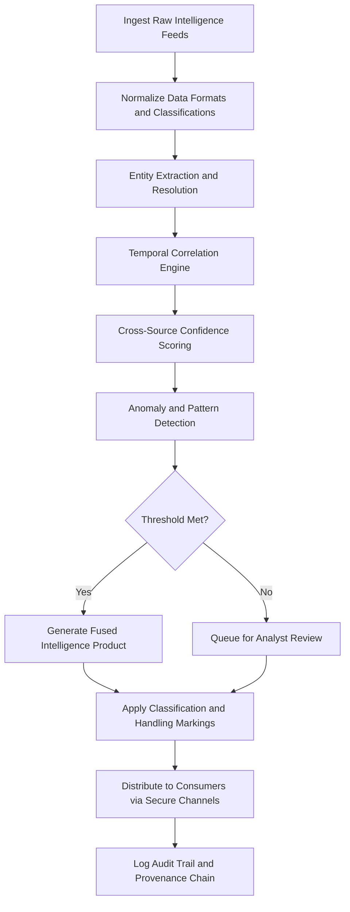

# Multi-Source Intelligence Fusion

Frankmax

NAICS 928110

> **Defense / Security / Intelligence** — Multi-Source Intelligence Fusion Module

## Objective & Purpose

Intelligence analysts operating across defense, national security, and allied coalition environments face a persistent challenge: the volume and velocity of incoming data from disparate collection disciplines far exceeds human processing capacity. Open-source intelligence (OSINT), signals intelligence (SIGINT), human intelligence (HUMINT), geospatial intelligence (GEOINT), and measurement and signature intelligence (MASINT) each arrive in different formats, classification levels, and temporal cadences. Without automated fusion, critical correlations remain buried in siloed databases while analysts spend 60-80% of their time on data preparation rather than sense-making.

The Multi-Source Intelligence Fusion module applies AI-driven entity resolution, temporal correlation, and confidence-weighted synthesis to ingest intelligence products from multiple collection disciplines simultaneously. The system normalizes disparate data streams into a unified intelligence picture, automatically identifies entity overlaps across sources, and surfaces anomalies that no single collection discipline would reveal in isolation. By reducing the data-to-insight cycle from days to minutes, analysts can focus on higher-order assessments and decision support.

This module enforces ORF (Obligation and Responsibility Finality) protocols to ensure every fused intelligence product carries full provenance metadata, source reliability ratings, and classification markings. ETLB (Execution-Time Liability Binding) guarantees that downstream consumers of fused products inherit the correct handling restrictions from the most restrictive contributing source, preventing inadvertent spillage or misattribution.

## Business Context

| Attribute | Value |
|---|---|
| **Business Process** | OSINT/SIGINT/HUMINT synthesis |
| **Business Function** | Intelligence Analysis |
| **Category** | Analytics |
| **Target Audience** | 2. Defense / Security / Intelligence |
| **Bundle** | Defense and Intelligence Pack ($25,000/mo) |
| **Monthly Cost of Inaction** | $180,000 in analyst overtime and missed threat correlations |

## BPMN Workflow

## Features

1. **Multi-Discipline Ingestion** — Accepts structured and unstructured data from OSINT, SIGINT, HUMINT, GEOINT, and MASINT feeds with automatic format normalization and schema mapping across NATO STANAG-compliant formats.

2. **Entity Resolution Engine** — Identifies and merges references to the same real-world entity across disparate sources using probabilistic matching, alias resolution, and phonetic similarity scoring in over 40 languages.

3. **Temporal Correlation Analysis** — Aligns events across time zones, calendar systems, and reporting delays to establish accurate activity timelines and detect coordination patterns that span multiple intelligence streams.

4. **Confidence-Weighted Synthesis** — Assigns and propagates source reliability ratings (A through F) and information accuracy codes (1 through 6) following NATO Admiralty System standards throughout the fusion process.

5. **Anomaly Surface Detection** — Identifies data points that contradict established patterns, highlight gaps in collection coverage, or suggest deception operations through statistical deviation analysis and adversarial model testing.

6. **Classification Guard** — Automatically applies the most restrictive classification marking from contributing sources and prevents downgrade without explicit authority, enforcing ETLB compliance at every fusion point.

7. **Coalition Sharing Controls** — Manages REL TO and NOFORN restrictions across allied intelligence sharing agreements, ensuring fused products respect bilateral and multilateral dissemination constraints.

## Workflow & Automation

**Step 1: Feed Registration** — Intelligence feeds are registered with source metadata including collection discipline, reliability history, update frequency, and classification ceiling. Each feed receives a unique provenance identifier.

**Step 2: Continuous Ingestion** — The system continuously ingests data from registered feeds, buffering and batching as needed to handle variable throughput. Raw data is preserved in its original format alongside normalized versions.

**Step 3: Entity Extraction** — Named entity recognition, geospatial coordinate extraction, temporal reference parsing, and relationship identification are performed automatically. Extracted entities are matched against existing knowledge graphs.

**Step 4: Cross-Source Fusion** — Entities and events confirmed across multiple independent sources are merged with elevated confidence scores. Contradictions are flagged for analyst adjudication with side-by-side source comparison.

**Step 5: Pattern Analysis** — The fused dataset is analyzed for emerging patterns, trend shifts, and activity clusters that were not visible in any single source. Results are ranked by novelty and operational relevance.

**Step 6: Product Generation** — Fused intelligence products are automatically formatted according to consumer requirements, whether intelligence summaries, structured data exports, or geospatial overlays.

**Step 7: Distribution and Audit** — Products are distributed through secure channels with full audit logging. Every downstream access is recorded with consumer identity, timestamp, and handling acknowledgment.

## Input/Output Specifications

| Direction | Data | Format | Description |
|---|---|---|---|
| Input | OSINT feeds | RSS/JSON/HTML | Open-source media, social platforms, public records |
| Input | SIGINT reports | XML/STIX | Signals intelligence products and intercepts |
| Input | HUMINT reports | ICD 203 format | Human source reporting with source protection |
| Input | GEOINT imagery | GeoTIFF/KML | Satellite and aerial imagery with metadata |
| Output | Fused intelligence products | STIX 2.1/JSON | Correlated multi-source assessments |
| Output | Confidence matrices | CSV/JSON | Source reliability and information accuracy scores |
| Output | Audit trail | Syslog/JSON | Full provenance chain for every fusion decision |

## Integration Points

| System | Integration Type | Data Flow |
|---|---|---|
| National Intelligence Databases | API/Batch | Bidirectional entity and report exchange |
| Allied Coalition Networks | STANAG-compliant gateway | Outbound fused products with REL TO controls |
| Geospatial Platforms (GIS) | OGC WMS/WFS | Bidirectional spatial data overlay |
| Analyst Workstations | REST API | Inbound queries, outbound products |
| Threat Pattern Recognition Engine | Internal API | Outbound fused data for pattern analysis |
| ORF Compliance Layer | Event-driven | Outbound obligation verification per product |

## Pricing & Revenue Model

| Component | Price |
|---|---|
| **Bundle** | Defense and Intelligence Pack |
| **Bundle Price** | $25,000/mo |
| **Standalone Module** | $4,500/mo |
| **Per-Feed Ingestion Add-on** | $300/mo per additional feed |
| **Implementation** | $35,000 one-time |

Revenue from the Multi-Source Intelligence Fusion module flows primarily through the bundled Defense and Intelligence Pack. The governance and compliance layers (ORF provenance tracking, classification guard, coalition sharing controls) represent high-margin "fries" revenue at 85% margin, while the base fusion capability serves as the "burger" drawing customers into the broader ecosystem.

## NAICS/SIC Mapping

| NAICS | SIC | Industry | Relevance |
|---|---|---|---|
| 928110 | 9711 | National Security | Primary — intelligence fusion for national defense |
| 541715 | 8711 | R&D in Physical, Engineering, and Life Sciences | Defense research and analysis support |
| 334511 | 3812 | Search, Detection, and Navigation Instruments | Sensor data integration and processing |
| 541990 | 7389 | All Other Professional, Scientific, and Technical Services | Intelligence consulting and support |
