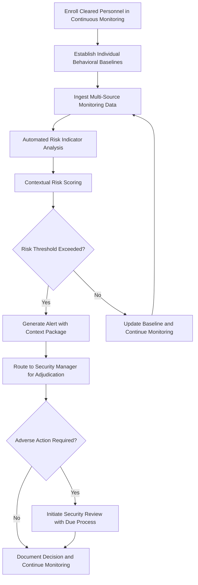

# Personnel Security Continuous Eval

Frankmax

NAICS 928110

> **Defense / Security / Intelligence** — Personnel Security Continuous Eval Module

## Objective & Purpose

Traditional personnel security relies on periodic reinvestigations conducted every five to ten years, creating a dangerous gap between clearance adjudication events. During these intervals, cleared personnel may develop financial vulnerabilities, foreign contacts, substance abuse problems, or ideological shifts that create insider threat risk. High-profile espionage cases consistently reveal that warning indicators were present for years before detection but fell between the cracks of point-in-time investigation cycles. The periodic reinvestigation model is both expensive (over $2 billion annually across the U.S. government) and ineffective at detecting evolving risk.

The Personnel Security Continuous Eval module replaces the periodic reinvestigation model with continuous, automated monitoring of cleared personnel across financial, criminal, travel, social media, and behavioral indicators. The system continuously evaluates risk across multiple data streams, generates alerts when indicator patterns cross configurable thresholds, and provides security managers with contextualized risk assessments that distinguish genuine concerns from benign life changes. By detecting risk indicators in near-real-time rather than during five-year investigation cycles, organizations can intervene before vulnerabilities are exploited.

All monitoring activities are governed by strict privacy protections and ETLB protocols ensuring that automated alerts require human adjudication before any adverse action. The ORF framework maintains complete records of every monitoring event, alert, and adjudication decision, supporting both due process requirements and security oversight audits. The system is designed to balance security effectiveness with civil liberties protections required under Executive Order and statutory authority.

## Business Context

| Attribute | Value |
|---|---|
| **Business Process** | Security clearance monitoring |
| **Business Function** | Personnel Security |
| **Category** | HR/Security |
| **Target Audience** | 2. Defense / Security / Intelligence |
| **Bundle** | Defense and Intelligence Pack ($25,000/mo) |
| **Monthly Cost of Inaction** | $220,000 in insider threat risk exposure and reinvestigation backlogs |

## BPMN Workflow

## Features

1. **Multi-Source Continuous Monitoring** — Continuously monitors financial records, criminal databases, court records, travel data, and publicly available social media for indicators relevant to security clearance adjudication criteria.

2. **Contextual Risk Scoring** — Evaluates individual indicators within the context of the person's baseline behavior, role sensitivity, access level, and personal circumstances to distinguish genuine security concerns from normal life events.

3. **Financial Vulnerability Detection** — Monitors for unexplained wealth, sudden financial distress, gambling patterns, and financial relationships with foreign nationals that may indicate vulnerability to coercion or active recruitment.

4. **Foreign Contact and Travel Analysis** — Tracks foreign travel patterns and identifies unreported foreign contacts or travel to countries of intelligence concern, comparing against self-reported disclosures.

5. **Behavioral Anomaly Detection** — Identifies changes in work patterns, network access behavior, data handling practices, and facility access that may indicate insider threat activity or pre-attack reconnaissance.

6. **Privacy-Preserving Architecture** — Implements privacy-by-design principles including data minimization, purpose limitation, and anonymization of non-alerting data to comply with statutory privacy requirements and Executive Order guidelines.

7. **Adjudication Decision Support** — Provides security managers with comprehensive context packages including indicator history, baseline comparisons, and relevant adjudicative guidelines when alerts require human review.

## Workflow & Automation

**Step 1: Enrollment** — Cleared personnel are enrolled in continuous monitoring with their authorization level, access permissions, role sensitivity classification, and self-reported personal circumstances recorded.

**Step 2: Baseline Establishment** — The system establishes individual behavioral baselines across all monitored data streams during an initial observation period, accounting for personal circumstances and role-specific patterns.

**Step 3: Continuous Data Ingestion** — Financial, criminal, travel, public records, and behavioral data are continuously ingested from authorized sources. Data is processed in compliance with privacy regulations and legal authorities.

**Step 4: Indicator Analysis** — Each data point is evaluated against security clearance adjudicative criteria. The system assesses whether indicators, individually or in combination, suggest elevated risk.

**Step 5: Contextual Scoring** — Indicators that meet initial screening criteria are further evaluated in context. A large withdrawal might be flagged initially but scored as low-risk when correlated with a home purchase record.

**Step 6: Alert Generation** — When risk scores exceed configurable thresholds, alerts are generated with full context packages and routed to designated security managers for human adjudication.

**Step 7: Adjudication and Documentation** — Security managers review alerts, make adjudication decisions, and document outcomes. All decisions are archived with ORF-compliant provenance for oversight and due process requirements.

## Input/Output Specifications

| Direction | Data | Format | Description |
|---|---|---|---|
| Input | Financial records | CSV/JSON | Credit reports, banking alerts, financial disclosures |
| Input | Criminal and court records | JSON/XML | Arrest records, civil proceedings, court filings |
| Input | Travel records | JSON | Border crossing data, travel bookings, passport events |
| Input | Network access logs | Syslog/JSON | System access, data handling, facility entry logs |
| Output | Risk alerts | JSON/PDF | Contextualized risk assessments for security managers |
| Output | Adjudication records | PDF/JSON | Documented decisions with supporting evidence |
| Output | Compliance reports | PDF/CSV | Program statistics and oversight reporting |

## Integration Points

| System | Integration Type | Data Flow |
|---|---|---|
| Personnel Security Databases | API/Batch | Bidirectional clearance and enrollment data |
| Financial Monitoring Services | Secure API | Inbound credit and financial alert data |
| Criminal Records Databases | API | Inbound criminal history and court records |
| Insider Threat Programs | Secure API | Outbound risk indicators and alert data |
| Security Oversight Bodies | Secure file exchange | Outbound compliance and audit reports |
| ORF Compliance Layer | Event-driven | Outbound monitoring and adjudication audit trail |

## Pricing & Revenue Model

| Component | Price |
|---|---|
| **Bundle** | Defense and Intelligence Pack |
| **Bundle Price** | $25,000/mo |
| **Standalone Module** | $3,800/mo |
| **Per-Person Monitoring** | $15/mo per enrolled individual |
| **Implementation** | $28,000 one-time |

Revenue scales predictably with the number of enrolled personnel, creating a volume-based recurring revenue stream alongside the bundled Defense and Intelligence Pack. The privacy-preserving architecture and adjudication decision support features represent high-margin "fries" at 91% margin. Per-person monitoring fees create a direct correlation between customer workforce size and revenue, providing natural expansion revenue as organizations grow their cleared workforce.

## NAICS/SIC Mapping

| NAICS | SIC | Industry | Relevance |
|---|---|---|---|
| 928110 | 9711 | National Security | Primary — personnel security for national defense |
| 541715 | 8711 | R&D in Physical, Engineering, and Life Sciences | Security research and behavioral analysis |
| 561611 | 7382 | Investigation Services | Personnel investigation and monitoring |
| 541612 | 8742 | Human Resources Consulting Services | Personnel security program management |
