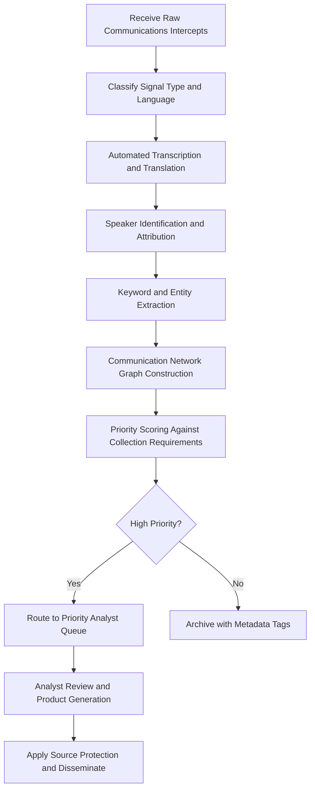

# Secure Communications Analyzer

Frankmax

NAICS 928110

> **Defense / Security / Intelligence** — Secure Communications Analyzer Module

## Objective & Purpose

The volume of intercepted communications across electromagnetic spectrum, digital networks, and encrypted channels has grown exponentially, far exceeding the capacity of human analysts to process, translate, and assess. Intelligence agencies report that less than 5% of collected signals intelligence receives human review, meaning 95% of potentially actionable intelligence is archived without analysis. This creates an operational paradox where more collection capability produces less analytical coverage.

The Secure Communications Analyzer applies natural language processing, speech recognition, pattern-of-life analysis, and network graph modeling to process intercepted communications at machine speed. The system handles over 40 languages with dialect-aware transcription, identifies communication network structures from metadata alone, and surfaces high-priority intercepts based on configurable criteria including keyword triggers, entity mentions, behavioral anomalies, and communication pattern changes. Analysts receive prioritized queues of pre-processed intercepts with automated translations, speaker identification, and contextual annotations.

All processing occurs under strict ETLB governance ensuring that automated analysis outputs carry explicit handling restrictions. The ORF framework maintains complete chain-of-custody documentation from raw intercept through processed product, supporting both legal proceedings and intelligence oversight requirements. Source protection mechanisms ensure that collection methods and capabilities are never exposed in downstream products.

## Business Context

| Attribute | Value |
|---|---|
| **Business Process** | Communications monitoring |
| **Business Function** | SIGINT |
| **Category** | Intelligence |
| **Target Audience** | 2. Defense / Security / Intelligence |
| **Bundle** | Defense and Intelligence Pack ($25,000/mo) |
| **Monthly Cost of Inaction** | $200,000 in unprocessed signals intelligence and missed intercepts |

## BPMN Workflow

## Features

1. **Multi-Language Processing** — Supports automated transcription and translation across over 40 languages with dialect-aware models that distinguish regional variants, code-switching, and domain-specific jargon used in military and intelligence contexts.

2. **Speaker Identification** — Voiceprint analysis identifies known speakers and clusters unknown speakers across intercepts, building speaker profiles over time even when names are never used in communications.

3. **Network Graph Analysis** — Constructs and continuously updates communication network graphs from metadata (who contacts whom, when, how often, through what channels) to reveal organizational structures and identify key nodes.

4. **Pattern-of-Life Detection** — Establishes baseline communication patterns for entities of interest and alerts when deviations occur, such as unusual contact timing, new communication partners, or changes in encryption usage.

5. **Priority Scoring Engine** — Scores every intercept against active collection requirements, standing intelligence priorities, and analyst-defined criteria to ensure the most operationally relevant communications reach human review first.

6. **Source Protection Layer** — Automatically strips collection method indicators from downstream products and applies handling caveats that prevent inadvertent exposure of signals intelligence capabilities.

7. **Encrypted Traffic Analysis** — Even when content decryption is not possible, analyzes traffic patterns, message sizes, timing, and protocol characteristics to extract intelligence value from encrypted communications metadata.

## Workflow & Automation

**Step 1: Intercept Reception** — Raw communications intercepts are received from collection systems with associated metadata including time, frequency, geolocation, and collection platform identifier.

**Step 2: Signal Classification** — The system classifies each intercept by signal type (voice, text, data), language, and encryption status. Encrypted intercepts are routed to separate processing pipelines.

**Step 3: Transcription and Translation** — Voice intercepts are transcribed using dialect-aware speech recognition. Non-English content is translated with preservation of nuance, idiom, and ambiguity markers.

**Step 4: Entity and Keyword Extraction** — Named entities, locations, organizations, technical terms, and collection requirement keywords are extracted and linked to existing intelligence databases.

**Step 5: Network Mapping** — Communication metadata is used to update network graphs, identify new connections, and flag changes in established communication patterns.

**Step 6: Priority Assessment** — Each processed intercept is scored against active collection requirements. Intercepts matching priority criteria are routed to analyst queues with pre-populated context.

**Step 7: Dissemination** — Analyst-validated products are disseminated with appropriate classification, source protection caveats, and ORF-compliant provenance documentation.

## Input/Output Specifications

| Direction | Data | Format | Description |
|---|---|---|---|
| Input | Voice intercepts | WAV/FLAC | Audio recordings from collection platforms |
| Input | Text intercepts | Raw text/binary | Digital communications captures |
| Input | Metadata records | JSON/XML | Time, frequency, geolocation, protocol data |
| Input | Collection requirements | JSON | Priority intelligence requirements and keywords |
| Output | Transcribed and translated intercepts | JSON/PDF | Processed communications with annotations |
| Output | Network graphs | GraphML/JSON | Communication relationship maps |
| Output | Priority alerts | STIX 2.1/JSON | High-priority intercept notifications |

## Integration Points

| System | Integration Type | Data Flow |
|---|---|---|
| Collection Platforms | Secure file transfer | Inbound raw intercepts and metadata |
| Multi-Source Intelligence Fusion | Internal API | Outbound processed SIGINT for fusion |
| Threat Pattern Recognition Engine | Internal API | Outbound communication pattern anomalies |
| Language Processing Services | API | Bidirectional translation and transcription |
| Intelligence Oversight Systems | Audit API | Outbound compliance and minimization records |
| ORF Compliance Layer | Event-driven | Outbound chain-of-custody documentation |

## Pricing & Revenue Model

| Component | Price |
|---|---|
| **Bundle** | Defense and Intelligence Pack |
| **Bundle Price** | $25,000/mo |
| **Standalone Module** | $4,800/mo |
| **Additional Language Packs** | $500/mo per language group |
| **Implementation** | $35,000 one-time |

Revenue from the Secure Communications Analyzer is driven by the bundled Defense and Intelligence Pack with incremental revenue from additional language pack subscriptions. The source protection layer and oversight compliance features represent high-margin "fries" at 88% margin, while the core transcription and translation engine serves as the "burger" entry point. Organizations processing high intercept volumes generate predictable recurring revenue through volume-based tiering.

## NAICS/SIC Mapping

| NAICS | SIC | Industry | Relevance |
|---|---|---|---|
| 928110 | 9711 | National Security | Primary — signals intelligence for national security |
| 541715 | 8711 | R&D in Physical, Engineering, and Life Sciences | Communications research and analysis |
| 334511 | 3812 | Search, Detection, and Navigation Instruments | Signal processing and detection systems |
| 517110 | 4813 | Wired Telecommunications Carriers | Communications infrastructure analysis |
