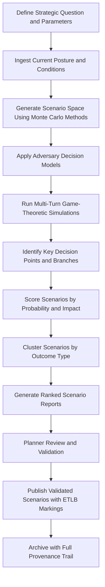

# Strategic Scenario Modeler

Frankmax

NAICS 541715

> **Defense / Security / Intelligence** — Strategic Scenario Modeler Module

## Objective & Purpose

Strategic planning in defense and national security environments has historically been constrained by human cognitive bandwidth. Traditional wargaming exercises involve small teams, take weeks to execute, and typically explore fewer than a dozen scenarios. This leaves vast swaths of the possibility space unexamined, creating blind spots that adversaries can exploit. When strategic surprise occurs, it almost always originates from scenarios that planners considered but lacked the capacity to fully model.

The Strategic Scenario Modeler uses AI-driven simulation to generate, evaluate, and stress-test over 1,000 strategic scenarios in the time it takes a human team to manually develop five. The system ingests current force postures, alliance structures, economic conditions, and adversary capabilities to construct a probabilistic scenario space. Each scenario is run through multi-turn game-theoretic simulations that model adversary responses, coalition dynamics, and escalation pathways. Planners receive ranked scenarios with probability distributions, key decision points, and identified branches where small interventions produce outsized strategic effects.

The module operates under strict ETLB governance to ensure that scenario outputs carry explicit liability markings distinguishing AI-generated projections from validated assessments. ORF protocols track every scenario from generation through review, preventing unvalidated AI projections from being cited as intelligence assessments without appropriate caveats and human endorsement.

## Business Context

| Attribute | Value |
|---|---|
| **Business Process** | Wargaming and scenario planning |
| **Business Function** | Strategic Planning |
| **Category** | Planning |
| **Target Audience** | 2. Defense / Security / Intelligence |
| **Bundle** | Defense and Intelligence Pack ($25,000/mo) |
| **Monthly Cost of Inaction** | $300,000 in strategic planning labor and unexamined scenario risk |

## BPMN Workflow

## Features

1. **Massive Scenario Generation** — Produces over 1,000 unique strategic scenarios using Monte Carlo sampling across geopolitical, military, economic, and technological variable spaces with configurable granularity and time horizons.

2. **Adversary Decision Modeling** — Incorporates game-theoretic models of adversary decision-making based on historical behavior, doctrine analysis, and capability assessments to generate realistic adversary responses at each scenario branch.

3. **Escalation Pathway Mapping** — Identifies escalation ladders and off-ramps within each scenario, highlighting decision points where actions by either side are most likely to trigger escalation or create opportunities for de-escalation.

4. **Coalition Dynamics Simulation** — Models alliance behavior including burden-sharing calculations, political will constraints, and domestic audience costs to project realistic coalition responses rather than assuming monolithic alliance action.

5. **Sensitivity Analysis** — Identifies variables with disproportionate impact on scenario outcomes, allowing planners to focus intelligence collection and policy attention on the factors that matter most.

6. **Historical Precedent Linking** — Automatically identifies historical parallels for generated scenarios and quantifies similarity scores, providing planners with real-world reference points for otherwise abstract projections.

7. **Interactive Branching** — Allows planners to inject decisions at any point in a scenario tree and observe cascading effects, enabling real-time exploration of "what-if" questions during planning sessions.

## Workflow & Automation

**Step 1: Problem Framing** — Planners define the strategic question, geographic scope, time horizon, and key actors. The system validates parameters against available data coverage and flags gaps.

**Step 2: Condition Ingestion** — Current force dispositions, economic indicators, alliance relationships, and adversary capabilities are ingested from intelligence databases and open-source monitoring.

**Step 3: Scenario Generation** — Monte Carlo methods generate a broad scenario space. Variables are sampled from probability distributions derived from historical data and expert assessments.

**Step 4: Simulation Execution** — Each scenario is run through multi-turn simulations with adversary decision models responding to each action. Coalition dynamics and third-party reactions are modeled at each turn.

**Step 5: Analysis and Ranking** — Completed scenarios are scored by probability, impact severity, and strategic consequence. Clustering algorithms group similar outcomes to reduce cognitive load.

**Step 6: Report Generation** — Ranked scenarios are formatted into actionable planning documents with decision trees, sensitivity analyses, and historical precedent links.

**Step 7: Validation and Publication** — Planners review, annotate, and validate scenarios. Published scenarios carry ETLB markings distinguishing AI projections from human-validated assessments.

## Input/Output Specifications

| Direction | Data | Format | Description |
|---|---|---|---|
| Input | Force posture data | JSON/XML | Current military dispositions and readiness |
| Input | Economic indicators | CSV/JSON | GDP, trade flows, sanctions data, energy markets |
| Input | Alliance structure data | JSON | Treaty obligations, command structures, political alignment |
| Input | Adversary capability assessments | STIX 2.1/JSON | Intelligence on adversary forces and doctrine |
| Output | Ranked scenario reports | PDF/JSON | Probability-weighted scenario analyses |
| Output | Decision trees | JSON/SVG | Interactive branching scenario visualizations |
| Output | Sensitivity matrices | CSV/JSON | Variable impact rankings and correlations |

## Integration Points

| System | Integration Type | Data Flow |
|---|---|---|
| Multi-Source Intelligence Fusion | Internal API | Inbound current intelligence for scenario generation |
| Adversary Behavior Predictor | Internal API | Inbound adversary models for simulation |
| Threat Pattern Recognition Engine | Internal API | Inbound threat patterns as scenario seeds |
| Joint Planning Systems | Secure file exchange | Outbound scenario products for planning staffs |
| Wargaming Platforms | REST API | Bidirectional scenario exchange and validation |
| ORF Compliance Layer | Event-driven | Outbound scenario provenance and liability tracking |

## Pricing & Revenue Model

| Component | Price |
|---|---|
| **Bundle** | Defense and Intelligence Pack |
| **Bundle Price** | $25,000/mo |
| **Standalone Module** | $5,500/mo |
| **Custom Adversary Model Development** | $12,000 one-time per model |
| **Implementation** | $40,000 one-time |

Revenue is anchored in the Defense and Intelligence Pack bundle with premium add-ons for custom adversary decision models tailored to specific theaters. The governance layer (ETLB liability markings, scenario provenance tracking, validation workflows) accounts for 40% of module value and represents 90% margin "fries" revenue that compounds as organizations accumulate validated scenario libraries.

## NAICS/SIC Mapping

| NAICS | SIC | Industry | Relevance |
|---|---|---|---|
| 541715 | 8711 | R&D in Physical, Engineering, and Life Sciences | Primary — defense research and strategic analysis |
| 928110 | 9711 | National Security | Strategic planning for national defense |
| 541611 | 8742 | Administrative Management and General Management Consulting | Strategic advisory and planning services |
| 334511 | 3812 | Search, Detection, and Navigation Instruments | Simulation and modeling systems |
