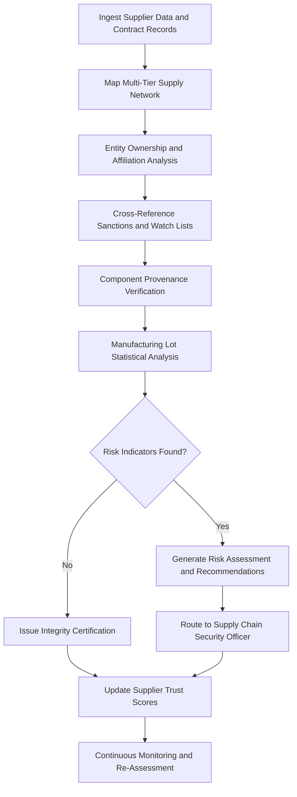

# Supply Chain Integrity Verifier

Frankmax

NAICS 928110

> **Defense / Security / Intelligence** — Supply Chain Integrity Verifier Module

## Objective & Purpose

Defense supply chains span thousands of suppliers across dozens of countries, creating systemic vulnerability to counterfeit components, compromised hardware, adversary-controlled entities, and supply disruption. A single counterfeit microchip in a weapons system can cause mission failure. A supplier with undisclosed foreign ownership can become a vector for espionage. Traditional supply chain audits are point-in-time snapshots that miss the continuous evolution of risk across multi-tier supplier networks where sub-tier relationships are often opaque.

The Supply Chain Integrity Verifier applies AI-driven provenance tracing, entity ownership analysis, and continuous risk monitoring across the full depth of defense supply chains. The system maps supplier networks down to raw material sources, continuously monitors ownership changes and financial health indicators, cross-references against sanctions lists and adversary-affiliated entity databases, and detects counterfeit component signatures through statistical analysis of manufacturing lot data. Organizations gain real-time visibility into supply chain risk that would require hundreds of manual auditors to achieve.

All verification activities are governed by ORF protocols ensuring that every supply chain assessment carries full provenance documentation. ETLB bindings attach liability to specific verification decisions, creating accountability for both automated assessments and human overrides. The system maintains a tamper-evident audit trail that supports congressional reporting, inspector general investigations, and contract dispute resolution.

## Business Context

| Attribute | Value |
|---|---|
| **Business Process** | Defense supply chain audit |
| **Business Function** | Supply Chain Security |
| **Category** | Procurement |
| **Target Audience** | 2. Defense / Security / Intelligence |
| **Bundle** | Defense and Intelligence Pack ($25,000/mo) |
| **Monthly Cost of Inaction** | $500,000 in counterfeit component risk and supply disruption exposure |

## BPMN Workflow

## Features

1. **Multi-Tier Network Mapping** — Automatically discovers and maps supplier relationships through multiple tiers from prime contractors to raw material sources, revealing hidden dependencies and single points of failure that are invisible in contract documentation alone.

2. **Entity Ownership Analysis** — Traces ultimate beneficial ownership of suppliers through corporate structures, shell companies, and investment vehicles, identifying undisclosed connections to adversary-affiliated entities or sanctioned parties.

3. **Counterfeit Detection** — Analyzes manufacturing lot data, component serial numbers, and test results using statistical methods to identify counterfeit components before they enter weapons systems, comparing against known-good manufacturing signatures.

4. **Sanctions and Watch List Screening** — Continuously screens all suppliers and their affiliated entities against OFAC SDN, Entity List, Denied Persons List, and allied partner restriction lists with automated re-screening when lists are updated.

5. **Financial Health Monitoring** — Tracks supplier financial indicators including revenue trends, debt ratios, legal proceedings, and credit ratings to identify suppliers at risk of financial distress that could disrupt critical supply lines.

6. **Geopolitical Risk Overlay** — Assesses supply chain exposure to geopolitical risks including trade restrictions, conflict zones, natural disaster vulnerability, and critical mineral dependencies by production geography.

7. **DFARS Compliance Verification** — Automatically verifies supplier compliance with Defense Federal Acquisition Regulation Supplement requirements including cybersecurity maturity (CMMC), domestic sourcing, and specialty metals provisions.

## Workflow & Automation

**Step 1: Data Ingestion** — Supplier databases, contract records, shipping manifests, and component specifications are ingested from procurement systems, logistics platforms, and government databases.

**Step 2: Network Discovery** — AI models trace supplier relationships through sub-contracts, bill-of-materials data, and shipping records to build comprehensive multi-tier supply network maps.

**Step 3: Entity Analysis** — Each entity in the supply network undergoes ownership analysis, sanctions screening, and affiliation checking against intelligence databases and public corporate records.

**Step 4: Component Verification** — Critical components are verified through manufacturing lot analysis, serial number validation, and statistical comparison against known-good production baselines.

**Step 5: Risk Scoring** — Each supplier and supply pathway receives a composite risk score incorporating ownership risk, counterfeit risk, financial health, geopolitical exposure, and compliance status.

**Step 6: Certification or Escalation** — Low-risk suppliers receive integrity certifications. High-risk suppliers trigger alerts routed to supply chain security officers with detailed risk assessments and recommended mitigations.

**Step 7: Continuous Monitoring** — All suppliers remain under continuous monitoring for ownership changes, financial deterioration, sanctions list additions, and new risk indicators.

## Input/Output Specifications

| Direction | Data | Format | Description |
|---|---|---|---|
| Input | Supplier databases | CSV/JSON/XML | Contractor and sub-contractor records |
| Input | Contract records | PDF/JSON | DFARS-compliant contract documentation |
| Input | Component specifications | JSON/XML | Bill of materials and part specifications |
| Input | Sanctions lists | CSV/JSON | OFAC, Entity List, allied restriction lists |
| Output | Supply network maps | GraphML/JSON | Multi-tier supplier relationship visualizations |
| Output | Risk assessments | PDF/JSON | Supplier risk scores with supporting evidence |
| Output | Integrity certifications | PDF/JSON | Verified supplier compliance documentation |

## Integration Points

| System | Integration Type | Data Flow |
|---|---|---|
| Defense Procurement Systems | API/Batch | Inbound contract and supplier data |
| Sanctions Screening Services | REST API | Inbound updated sanctions and watch lists |
| Financial Data Providers | API | Inbound supplier financial health indicators |
| Logistics and Shipping Platforms | API | Inbound shipping manifest and tracking data |
| Inspector General Reporting | Secure file exchange | Outbound audit documentation and findings |
| ORF Compliance Layer | Event-driven | Outbound verification provenance and liability chain |

## Pricing & Revenue Model

| Component | Price |
|---|---|
| **Bundle** | Defense and Intelligence Pack |
| **Bundle Price** | $25,000/mo |
| **Standalone Module** | $4,500/mo |
| **Per-Supplier Deep Dive Analysis** | $1,200 one-time per supplier |
| **Implementation** | $32,000 one-time |

Revenue is anchored in the Defense and Intelligence Pack bundle with per-supplier deep dive analyses providing transaction-based revenue. The DFARS compliance verification and entity ownership analysis features represent high-margin "fries" at 90% margin. The continuously growing supplier trust score database creates "kitchen" moat value — each verified supplier relationship becomes institutional knowledge that new competitors cannot replicate.

## NAICS/SIC Mapping

| NAICS | SIC | Industry | Relevance |
|---|---|---|---|
| 928110 | 9711 | National Security | Primary — defense supply chain security |
| 541715 | 8711 | R&D in Physical, Engineering, and Life Sciences | Supply chain research and verification |
| 334511 | 3812 | Search, Detection, and Navigation Instruments | Defense component verification |
| 541614 | 8742 | Process, Physical Distribution, and Logistics Consulting | Supply chain risk management consulting |
