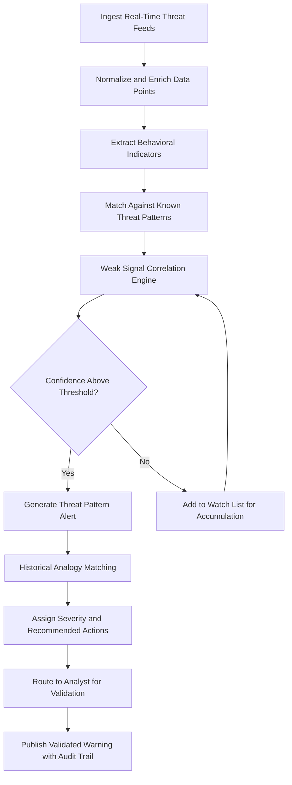

# Threat Pattern Recognition Engine

Frankmax

NAICS 928110

> **Defense / Security / Intelligence** — Threat Pattern Recognition Engine Module

## Objective & Purpose

Traditional threat detection relies on signature-based matching and known indicator lists, creating a fundamental blind spot: novel threats, slow-rolling adversary campaigns, and low-confidence weak signals are systematically missed until they escalate into crises. Defense and intelligence organizations routinely discover threats only after they materialize, turning early warning systems into post-incident explanation systems. The cost of this reactive posture is measured in lives, strategic surprise, and eroded deterrence credibility.

The Threat Pattern Recognition Engine applies machine learning models trained on historical threat sequences, adversary tradecraft databases, and real-time telemetry to identify emerging patterns from weak signals before they cross conventional detection thresholds. The system continuously correlates across geopolitical, cyber, kinetic, and economic domains to surface threat precursors that human analysts would require weeks to identify manually. Pattern confidence scores and historical analogy matching provide analysts with both the "what" and the "why it matters."

All pattern detections are governed by ETLB protocols ensuring that automated threat assessments carry explicit liability bindings — no autonomous escalation occurs without human validation. The ORF framework tracks every pattern detection through its full lifecycle from initial signal to validated assessment, creating an auditable chain that supports both operational decisions and post-incident review.

## Business Context

| Attribute | Value |
|---|---|
| **Business Process** | Threat assessment |
| **Business Function** | Early Warning |
| **Category** | Security |
| **Target Audience** | 2. Defense / Security / Intelligence |
| **Bundle** | Defense and Intelligence Pack ($25,000/mo) |
| **Monthly Cost of Inaction** | $250,000 in delayed response and undetected threat escalation |

## BPMN Workflow

## Features

1. **Weak Signal Aggregation** — Collects sub-threshold indicators from multiple domains and accumulates them over configurable time windows, surfacing patterns that only become visible when isolated data points are viewed collectively.

2. **Adversary Tradecraft Library** — Maintains a continuously updated database of known adversary tactics, techniques, and procedures (TTPs) mapped to MITRE ATT&CK and custom defense frameworks for rapid pattern matching.

3. **Historical Analogy Engine** — Compares emerging patterns against historical threat sequences to identify parallels, providing analysts with precedent-based context including how similar patterns evolved and what responses proved effective.

4. **Multi-Domain Correlation** — Links indicators across cyber, kinetic, economic, diplomatic, and information domains to detect hybrid threat campaigns that deliberately operate below the detection threshold of any single domain.

5. **Confidence Decay Modeling** — Automatically adjusts pattern confidence scores over time based on corroborating or contradicting evidence, preventing stale assessments from persisting and reducing alert fatigue.

6. **Escalation Governance** — Enforces human-in-the-loop validation for all threat assessments above configurable severity thresholds, with ETLB-compliant audit trails documenting every escalation decision.

7. **Geopolitical Context Overlay** — Enriches threat patterns with current geopolitical context including alliance relationships, treaty obligations, and ongoing operations to assess operational relevance.

8. **False Positive Learning Loop** — Analyst feedback on false positives and missed detections is continuously fed back into model training, improving detection accuracy with each operational cycle.

## Workflow & Automation

**Step 1: Feed Ingestion** — Real-time threat intelligence feeds from government, commercial, and allied sources are ingested and normalized. Each data point is tagged with source reliability, timestamp, and domain classification.

**Step 2: Indicator Extraction** — Behavioral indicators, technical signatures, and contextual markers are extracted from raw data. Natural language processing handles unstructured reports while parsers handle structured feeds.

**Step 3: Pattern Matching** — Extracted indicators are compared against the adversary tradecraft library and historical pattern database. Exact matches generate immediate alerts; partial matches enter the weak signal accumulation engine.

**Step 4: Accumulation and Correlation** — Sub-threshold indicators are accumulated and correlated across domains and time windows. When accumulated evidence crosses configurable confidence thresholds, the system generates a pattern alert.

**Step 5: Severity Assessment** — Validated patterns are scored for severity based on potential impact, target criticality, adversary capability, and response timeline requirements. Historical analogies inform severity calibration.

**Step 6: Analyst Routing** — Alerts are routed to qualified analysts based on domain expertise, current workload, and security clearance. Priority alerts bypass queue and trigger immediate notification.

## Input/Output Specifications

| Direction | Data | Format | Description |
|---|---|---|---|
| Input | Threat intelligence feeds | STIX/TAXII 2.1 | Structured threat indicators and reports |
| Input | Geopolitical event data | JSON/RSS | Current events, diplomatic signals, military movements |
| Input | Cyber telemetry | CEF/Syslog | Network and endpoint detection events |
| Input | Fused intelligence products | STIX 2.1/JSON | From Multi-Source Intelligence Fusion module |
| Output | Threat pattern alerts | STIX 2.1/JSON | Detected patterns with confidence scores |
| Output | Historical analogy reports | PDF/JSON | Precedent analysis for emerging patterns |
| Output | Severity dashboards | REST API/WebSocket | Real-time threat landscape visualization |

## Integration Points

| System | Integration Type | Data Flow |
|---|---|---|
| Multi-Source Intelligence Fusion | Internal API | Inbound fused intelligence products |
| Adversary Behavior Predictor | Internal API | Outbound detected patterns for prediction |
| National Threat Warning Systems | Secure gateway | Outbound validated threat warnings |
| MITRE ATT&CK Framework | REST API | Bidirectional TTP mapping and enrichment |
| Cyber Threat Hunting Platform | Internal API | Bidirectional indicator and pattern sharing |
| ORF Compliance Layer | Event-driven | Outbound pattern lifecycle tracking |

## Pricing & Revenue Model

| Component | Price |
|---|---|
| **Bundle** | Defense and Intelligence Pack |
| **Bundle Price** | $25,000/mo |
| **Standalone Module** | $4,200/mo |
| **Custom Tradecraft Library** | $8,000 one-time per library |
| **Implementation** | $30,000 one-time |

Revenue is driven by bundled subscriptions with high-margin add-ons for custom adversary tradecraft libraries tailored to specific theaters or adversary sets. The escalation governance and audit trail capabilities represent the "fries" margin play at 90% margins, while the core pattern detection engine serves as the engagement driver pulling customers deeper into the Defense and Intelligence Pack.

## NAICS/SIC Mapping

| NAICS | SIC | Industry | Relevance |
|---|---|---|---|
| 928110 | 9711 | National Security | Primary — threat detection for national defense |
| 541715 | 8711 | R&D in Physical, Engineering, and Life Sciences | Threat research and modeling |
| 334511 | 3812 | Search, Detection, and Navigation Instruments | Sensor-based threat detection systems |
| 541512 | 7372 | Computer Systems Design Services | Cybersecurity threat detection integration |
