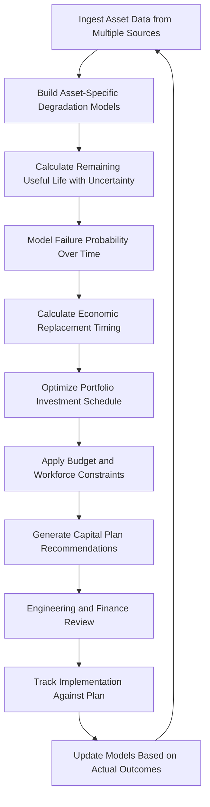

# Asset Lifecycle Optimizer

Frankmax

NAICS 221112

> **National Critical Infrastructure** — Asset Lifecycle Optimizer Module

## Objective & Purpose

Critical infrastructure operators manage asset portfolios worth billions of dollars with service lives spanning 30-80 years. The central capital planning challenge is timing: replace too early and billions are wasted on functional equipment; defer too long and catastrophic failures cause outages, safety incidents, and emergency replacement costs that far exceed planned replacement. Traditional asset management relies on age-based replacement schedules that treat all assets of the same type identically, ignoring the wide variation in actual condition, utilization, operating environment, and maintenance history that determines when individual assets actually need replacement.

The Asset Lifecycle Optimizer applies AI-driven condition assessment, degradation modeling, and economic optimization to determine the optimal replacement, refurbishment, or maintenance timing for every asset in the portfolio. The system integrates inspection data, sensor monitoring, maintenance records, operating history, and failure data to build asset-specific degradation curves that predict remaining useful life with quantified uncertainty. Economic optimization models then determine when each asset should be replaced, refurbished, or maintained based on the intersection of degradation projections, failure consequences, replacement costs, and budget constraints.

All lifecycle optimization decisions are governed by ETLB protocols ensuring that liability for capital planning recommendations is explicitly bound. The ORF framework maintains complete records of every condition assessment, degradation prediction, and investment recommendation, supporting rate case filings, prudence reviews, and regulatory capital planning submissions.

## Business Context

| Attribute | Value |
|---|---|
| **Business Process** | Capital planning |
| **Business Function** | Asset Management |
| **Category** | Finance |
| **Target Audience** | 3. National Critical Infrastructure |
| **Bundle** | Critical Infrastructure Pack ($15,000/mo) |
| **Monthly Cost of Inaction** | $900,000 in premature replacement waste and deferred maintenance risk |

## BPMN Workflow

## Features

1. **Asset-Specific Degradation Modeling** — Builds individual degradation curves for each asset based on inspection results, sensor data, operating history, environmental exposure, and maintenance effectiveness rather than relying on fleet-average assumptions.

2. **Remaining Useful Life Prediction** — Calculates remaining useful life with quantified uncertainty ranges for each asset, distinguishing between assets that need immediate attention and those that can safely operate for decades.

3. **Economic Replacement Optimization** — Determines the economically optimal replacement timing by balancing the increasing cost of maintenance and failure risk against the capital cost of replacement, accounting for the time value of money.

4. **Portfolio-Level Capital Planning** — Optimizes capital investment across the entire asset portfolio under budget and workforce constraints, ensuring that limited capital is allocated to assets where investment delivers the greatest risk reduction and value.

5. **Risk-Based Prioritization** — Prioritizes assets for investment based on failure consequence severity (safety, reliability, environmental, financial) combined with failure probability, not just asset age or condition score.

6. **Maintenance vs. Replace Decision Support** — Quantifies whether additional maintenance investment can cost-effectively extend asset life or whether replacement is the better economic choice, preventing both premature replacement and futile maintenance spending.

7. **Rate Case Documentation** — Automatically generates documentation supporting regulatory rate case filings, demonstrating the prudence of capital investment decisions with data-driven justification for each investment in the plan.

8. **What-If Scenario Analysis** — Enables planners to explore alternative budget scenarios, deferral strategies, and technology options to understand how different capital strategies affect portfolio risk and cost over time.

## Workflow & Automation

**Step 1: Data Aggregation** — Asset data is aggregated from enterprise asset management systems, inspection records, sensor monitoring, maintenance management, and financial systems into a unified asset data model.

**Step 2: Degradation Modeling** — Machine learning models are trained on failure history and condition data to build asset-specific degradation curves. Models are validated against known failure events and condition trends.

**Step 3: Life Prediction** — Remaining useful life is calculated for each asset with confidence intervals. Assets are categorized by life expectancy relative to planned replacement dates to identify mismatches.

**Step 4: Economic Analysis** — Optimal replacement timing is calculated for each asset by minimizing total lifecycle cost including maintenance, failure risk, replacement capital, and operational impacts.

**Step 5: Portfolio Optimization** — Individual asset replacement timings are optimized as a portfolio under budget, workforce, and outage window constraints. The optimizer balances competing needs across the entire infrastructure.

**Step 6: Plan Generation** — Capital investment plans are generated for short-term (1-3 year), medium-term (3-10 year), and long-term (10-30 year) horizons with annual spending profiles and risk trend projections.

**Step 7: Performance Tracking** — Actual asset performance and failure outcomes are tracked against predictions. Model accuracy is continuously assessed and improved based on real-world outcomes.

## Input/Output Specifications

| Direction | Data | Format | Description |
|---|---|---|---|
| Input | Asset register data | JSON/CSV | Asset type, age, location, specifications, value |
| Input | Inspection records | JSON/PDF | Condition assessment results and deficiency reports |
| Input | Maintenance records | JSON/CSV | Work order history, costs, and effectiveness |
| Input | Sensor monitoring data | OPC-UA/JSON | Real-time and historical condition monitoring |
| Output | Lifecycle optimization plans | PDF/JSON | Asset-level replacement and refurbishment timing |
| Output | Capital investment schedules | CSV/JSON | Annual spending profiles with risk justification |
| Output | Rate case documentation | PDF/XBRL | Regulatory filing support materials |

## Integration Points

| System | Integration Type | Data Flow |
|---|---|---|
| Enterprise Asset Management (EAM) | REST API | Bidirectional asset data and work orders |
| Financial Planning Systems | API | Outbound capital plan data for budgeting |
| Pipeline Integrity Monitor | Internal API | Inbound pipeline-specific condition data |
| Climate Resilience Modeler | Internal API | Inbound climate risk adjustments for lifecycle models |
| Regulatory Compliance Automator | Internal API | Outbound capital planning data for rate filings |
| ORF Compliance Layer | Event-driven | Outbound investment decision audit trail |

## Pricing & Revenue Model

| Component | Price |
|---|---|
| **Bundle** | Critical Infrastructure Pack |
| **Bundle Price** | $15,000/mo |
| **Standalone Module** | $3,500/mo |
| **Per-Asset Class Modeling** | $5,000 one-time per asset class |
| **Implementation** | $45,000 one-time |

Revenue scales with asset portfolio complexity through per-asset-class modeling fees. The rate case documentation and what-if scenario analysis represent high-margin "fries" at 87% margin. The ROI case is compelling: optimizing replacement timing for even 1% of a billion-dollar asset portfolio generates $10 million in value. The accumulated asset-specific degradation models create "kitchen" moat value that becomes irreplaceable as prediction accuracy improves with years of operational data.

## NAICS/SIC Mapping

| NAICS | SIC | Industry | Relevance |
|---|---|---|---|
| 221112 | 4911 | Fossil Fuel Electric Power Generation | Primary — power generation asset lifecycle |
| 221121 | 4911 | Electric Bulk Power Transmission and Control | Transmission and distribution asset management |
| 221310 | 4941 | Water Supply and Irrigation Systems | Water infrastructure lifecycle planning |
| 541611 | 8742 | Administrative Management Consulting | Asset management consulting and optimization |
