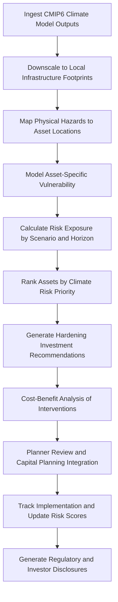

# Climate Resilience Modeler

Frankmax

NAICS 221112

> **National Critical Infrastructure** — Climate Resilience Modeler Module

## Objective & Purpose

Critical infrastructure designed for historical climate conditions faces escalating threats from climate change. Flood plains are expanding beyond mapped boundaries. Heat waves are exceeding design temperatures for electrical transformers and rail lines. Wildfire zones are encroaching on transmission corridors and pipeline rights-of-way. Sea level rise threatens coastal power plants, water treatment facilities, and telecommunications hubs. Infrastructure investment decisions made today must account for conditions 30-50 years into the future, yet most organizations lack the analytical capability to translate climate projections into asset-level vulnerability assessments and capital planning decisions.

The Climate Resilience Modeler translates global and regional climate projections into asset-specific vulnerability assessments for critical infrastructure. The system ingests climate model outputs from CMIP6 ensembles, downscales projections to local infrastructure footprints, and models the physical impacts of projected temperature changes, precipitation pattern shifts, sea level rise, extreme weather frequency increases, and wildfire risk evolution on specific assets. Organizations receive quantified risk exposure by asset, time horizon, and climate scenario, enabling data-driven capital planning that prioritizes hardening investments where they deliver the greatest risk reduction.

All climate assessments are governed by ETLB protocols that explicitly mark the uncertainty ranges inherent in climate projections, preventing downstream decision-makers from treating probabilistic projections as certainties. The ORF framework maintains provenance chains from climate model inputs through asset-level vulnerability scores, supporting regulatory filings, insurance negotiations, and investor disclosures.

## Business Context

| Attribute | Value |
|---|---|
| **Business Process** | Infrastructure vulnerability assessment |
| **Business Function** | Risk Management |
| **Category** | Planning |
| **Target Audience** | 3. National Critical Infrastructure |
| **Bundle** | Critical Infrastructure Pack ($15,000/mo) |
| **Monthly Cost of Inaction** | $600,000 in unquantified climate exposure and misallocated hardening investments |

## BPMN Workflow

## Features

1. **Climate Projection Downscaling** — Translates global climate model outputs (CMIP6 ensemble) to local resolution matching infrastructure footprints, using statistical and dynamical downscaling methods appropriate for each hazard type.

2. **Multi-Hazard Vulnerability Assessment** — Evaluates asset vulnerability across heat stress, flooding, wind damage, wildfire, drought, sea level rise, freeze-thaw cycles, and compound hazard scenarios simultaneously.

3. **Asset-Level Risk Quantification** — Calculates quantified financial risk exposure for each infrastructure asset by combining hazard probability, asset vulnerability, consequence severity, and replacement or repair cost.

4. **Scenario Comparison Dashboard** — Presents risk assessments across multiple climate scenarios (SSP1-2.6, SSP2-4.5, SSP3-7.0, SSP5-8.5) and time horizons (2030, 2050, 2070, 2100) for side-by-side comparison.

5. **Adaptation Investment Optimizer** — Identifies and ranks hardening investments by cost-effectiveness, calculating the risk reduction per dollar invested for each potential intervention across the entire infrastructure portfolio.

6. **Cascading Impact Analysis** — Models how climate impacts on one infrastructure system cascade into dependent systems — how a flooded substation affects water treatment, how heat-damaged rail affects freight delivery to power plants.

7. **Regulatory Disclosure Generator** — Automatically generates climate risk disclosures in formats required by SEC, state regulators, and international frameworks (TCFD/ISSB), ensuring consistent reporting across jurisdictions.

## Workflow & Automation

**Step 1: Climate Data Ingestion** — Global climate model outputs from CMIP6 ensembles are ingested, quality-checked, and processed. Multiple scenarios and model runs are maintained to capture the full range of projected futures.

**Step 2: Spatial Downscaling** — Global projections are downscaled to local resolution using methods calibrated against historical observational data for each infrastructure location, producing site-specific hazard projections.

**Step 3: Hazard Mapping** — Downscaled projections are translated into physical hazard metrics (flood depth, heat days above threshold, wind speed exceedance, fire weather index) at each asset location.

**Step 4: Vulnerability Modeling** — Each asset's vulnerability to each hazard is modeled based on design specifications, current condition, age, materials, and elevation relative to projected hazard levels.

**Step 5: Risk Quantification** — Financial risk is calculated by combining hazard probability, asset vulnerability, and consequence severity including repair costs, service disruption, and cascading impacts.

**Step 6: Investment Optimization** — Hardening investment options are evaluated for cost-effectiveness. The optimizer identifies the portfolio of investments that maximizes risk reduction within budget constraints.

**Step 7: Disclosure and Reporting** — Climate risk assessments are formatted into regulatory disclosure documents, investor presentations, and insurance submissions with full uncertainty documentation.

## Input/Output Specifications

| Direction | Data | Format | Description |
|---|---|---|---|
| Input | CMIP6 climate projections | NetCDF/GRIB | Global climate model ensemble outputs |
| Input | Asset registers | JSON/CSV/GIS | Infrastructure location, type, condition, value |
| Input | Design specifications | PDF/JSON | Equipment ratings, material properties, elevation |
| Input | Historical weather data | CSV/JSON | Observational records for downscaling calibration |
| Output | Vulnerability assessments | PDF/JSON | Asset-level climate risk scores by scenario |
| Output | Investment recommendations | PDF/JSON | Ranked hardening priorities with cost-benefit analysis |
| Output | Regulatory disclosures | PDF/XBRL | TCFD/ISSB/SEC-formatted climate risk reports |

## Integration Points

| System | Integration Type | Data Flow |
|---|---|---|
| GIS Platforms | OGC WMS/WFS | Bidirectional asset location and hazard mapping |
| Asset Lifecycle Optimizer | Internal API | Outbound climate risk inputs for lifecycle planning |
| Grid Stability Predictor | Internal API | Outbound long-term generation capacity projections |
| Capital Planning Systems | REST API | Outbound investment recommendations |
| Insurance and Risk Transfer | Secure file exchange | Outbound risk quantification for underwriting |
| ORF Compliance Layer | Event-driven | Outbound assessment provenance and uncertainty documentation |

## Pricing & Revenue Model

| Component | Price |
|---|---|
| **Bundle** | Critical Infrastructure Pack |
| **Bundle Price** | $15,000/mo |
| **Standalone Module** | $3,500/mo |
| **Per-Asset Deep Assessment** | $500 one-time per asset |
| **Implementation** | $40,000 one-time |

Revenue scales with the number of assets under climate risk assessment, creating predictable recurring revenue alongside one-time deep assessment fees. The regulatory disclosure generator and adaptation investment optimizer represent high-margin "fries" at 88% margin. The locally calibrated climate downscaling models and accumulated asset vulnerability data create "kitchen" moat value that improves with each year of observational validation.

## NAICS/SIC Mapping

| NAICS | SIC | Industry | Relevance |
|---|---|---|---|
| 221112 | 4911 | Fossil Fuel Electric Power Generation | Primary — power infrastructure climate risk |
| 221310 | 4941 | Water Supply and Irrigation Systems | Water infrastructure vulnerability |
| 486110 | 4612 | Crude Petroleum Pipelines | Pipeline climate exposure assessment |
| 541620 | 8999 | Environmental Consulting Services | Climate risk consulting and assessment |
