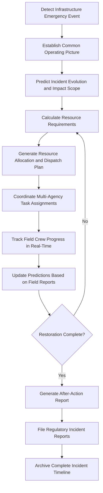

# Emergency Response Coordinator

Frankmax

NAICS 221112

> **National Critical Infrastructure** — Emergency Response Coordinator Module

## Objective & Purpose

When critical infrastructure emergencies occur — whether natural disasters, cyberattacks, equipment failures, or cascading outages — the response requires coordination across multiple agencies, utilities, contractors, and government entities that operate different systems, follow different procedures, and communicate on different channels. The chaos of multi-agency coordination during emergencies consistently produces delays, resource misallocation, communication failures, and duplicated effort. Post-incident reviews of major infrastructure emergencies almost universally identify coordination breakdowns as the primary factor that extended outage duration and increased damage.

The Emergency Response Coordinator provides AI-driven orchestration of multi-agency infrastructure emergency response. The system integrates real-time situational awareness from SCADA systems, weather services, social media, field crews, and public safety agencies into a common operating picture. AI models predict incident evolution and resource requirements, automatically generate and update resource allocation plans, coordinate crew dispatch across multiple responding organizations, and track restoration progress against predicted timelines. The platform replaces ad-hoc phone calls and spreadsheets with structured coordination that ensures every responding entity has current situational awareness and clear task assignments.

All emergency response activities are governed by ETLB protocols ensuring that liability for resource allocation and prioritization decisions during emergencies is explicitly bound to authorized incident commanders. The ORF framework maintains complete incident timelines from initial detection through full restoration, supporting after-action reviews, regulatory incident reporting, and insurance claims documentation.

## Business Context

| Attribute | Value |
|---|---|
| **Business Process** | Disaster response |
| **Business Function** | Crisis Management |
| **Category** | Operations |
| **Target Audience** | 3. National Critical Infrastructure |
| **Bundle** | Critical Infrastructure Pack ($15,000/mo) |
| **Monthly Cost of Inaction** | $1,500,000 in extended outage duration and uncoordinated response costs |

## BPMN Workflow

## Features

1. **Common Operating Picture** — Aggregates real-time data from SCADA, weather, field crews, public safety, and social media into a unified situational awareness dashboard accessible to all responding organizations with role-appropriate views.

2. **Incident Evolution Prediction** — Models how infrastructure emergencies will evolve based on current conditions, weather forecasts, infrastructure interdependencies, and historical incident patterns, enabling proactive rather than reactive resource positioning.

3. **Resource Optimization Engine** — Calculates optimal allocation of crews, equipment, materials, and mutual aid resources across all affected areas, balancing restoration speed against safety constraints and resource availability.

4. **Multi-Agency Coordination Hub** — Provides structured coordination between utilities, emergency management agencies, public safety, contractors, and mutual aid partners through shared task boards, status tracking, and communication channels.

5. **Restoration Priority Optimization** — Prioritizes restoration sequences based on critical facility dependencies (hospitals, water treatment, communications), customer impact, and safety considerations rather than simple proximity or outage size.

6. **Crew Safety Monitoring** — Tracks field crew locations, assignments, and safety check-ins in real-time, ensuring compliance with work hour limits, hazard zone restrictions, and buddy system requirements.

7. **Public Communication Automation** — Generates and distributes public notifications including estimated restoration times, safety advisories, and shelter locations through multiple channels based on affected area demographics and infrastructure status.

## Workflow & Automation

**Step 1: Event Detection** — Infrastructure emergencies are detected through SCADA alarms, weather warnings, public safety notifications, or social media reports. The system automatically initiates the emergency response protocol.

**Step 2: Situation Assessment** — Real-time data from all available sources is aggregated to assess incident scope, affected infrastructure, customer impact, and initial resource requirements.

**Step 3: Impact Prediction** — AI models predict how the incident will evolve based on weather progression, infrastructure interdependencies, and historical patterns. Predicted impact is used to pre-position resources before damage assessment is complete.

**Step 4: Resource Planning** — Required resources are calculated based on predicted damage scope. Available internal resources, contractor capacity, and mutual aid availability are assessed against requirements.

**Step 5: Dispatch and Coordination** — Crews are dispatched with optimized routing and prioritized task assignments. Multi-agency coordination is managed through the shared platform with real-time status tracking.

**Step 6: Progress Tracking** — Field progress is tracked in real-time. Predictions and resource plans are continuously updated based on actual restoration rates, additional damage discoveries, and changing conditions.

**Step 7: Incident Closure** — When restoration is complete, the system generates after-action reports, compiles regulatory incident filings, and archives the complete incident timeline for review and training.

## Input/Output Specifications

| Direction | Data | Format | Description |
|---|---|---|---|
| Input | SCADA alarm data | OPC-UA/DNP3 | Real-time equipment status and outage detection |
| Input | Weather data | JSON/CAP | Severe weather warnings and forecasts |
| Input | Field crew reports | Mobile app/JSON | Damage assessments and restoration progress |
| Input | Mutual aid availability | JSON/API | Available resources from partner organizations |
| Output | Common operating picture | WebSocket/REST | Real-time situational awareness dashboard |
| Output | Resource allocation plans | JSON/PDF | Crew dispatch and material deployment plans |
| Output | After-action reports | PDF/JSON | Complete incident documentation for review |

## Integration Points

| System | Integration Type | Data Flow |
|---|---|---|
| SCADA/EMS Systems | OPC-UA/API | Inbound real-time outage and equipment data |
| Outage Management Systems (OMS) | REST API | Bidirectional outage tracking and restoration data |
| Weather Service Providers | REST API/CAP | Inbound severe weather data and forecasts |
| Public Safety / 911 Systems | CAD API | Bidirectional incident and safety coordination |
| Transportation Flow Optimizer | Internal API | Outbound evacuation routing, inbound road status |
| ORF Compliance Layer | Event-driven | Outbound emergency response decision audit trail |

## Pricing & Revenue Model

| Component | Price |
|---|---|
| **Bundle** | Critical Infrastructure Pack |
| **Bundle Price** | $15,000/mo |
| **Standalone Module** | $3,800/mo |
| **Multi-Agency Coordination Add-on** | $1,200/mo per additional responding organization |
| **Implementation** | $42,000 one-time |

Revenue scales with the number of organizations participating in coordinated response. The restoration priority optimization and crew safety monitoring represent high-margin "fries" at 86% margin. The ROI case is most compelling during major events: reducing a major storm restoration by even 10% saves millions in overtime, mutual aid, and customer impact costs. The incident prediction models improve with each event, creating "kitchen" moat value through accumulated regional emergency response data.

## NAICS/SIC Mapping

| NAICS | SIC | Industry | Relevance |
|---|---|---|---|
| 221112 | 4911 | Fossil Fuel Electric Power Generation | Primary — power grid emergency response |
| 221310 | 4941 | Water Supply and Irrigation Systems | Water system emergency coordination |
| 517311 | 4813 | Wired Telecommunications Carriers | Telecom disaster response |
| 922190 | 9229 | Other Justice, Public Order, and Safety Activities | Public safety coordination and emergency management |
