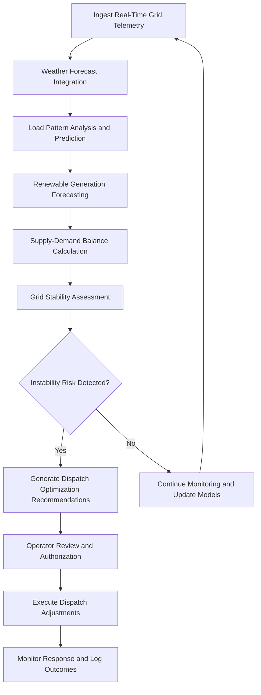

# Grid Stability Predictor

Frankmax

NAICS 221112

> **National Critical Infrastructure** — Grid Stability Predictor Module

## Objective & Purpose

The integration of variable renewable energy sources — solar, wind, and distributed generation — into power grids designed for centralized, dispatchable generation has created unprecedented stability challenges. Grid operators must balance supply and demand in real time across millions of generation and consumption points, with renewable output fluctuating based on weather conditions that can change in minutes. Traditional load forecasting methods built for stable baseload generation cannot handle this variability, leading to frequency deviations, voltage instability, and cascading failures that cost billions annually in economic damage and endanger public safety.

The Grid Stability Predictor applies AI-driven forecasting models that integrate weather prediction, load pattern analysis, generation dispatch optimization, and grid topology modeling to predict stability conditions hours to days in advance. The system continuously monitors grid frequency, voltage, power flow, and reserve margins across transmission and distribution networks, generating actionable predictions that enable operators to preposition resources, adjust dispatch schedules, and activate demand response programs before instability materializes. Machine learning models trained on historical grid events identify precursor patterns that precede cascading failures, providing early warning that exceeds conventional monitoring capabilities.

All predictions and automated dispatch recommendations are governed by ETLB protocols ensuring that liability for grid operations decisions is explicitly bound to the appropriate authority level. The ORF framework maintains complete records of every prediction, recommendation, and operator action, supporting NERC reliability compliance reporting and post-event analysis.

## Business Context

| Attribute | Value |
|---|---|
| **Business Process** | Energy grid management |
| **Business Function** | Power Operations |
| **Category** | Operations |
| **Target Audience** | 3. National Critical Infrastructure |
| **Bundle** | Critical Infrastructure Pack ($15,000/mo) |
| **Monthly Cost of Inaction** | $750,000 in grid instability events and unoptimized dispatch costs |

## BPMN Workflow

## Features

1. **Multi-Horizon Load Forecasting** — Predicts grid load at intervals ranging from 15 minutes to 7 days using ensemble models that incorporate weather, calendar patterns, economic activity, electric vehicle charging behavior, and historical consumption profiles.

2. **Renewable Generation Prediction** — Forecasts solar and wind generation output by integrating numerical weather prediction data, satellite imagery, and historical performance data from individual generation sites.

3. **Cascading Failure Early Warning** — Identifies precursor patterns that historically precede cascading failures including line overloading sequences, voltage depression patterns, and frequency deviation trends, providing operators with actionable warning minutes to hours before conventional alarms.

4. **Dispatch Optimization Engine** — Recommends optimal generation dispatch schedules that minimize cost while maintaining stability margins, balancing economic efficiency against reliability requirements across the full generation fleet.

5. **Demand Response Integration** — Models the availability and response characteristics of demand response resources, incorporating them into stability predictions and dispatch recommendations as flexible grid assets.

6. **Frequency and Voltage Stability Analysis** — Continuously monitors grid frequency and voltage stability margins, predicting when margins will narrow to critical levels and recommending preventive actions.

7. **Storage Optimization** — Optimizes charge/discharge cycles for battery energy storage systems based on predicted load patterns, renewable generation forecasts, and market price signals to maximize stability contribution and revenue.

## Workflow & Automation

**Step 1: Telemetry Ingestion** — Real-time data from SCADA systems, phasor measurement units (PMUs), smart meters, and weather stations is continuously ingested and validated for quality and completeness.

**Step 2: Forecast Generation** — Load forecasts, renewable generation predictions, and weather-adjusted demand models are generated at multiple time horizons and updated continuously as new data arrives.

**Step 3: Balance Assessment** — Predicted supply and demand are compared across all time horizons. Reserve margins, ramping requirements, and flexibility needs are calculated for each forecasting period.

**Step 4: Stability Analysis** — Grid topology models are used to assess whether predicted power flows will maintain stable operation. Contingency analysis evaluates stability under N-1 and N-2 scenarios.

**Step 5: Recommendation Generation** — When stability risks are identified, the system generates specific dispatch optimization recommendations including unit commitment changes, storage dispatch, and demand response activation.

**Step 6: Operator Authorization** — Recommendations are presented to grid operators with supporting data and risk assessments. Operators authorize adjustments through ETLB-compliant decision workflows.

**Step 7: Outcome Monitoring** — Implemented adjustments are monitored for effectiveness. Actual outcomes are compared against predictions to continuously calibrate forecasting models.

## Input/Output Specifications

| Direction | Data | Format | Description |
|---|---|---|---|
| Input | SCADA telemetry | OPC-UA/DNP3 | Real-time grid measurements and equipment status |
| Input | PMU data | IEEE C37.118 | Synchrophasor measurements for stability monitoring |
| Input | Weather forecasts | GRIB/JSON | Numerical weather prediction data |
| Input | Smart meter data | JSON/CSV | Aggregated consumption data from distribution networks |
| Output | Load forecasts | JSON/CSV | Multi-horizon demand predictions |
| Output | Stability assessments | JSON/PDF | Grid stability risk ratings and trend analysis |
| Output | Dispatch recommendations | JSON | Optimized generation and storage dispatch schedules |

## Integration Points

| System | Integration Type | Data Flow |
|---|---|---|
| Energy Management Systems (EMS) | OPC-UA/API | Bidirectional telemetry and dispatch commands |
| Weather Service Providers | REST API | Inbound numerical weather prediction data |
| Market Operations Systems | API | Bidirectional pricing and dispatch data |
| SCADA/ICS Security Monitor | Internal API | Outbound grid state data for security monitoring |
| Regulatory Compliance Automator | Internal API | Outbound reliability data for NERC reporting |
| ORF Compliance Layer | Event-driven | Outbound decision audit trail |

## Pricing & Revenue Model

| Component | Price |
|---|---|
| **Bundle** | Critical Infrastructure Pack |
| **Bundle Price** | $15,000/mo |
| **Standalone Module** | $3,500/mo |
| **Per-Substation Monitoring Add-on** | $200/mo per substation |
| **Implementation** | $40,000 one-time |

Revenue is driven by the Critical Infrastructure Pack bundle with per-substation monitoring providing scalable recurring revenue. The dispatch optimization and cascading failure early warning features represent high-margin "fries" at 87% margin. The continuously improving forecast models and accumulated grid behavior data create "kitchen" moat value that compounds as the system learns each grid's unique characteristics over time.

## NAICS/SIC Mapping

| NAICS | SIC | Industry | Relevance |
|---|---|---|---|
| 221112 | 4911 | Fossil Fuel Electric Power Generation | Primary — grid stability for power generation |
| 221115 | 4911 | Wind Electric Power Generation | Renewable integration forecasting |
| 221114 | 4911 | Solar Electric Power Generation | Solar generation prediction |
| 221121 | 4911 | Electric Bulk Power Transmission and Control | Transmission stability analysis |
