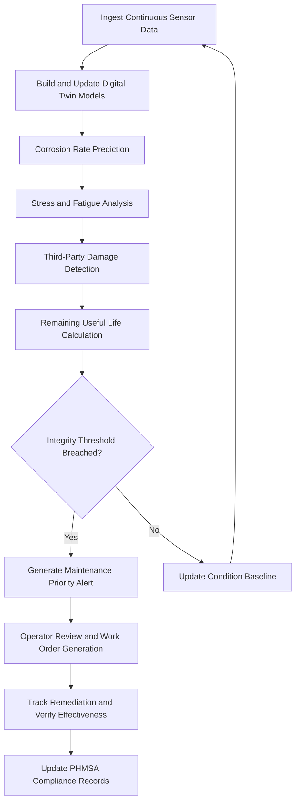

# Pipeline Integrity Monitor

Frankmax

NAICS 486110

> **National Critical Infrastructure** — Pipeline Integrity Monitor Module

## Objective & Purpose

The nation's pipeline infrastructure — over 2.6 million miles of natural gas, oil, and hazardous liquid pipelines — ages continuously while operating under demanding conditions including high pressure, corrosive products, temperature extremes, and ground movement. Pipeline failures cause catastrophic consequences: explosions, environmental contamination, supply disruption, and loss of life. Traditional integrity management relies on periodic inline inspections (pigging) conducted at intervals of 5-10 years, supplemented by external surveys and cathodic protection monitoring. Between inspections, degradation progresses unmonitored, and operators discover failures only after they occur.

The Pipeline Integrity Monitor applies AI-driven predictive analytics to continuous sensor data from distributed fiber optic sensors, pressure transducers, flow meters, corrosion probes, and cathodic protection systems to predict pipeline degradation before failure occurs. The system builds digital twin models of pipeline segments that incorporate material properties, operating history, environmental conditions, and inspection data to forecast remaining useful life at every point along the pipeline. Anomalies detected in sensor data are correlated against degradation models to prioritize maintenance interventions based on actual condition rather than arbitrary time intervals.

All integrity assessments carry ORF-compliant provenance documentation linking predictions to sensor data, model versions, and calibration status. ETLB protocols bind liability for maintenance prioritization decisions, ensuring clear accountability for both AI-recommended and operator-overridden maintenance schedules. The system generates PHMSA-compliant integrity management reports automatically, reducing regulatory reporting burden by 70%.

## Business Context

| Attribute | Value |
|---|---|
| **Business Process** | Asset condition monitoring |
| **Business Function** | Asset Management |
| **Category** | Maintenance |
| **Target Audience** | 3. National Critical Infrastructure |
| **Bundle** | Critical Infrastructure Pack ($15,000/mo) |
| **Monthly Cost of Inaction** | $1,200,000 in undetected degradation risk and unplanned failure costs |

## BPMN Workflow

## Features

1. **Digital Twin Pipeline Models** — Constructs physics-based digital twins of pipeline segments incorporating material specifications, weld records, coating condition, soil characteristics, and operating history to predict degradation with segment-level granularity.

2. **Corrosion Rate Prediction** — Models internal and external corrosion rates using sensor data, product composition analysis, cathodic protection effectiveness, and environmental exposure factors to forecast wall thickness loss over time.

3. **Distributed Fiber Optic Analysis** — Processes data from distributed acoustic sensing (DAS) and distributed temperature sensing (DTS) fiber optic systems to detect leaks, third-party encroachment, and ground movement along the pipeline right-of-way.

4. **Remaining Useful Life Calculation** — Calculates remaining useful life for every pipeline segment based on current condition, degradation rates, operating pressure, and material properties, enabling condition-based maintenance scheduling.

5. **Third-Party Damage Detection** — Identifies excavation activity, ground disturbance, and unauthorized encroachment near pipeline rights-of-way using distributed acoustic sensing, satellite imagery, and geographic information systems.

6. **Inline Inspection Correlation** — Integrates periodic inline inspection (pigging) results with continuous monitoring data to calibrate digital twin models and validate predictive accuracy against direct measurement.

7. **PHMSA Compliance Reporting** — Automatically generates Pipeline and Hazardous Materials Safety Administration compliance documentation including integrity management program reports, risk assessments, and remediation tracking.

## Workflow & Automation

**Step 1: Sensor Integration** — Distributed fiber optic sensors, pressure transducers, flow meters, corrosion probes, and cathodic protection monitoring systems are integrated into the continuous data ingestion platform.

**Step 2: Digital Twin Construction** — Pipeline digital twins are constructed from as-built records, material certifications, operating history, and historical inspection data. Models are calibrated against known condition data.

**Step 3: Continuous Monitoring** — Sensor data is continuously analyzed for anomalies including pressure deviations, flow imbalances, acoustic signatures, temperature changes, and cathodic protection voltage shifts.

**Step 4: Degradation Modeling** — Corrosion rates, stress cycles, and fatigue accumulation are modeled continuously. Digital twin models are updated with each new data point to refine remaining useful life predictions.

**Step 5: Alert Generation** — When predicted condition approaches integrity thresholds or anomalous sensor readings indicate potential issues, prioritized alerts are generated with supporting data and recommended actions.

**Step 6: Maintenance Coordination** — Alerts are routed to maintenance planning systems with work order recommendations including scope, urgency, and resource requirements for optimal remediation scheduling.

**Step 7: Compliance Documentation** — All monitoring data, predictions, alerts, and maintenance actions are automatically compiled into PHMSA-compliant integrity management documentation.

## Input/Output Specifications

| Direction | Data | Format | Description |
|---|---|---|---|
| Input | Distributed fiber optic data | Binary/JSON | DAS and DTS measurements along pipeline |
| Input | Pressure and flow data | OPC-UA/Modbus | Real-time operating parameters |
| Input | Cathodic protection readings | JSON/CSV | CP voltage and current measurements |
| Input | Inline inspection results | PODS/JSON | Pigging data from periodic inspections |
| Output | Remaining useful life reports | PDF/JSON | Segment-level condition and life predictions |
| Output | Priority maintenance alerts | JSON | Ranked maintenance recommendations |
| Output | PHMSA compliance reports | PDF/XML | Regulatory filing documentation |

## Integration Points

| System | Integration Type | Data Flow |
|---|---|---|
| SCADA Systems | OPC-UA/DNP3 | Inbound real-time operating data |
| Maintenance Management (CMMS) | REST API | Outbound work order recommendations |
| GIS Platforms | OGC WMS/WFS | Bidirectional spatial data and pipeline routing |
| Inline Inspection Vendors | File exchange | Inbound pigging results and anomaly data |
| SCADA/ICS Security Monitor | Internal API | Outbound operational data for security analysis |
| ORF Compliance Layer | Event-driven | Outbound integrity assessment audit trail |

## Pricing & Revenue Model

| Component | Price |
|---|---|
| **Bundle** | Critical Infrastructure Pack |
| **Bundle Price** | $15,000/mo |
| **Standalone Module** | $3,800/mo |
| **Per-Mile Monitoring** | $50/mo per pipeline mile |
| **Implementation** | $45,000 one-time |

Revenue scales with pipeline mileage under monitoring, creating predictable recurring revenue that grows as operators expand coverage. The PHMSA compliance reporting and remaining useful life calculation features represent high-margin "fries" at 88% margin. The accumulating digital twin data creates "kitchen" moat value — years of calibrated degradation models for specific pipeline segments represent irreplaceable institutional knowledge.

## NAICS/SIC Mapping

| NAICS | SIC | Industry | Relevance |
|---|---|---|---|
| 486110 | 4612 | Crude Petroleum Pipelines | Primary — oil pipeline integrity management |
| 486210 | 4613 | Pipeline Transportation of Natural Gas | Natural gas pipeline monitoring |
| 486990 | 4619 | All Other Pipeline Transportation | Specialty pipeline integrity management |
| 221210 | 4924 | Natural Gas Distribution | Gas distribution network monitoring |
