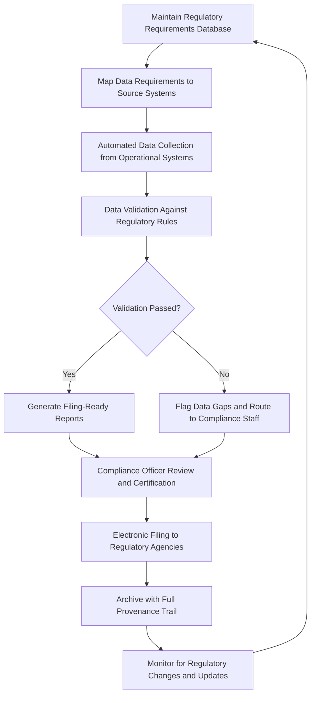

# Regulatory Compliance Automator

Frankmax

NAICS 221112

> **National Critical Infrastructure** — Regulatory Compliance Automator Module

## Objective & Purpose

Critical infrastructure operators face a staggering regulatory burden. A mid-sized electric utility files over 400 regulatory reports annually across NERC, FERC, state PUCs, EPA, OSHA, and DOE. Water utilities report to EPA, state environmental agencies, and health departments. Pipeline operators answer to PHMSA, state pipeline safety offices, and environmental regulators. Each agency maintains different reporting formats, schedules, data requirements, and filing procedures. The compliance workforce required to manually collect data, prepare reports, validate accuracy, and file on time consumes 10-15% of operating budgets while providing zero operational value — it is pure overhead that diverts engineering talent from infrastructure operations.

The Regulatory Compliance Automator eliminates 70-80% of manual compliance effort by automatically collecting required data from operational systems, mapping data to regulatory reporting templates, validating completeness and accuracy against regulatory rules, and generating filing-ready reports. The system maintains a continuously updated regulatory requirements database covering all federal and state obligations for electric, gas, water, telecom, and transportation infrastructure operators. When regulations change, the system automatically updates reporting templates and notifies compliance staff of new requirements.

All automated compliance activities are governed by ORF protocols ensuring that every data point in every regulatory filing carries full provenance documentation from source system through published report. ETLB bindings create clear accountability for compliance decisions, distinguishing between automated data collection and human-validated assertions.

## Business Context

| Attribute | Value |
|---|---|
| **Business Process** | Regulatory reporting |
| **Business Function** | Compliance |
| **Category** | Regulatory |
| **Target Audience** | 3. National Critical Infrastructure |
| **Bundle** | Critical Infrastructure Pack ($15,000/mo) |
| **Monthly Cost of Inaction** | $180,000 in compliance staff costs and regulatory penalty risk |

## BPMN Workflow

## Features

1. **Multi-Agency Requirements Database** — Maintains a continuously updated database of regulatory reporting requirements across NERC, FERC, EPA, PHMSA, FCC, state PUCs, and state environmental agencies, including schedules, formats, and data specifications.

2. **Automated Data Collection** — Connects to SCADA, EMS, LIMS, CMMS, financial systems, and other operational platforms to automatically collect data required for regulatory reports without manual extraction.

3. **Cross-Report Data Consistency** — Ensures that data reported to different agencies from the same source is consistent, preventing contradictions between filings that trigger regulatory inquiries and audits.

4. **Regulatory Change Monitoring** — Monitors Federal Register, state regulatory dockets, and agency websites for proposed and final rule changes, alerting compliance staff to new requirements and automatically updating reporting templates.

5. **Validation Rules Engine** — Applies regulatory-specific validation rules to collected data including range checks, consistency checks, temporal completeness, and cross-reference verification before report generation.

6. **Filing Calendar Management** — Maintains a comprehensive filing calendar across all regulatory agencies, tracking deadlines, extension requests, and filing confirmations. Generates escalating reminders as deadlines approach.

7. **Audit Response Automation** — When regulators request supporting documentation or clarification, the system retrieves relevant data with full provenance chains, reducing audit response time from weeks to hours.

8. **Penalty Risk Assessment** — Quantifies the financial exposure from potential compliance violations based on violation severity, regulatory penalty guidelines, and organizational compliance history.

## Workflow & Automation

**Step 1: Requirements Mapping** — Regulatory reporting requirements are mapped to specific data sources within the organization. Each data element is linked to its source system, extraction method, and validation criteria.

**Step 2: Automated Collection** — On configurable schedules aligned with reporting periods, the system automatically extracts required data from connected operational systems. Real-time data is aggregated to reporting periods.

**Step 3: Validation** — Collected data passes through regulatory-specific validation rules. Range violations, missing data, inconsistencies, and anomalies are flagged for review before report generation.

**Step 4: Report Generation** — Validated data is formatted into agency-specific reporting templates. Reports are generated in the exact format required by each regulatory body, including electronic filing formats.

**Step 5: Human Review** — Compliance officers review generated reports, verify key data points, and certify accuracy. The system highlights items requiring particular attention based on materiality and regulatory sensitivity.

**Step 6: Filing and Confirmation** — Reports are filed electronically where agencies support electronic submission. Filing confirmations are captured and archived with the report package.

**Step 7: Archive and Audit Trail** — All reports, supporting data, validation results, and filing confirmations are archived with ORF-compliant provenance documentation for the regulatory retention period.

## Input/Output Specifications

| Direction | Data | Format | Description |
|---|---|---|---|
| Input | Operational data | OPC-UA/API/CSV | SCADA, EMS, LIMS, CMMS system data |
| Input | Financial data | JSON/CSV | Cost, revenue, and investment data for rate filings |
| Input | Regulatory requirements | JSON | Agency-specific reporting rules and templates |
| Input | Regulatory change notices | RSS/API | Federal Register and state docket monitoring |
| Output | Regulatory filings | PDF/XML/XBRL | Agency-formatted compliance reports |
| Output | Filing calendar | JSON/iCal | Deadline tracking and reminder schedules |
| Output | Audit response packages | PDF/JSON | Provenance-documented supporting data |

## Integration Points

| System | Integration Type | Data Flow |
|---|---|---|
| SCADA/EMS Systems | OPC-UA/API | Inbound operational data for reporting |
| LIMS (Laboratory Information) | REST API | Inbound water quality and environmental data |
| CMMS (Maintenance Management) | REST API | Inbound maintenance and inspection records |
| Regulatory Agency Portals | Web API/SFTP | Outbound electronic filings |
| Grid Stability Predictor | Internal API | Inbound reliability data for NERC reporting |
| ORF Compliance Layer | Event-driven | Outbound filing provenance and certification trail |

## Pricing & Revenue Model

| Component | Price |
|---|---|
| **Bundle** | Critical Infrastructure Pack |
| **Bundle Price** | $15,000/mo |
| **Standalone Module** | $3,200/mo |
| **Per-Agency Reporting Module** | $400/mo per regulatory agency |
| **Implementation** | $35,000 one-time |

Revenue scales with the number of regulatory agencies an organization must report to, creating predictable per-agency recurring revenue. The ROI case is direct: compliance staff cost reduction of 70-80% typically provides payback within 4-6 months. The regulatory change monitoring and audit response automation features represent high-margin "fries" at 90% margin. The continuously maintained regulatory requirements database creates "kitchen" moat value that new entrants would need years to replicate.

## NAICS/SIC Mapping

| NAICS | SIC | Industry | Relevance |
|---|---|---|---|
| 221112 | 4911 | Fossil Fuel Electric Power Generation | Primary — utility regulatory compliance |
| 221310 | 4941 | Water Supply and Irrigation Systems | Water utility compliance reporting |
| 486110 | 4612 | Crude Petroleum Pipelines | Pipeline regulatory compliance |
| 541611 | 8742 | Administrative Management Consulting | Compliance consulting and automation |
