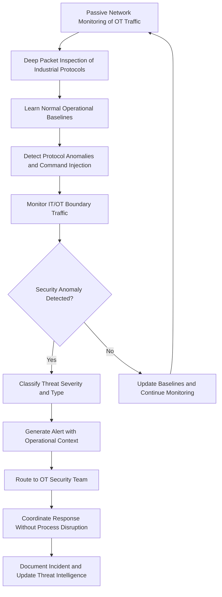

# SCADA/ICS Security Monitor

Frankmax

NAICS 221112

> **National Critical Infrastructure** — SCADA/ICS Security Monitor Module

## Objective & Purpose

Supervisory Control and Data Acquisition (SCADA) and Industrial Control Systems (ICS) that operate critical infrastructure — power grids, water treatment, pipelines, and transportation — were designed for reliability and safety in air-gapped environments, not cybersecurity in connected networks. As operational technology (OT) networks have converged with IT networks for operational efficiency, these systems have become prime targets for nation-state adversaries and criminal organizations. Attacks on ICS/SCADA systems carry consequences that extend beyond data theft into physical damage, environmental contamination, and loss of life. Traditional IT security tools are ineffective in OT environments because they do not understand industrial protocols, cannot distinguish between legitimate operational commands and malicious manipulations, and may disrupt safety-critical processes.

The SCADA/ICS Security Monitor provides purpose-built OT cybersecurity that understands industrial protocols (Modbus, DNP3, OPC-UA, IEC 61850, BACnet), learns normal operational behavior for each industrial process, and detects anomalies that indicate cyberattack, insider threat, or equipment malfunction. The system provides deep packet inspection of industrial protocols without disrupting real-time operations, identifies unauthorized configuration changes, detects command injection attacks, and monitors for lateral movement between IT and OT network segments. Unlike IT security tools adapted for OT, this monitor is designed from the ground up for environments where availability and safety take precedence over confidentiality.

All security monitoring and alerting is governed by ETLB protocols ensuring that automated response actions in OT environments require appropriate authorization given the potential for physical consequences. The ORF framework maintains audit trails that support NERC CIP, TSA Pipeline Security, and CISA reporting requirements.

## Business Context

| Attribute | Value |
|---|---|
| **Business Process** | Industrial control system security |
| **Business Function** | Cybersecurity |
| **Category** | Security |
| **Target Audience** | 3. National Critical Infrastructure |
| **Bundle** | Critical Infrastructure Pack ($15,000/mo) |
| **Monthly Cost of Inaction** | $800,000 in OT cyber risk exposure and regulatory non-compliance |

## BPMN Workflow

## Features

1. **Industrial Protocol Deep Packet Inspection** — Performs deep packet inspection of SCADA/ICS protocols including Modbus, DNP3, OPC-UA, IEC 61850, BACnet, and EtherNet/IP without introducing latency or disrupting real-time operations.

2. **Operational Behavior Learning** — Builds process-specific behavioral baselines that distinguish legitimate operational commands from anomalous activity by understanding the physics and logic of each monitored industrial process.

3. **IT/OT Boundary Monitoring** — Monitors traffic crossing IT/OT network boundaries to detect lateral movement, unauthorized remote access, and data exfiltration attempts that traverse the convergence point.

4. **Unauthorized Configuration Detection** — Identifies unauthorized changes to PLC logic, HMI configurations, setpoint values, and firmware that could indicate supply chain compromise, insider threat, or active cyberattack.

5. **Asset Discovery and Inventory** — Passively discovers and inventories all OT network assets including PLCs, RTUs, HMIs, engineering workstations, and embedded devices, maintaining a continuously updated asset register.

6. **Vulnerability Assessment** — Maps discovered assets against known vulnerability databases (ICS-CERT, CVE) to identify exploitable vulnerabilities in the OT environment and prioritize patching based on operational risk.

7. **Safety System Monitoring** — Monitors safety instrumented systems (SIS) and protective relay configurations for unauthorized changes that could disable safety functions, creating a critical last line of defense.

8. **Compliance Mapping** — Maps monitoring coverage and security controls against NERC CIP, TSA Pipeline Security Directives, NIST SP 800-82, and IEC 62443 requirements to identify compliance gaps.

## Workflow & Automation

**Step 1: Passive Deployment** — Network taps and SPAN ports are configured to mirror OT network traffic to the monitoring system without introducing any inline components that could disrupt operations.

**Step 2: Asset Discovery** — The system passively discovers all communicating devices on the OT network, building an inventory that includes device type, firmware version, communication patterns, and network relationships.

**Step 3: Baseline Learning** — Normal operational patterns are learned for each process, device, and communication flow over a configurable baseline period. Baselines incorporate time-of-day, operational mode, and seasonal variations.

**Step 4: Continuous Monitoring** — All OT network traffic is continuously monitored for anomalies including protocol violations, command injection, unauthorized access, configuration changes, and behavioral deviations.

**Step 5: Threat Classification** — Detected anomalies are classified by threat type (cyberattack, insider threat, equipment malfunction, configuration drift) and severity based on potential operational impact.

**Step 6: Alert and Response** — Alerts are routed to OT security personnel with full operational context including affected assets, process impact assessment, and recommended response actions that avoid operational disruption.

**Step 7: Compliance Reporting** — Security events, monitoring coverage, and compliance status are documented in formats aligned with NERC CIP, TSA, and CISA reporting requirements.

## Input/Output Specifications

| Direction | Data | Format | Description |
|---|---|---|---|
| Input | OT network traffic | PCAP/mirrored | Raw industrial protocol communications |
| Input | Asset configuration data | JSON/XML | PLC programs, HMI configurations, firmware versions |
| Input | Vulnerability databases | JSON/CSV | ICS-CERT advisories and CVE data |
| Input | Network architecture documents | JSON/Visio | IT/OT network topology and segmentation |
| Output | Security alerts | CEF/JSON | Classified threat notifications with context |
| Output | Asset inventory | JSON/CSV | Complete OT asset register with vulnerability status |
| Output | Compliance reports | PDF/JSON | Regulatory compliance documentation |

## Integration Points

| System | Integration Type | Data Flow |
|---|---|---|
| SCADA/EMS Systems | Passive monitoring | Inbound mirrored OT network traffic |
| Enterprise SIEM | CEF/Syslog | Outbound security alerts and events |
| Grid Stability Predictor | Internal API | Bidirectional operational and security data |
| Pipeline Integrity Monitor | Internal API | Bidirectional asset health and security data |
| Cyber Threat Hunting Platform | Secure API | Bidirectional OT-specific threat intelligence |
| ORF Compliance Layer | Event-driven | Outbound security event audit trail |

## Pricing & Revenue Model

| Component | Price |
|---|---|
| **Bundle** | Critical Infrastructure Pack |
| **Bundle Price** | $15,000/mo |
| **Standalone Module** | $4,000/mo |
| **Per-Site Deployment** | $2,000/mo per additional OT site |
| **Implementation** | $50,000 one-time |

Revenue scales with the number of OT sites under monitoring. The compliance mapping and safety system monitoring features represent high-margin "fries" at 91% margin. Implementation fees are higher than other modules due to the specialized nature of OT network deployment. The accumulated process behavioral baselines create "kitchen" moat value — each site's operational fingerprint becomes more precise over time and represents irreplaceable institutional knowledge.

## NAICS/SIC Mapping

| NAICS | SIC | Industry | Relevance |
|---|---|---|---|
| 221112 | 4911 | Fossil Fuel Electric Power Generation | Primary — power grid SCADA security |
| 486110 | 4612 | Crude Petroleum Pipelines | Pipeline SCADA security |
| 221310 | 4941 | Water Supply and Irrigation Systems | Water treatment ICS security |
| 541512 | 7372 | Computer Systems Design Services | OT cybersecurity integration |
