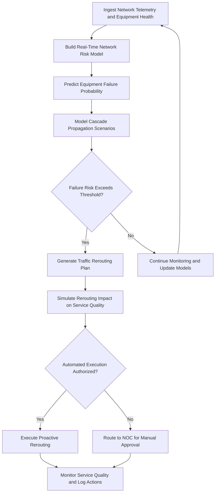

# Telecom Network Resilience Engine

Frankmax

NAICS 517311

> **National Critical Infrastructure** — Telecom Network Resilience Engine Module

## Objective & Purpose

Telecommunications networks serve as the backbone of modern critical infrastructure — when telecom fails, emergency services, financial systems, government communications, and public safety all degrade simultaneously. Network outages cascade through interconnected systems with compounding severity: a single fiber cut can isolate an entire region, overloaded cell towers during disasters prevent emergency calls, and routing convergence storms can propagate failures across autonomous systems in seconds. Traditional network management tools react to failures after they occur, and human operators cannot process the volume and velocity of network telemetry required to anticipate cascading failures in real time.

The Telecom Network Resilience Engine applies AI-driven predictive analytics and automated traffic engineering to anticipate network failures before they cascade, reroute traffic proactively around predicted failure points, and optimize network resource utilization under both normal and stressed conditions. The system continuously monitors network topology, traffic patterns, equipment health indicators, and environmental conditions to build a real-time risk model of the entire network. When failure precursors are detected, the engine automatically generates and optionally executes traffic rerouting plans that maintain service continuity while minimizing latency and jitter impact.

All automated traffic management decisions are governed by ETLB protocols that bind liability for service impact decisions to appropriate authorization levels. The ORF framework maintains complete audit trails of every routing change, capacity allocation, and failover decision, supporting SLA compliance documentation and regulatory reporting to the FCC.

## Business Context

| Attribute | Value |
|---|---|
| **Business Process** | Network management |
| **Business Function** | Network Operations |
| **Category** | Operations |
| **Target Audience** | 3. National Critical Infrastructure |
| **Bundle** | Critical Infrastructure Pack ($15,000/mo) |
| **Monthly Cost of Inaction** | $500,000 in network outage costs, SLA penalties, and customer churn |

## BPMN Workflow

## Features

1. **Predictive Equipment Failure** — Analyzes equipment telemetry including temperature, error rates, power consumption, and age-related degradation patterns to predict hardware failures hours to days before they occur.

2. **Cascade Failure Modeling** — Simulates how individual component failures propagate through the network, identifying single points of failure, critical path dependencies, and cascade amplification points.

3. **Automated Traffic Engineering** — Generates and optionally executes optimized traffic rerouting plans that redirect traffic around predicted or actual failure points while maintaining service quality constraints.

4. **Capacity Planning Intelligence** — Analyzes traffic growth patterns, peak usage trends, and geographic demand shifts to recommend capacity investments that prevent congestion-driven service degradation.

5. **Disaster Resilience Planning** — Models network behavior under disaster scenarios including natural disasters, cyberattacks, and mass-event overloads to identify vulnerabilities and recommend hardening investments.

6. **SLA Compliance Monitoring** — Continuously tracks service quality metrics against SLA commitments for every customer circuit, predicting SLA breaches before they occur and triggering preventive actions.

7. **Multi-Layer Optimization** — Optimizes across physical, transport, and IP layers simultaneously, ensuring that routing decisions at one layer do not create unintended consequences at other layers.

8. **Environmental Risk Integration** — Integrates weather forecasts, wildfire maps, flood zones, and seismic data to assess environmental threats to physical network infrastructure and preposition traffic rerouting.

## Workflow & Automation

**Step 1: Telemetry Collection** — Network devices continuously report health metrics, interface statistics, error counters, and environmental conditions. The system aggregates data across all network layers and segments.

**Step 2: Risk Modeling** — Equipment failure probabilities are calculated based on telemetry trends, maintenance history, environmental exposure, and age. Network topology models determine cascade impact for each potential failure.

**Step 3: Scenario Simulation** — The system continuously simulates failure scenarios for high-risk components, calculating service impact and generating pre-computed rerouting plans for rapid deployment.

**Step 4: Threshold Evaluation** — When equipment failure probability or cumulative network risk exceeds configurable thresholds, the system transitions from monitoring to active intervention mode.

**Step 5: Rerouting Plan Generation** — Traffic rerouting plans are generated that maintain service quality while avoiding predicted failure points. Plans are validated against capacity constraints and SLA requirements.

**Step 6: Execution** — Approved rerouting plans are executed through network management system integration. Automated execution operates within operator-defined boundaries; changes exceeding those boundaries require NOC approval.

**Step 7: Post-Action Analysis** — All routing changes are monitored for effectiveness. Actual service quality is compared against predicted impact, and models are updated based on outcomes.

## Input/Output Specifications

| Direction | Data | Format | Description |
|---|---|---|---|
| Input | Network telemetry | SNMP/gRPC/streaming | Equipment health, interface stats, error counters |
| Input | Traffic flow data | NetFlow/sFlow/IPFIX | Traffic volume, routing, and quality metrics |
| Input | Network topology | JSON/YANG | Physical and logical network structure |
| Input | Weather and environmental data | JSON | Forecasts for infrastructure risk assessment |
| Output | Failure predictions | JSON | Equipment-level failure probability and timeline |
| Output | Rerouting plans | YANG/JSON | Traffic engineering configuration changes |
| Output | SLA compliance reports | PDF/JSON | Service quality tracking against commitments |

## Integration Points

| System | Integration Type | Data Flow |
|---|---|---|
| Network Management Systems (NMS) | SNMP/API | Bidirectional telemetry and configuration |
| SDN Controllers | REST API/OpenFlow | Outbound traffic engineering commands |
| NOC Dashboards | WebSocket/REST | Outbound real-time risk and status visualization |
| SCADA/ICS Security Monitor | Internal API | Bidirectional security and operational data |
| Weather Service Providers | REST API | Inbound environmental risk data |
| ORF Compliance Layer | Event-driven | Outbound routing decision audit trail |

## Pricing & Revenue Model

| Component | Price |
|---|---|
| **Bundle** | Critical Infrastructure Pack |
| **Bundle Price** | $15,000/mo |
| **Standalone Module** | $3,200/mo |
| **Per-Node Monitoring Add-on** | $25/mo per network device |
| **Implementation** | $35,000 one-time |

Revenue scales with the number of network devices under monitoring, creating predictable per-node recurring revenue alongside the bundled Critical Infrastructure Pack. The SLA compliance monitoring and cascade failure modeling represent high-margin "fries" at 89% margin. The continuously trained equipment failure prediction models create "kitchen" moat value — failure predictions become more accurate as the system accumulates equipment-specific degradation data across the fleet.

## NAICS/SIC Mapping

| NAICS | SIC | Industry | Relevance |
|---|---|---|---|
| 517311 | 4813 | Wired Telecommunications Carriers | Primary — telecom network management |
| 517312 | 4812 | Wireless Telecommunications Carriers | Wireless network resilience |
| 517410 | 4899 | Satellite Telecommunications | Satellite network management |
| 518210 | 7374 | Data Processing, Hosting, and Related Services | Data center network resilience |
