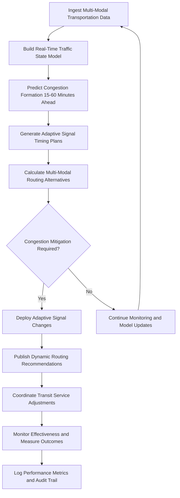

# Transportation Flow Optimizer

Frankmax

NAICS 488999

> **National Critical Infrastructure** — Transportation Flow Optimizer Module

## Objective & Purpose

Transportation congestion costs the United States over $87 billion annually in lost productivity, wasted fuel, and increased emissions. Traditional traffic management relies on fixed signal timing plans and reactive incident response — approaches designed for predictable traffic patterns that cannot adapt to the dynamic, multi-modal transportation networks of modern metropolitan areas. When incidents occur, congestion cascades through interconnected road, rail, and transit networks faster than human operators can develop and implement response plans. The result is systemic inefficiency where infrastructure capacity is chronically underutilized during off-peak periods and overwhelmed during peaks.

The Transportation Flow Optimizer applies AI-driven traffic prediction, adaptive signal control, and multi-modal coordination to maximize throughput across road, rail, transit, and freight networks simultaneously. The system ingests real-time data from traffic sensors, connected vehicles, transit systems, and freight tracking platforms to build a unified picture of transportation demand and capacity. Machine learning models predict congestion formation 15-60 minutes in advance, enabling preemptive signal timing adjustments, dynamic routing recommendations, and transit service modifications that prevent congestion rather than react to it.

All automated traffic control decisions are governed by ETLB protocols ensuring that liability for signal timing changes and routing recommendations is explicitly bound. The ORF framework maintains complete audit trails supporting federal and state transportation reporting requirements including FHWA performance measures.

## Business Context

| Attribute | Value |
|---|---|
| **Business Process** | Traffic and logistics management |
| **Business Function** | Transportation Ops |
| **Category** | Operations |
| **Target Audience** | 3. National Critical Infrastructure |
| **Bundle** | Critical Infrastructure Pack ($15,000/mo) |
| **Monthly Cost of Inaction** | $350,000 in congestion costs, fuel waste, and emissions penalties |

## BPMN Workflow

## Features

1. **Predictive Congestion Modeling** — Forecasts traffic congestion 15-60 minutes in advance using real-time sensor data, historical patterns, event calendars, weather conditions, and construction zone impacts.

2. **Adaptive Signal Control** — Dynamically adjusts traffic signal timing in real-time based on current and predicted traffic conditions, optimizing green time allocation, phase sequences, and coordination offsets across signal networks.

3. **Multi-Modal Coordination** — Coordinates traffic flow across road, rail, transit, bicycle, and pedestrian networks simultaneously, optimizing the entire transportation system rather than individual modes in isolation.

4. **Incident Response Optimization** — Detects incidents automatically through sensor anomalies and connected vehicle data, then generates and deploys optimized detour routing and signal timing plans within minutes of detection.

5. **Freight Priority Management** — Integrates freight vehicle tracking and delivery schedules to provide signal priority for commercial vehicles on designated freight corridors while minimizing impact on general traffic.

6. **Transit Signal Priority** — Coordinates traffic signals with transit vehicle locations and schedule adherence to provide conditional signal priority that keeps transit vehicles on schedule without disproportionately impacting cross-traffic.

7. **Emissions Reduction Tracking** — Quantifies emissions reductions achieved through congestion mitigation, idle time reduction, and modal shift, supporting environmental compliance and sustainability reporting.

## Workflow & Automation

**Step 1: Data Ingestion** — Real-time data from loop detectors, radar sensors, cameras, connected vehicles, transit AVL systems, and freight tracking platforms is continuously ingested and fused into a unified traffic state model.

**Step 2: State Estimation** — Current traffic conditions across all modes are estimated by combining sensor data with historical patterns and calibrated traffic models to fill coverage gaps and validate sensor readings.

**Step 3: Congestion Prediction** — Machine learning models predict where and when congestion will form based on current conditions, upstream demand, scheduled events, weather, and historical patterns.

**Step 4: Signal Optimization** — Optimal signal timing plans are calculated for predicted conditions. The system evaluates thousands of timing plan alternatives and selects plans that maximize network throughput while satisfying constraints.

**Step 5: Multi-Modal Routing** — Dynamic routing recommendations for vehicles, transit riders, and freight operators are generated based on predicted conditions and optimized signal plans.

**Step 6: Deployment** — Approved signal timing changes are deployed through traffic management center integration. Routing recommendations are published through traveler information systems and navigation platforms.

**Step 7: Performance Measurement** — Actual traffic performance is measured against predictions and compared against baseline conditions. Performance metrics are compiled for FHWA reporting and continuous model improvement.

## Input/Output Specifications

| Direction | Data | Format | Description |
|---|---|---|---|
| Input | Traffic sensor data | NTCIP/JSON | Loop detector counts, speeds, and occupancy |
| Input | Connected vehicle data | JSON/BSM | Vehicle position, speed, and trajectory data |
| Input | Transit AVL data | GTFS-RT/JSON | Bus and rail vehicle positions and schedule data |
| Input | Weather and event data | JSON | Conditions affecting traffic demand and capacity |
| Output | Signal timing plans | NTCIP/JSON | Optimized signal timing and coordination |
| Output | Routing recommendations | JSON/API | Dynamic route guidance for travelers and freight |
| Output | Performance reports | PDF/CSV | Congestion, delay, and emissions metrics |

## Integration Points

| System | Integration Type | Data Flow |
|---|---|---|
| Traffic Management Centers | NTCIP/API | Bidirectional signal control and monitoring |
| Transit Operations Centers | GTFS-RT/API | Bidirectional transit data and priority requests |
| Navigation Platforms | REST API | Outbound routing recommendations |
| Freight Management Systems | API | Inbound freight schedules, outbound priority corridors |
| Emergency Response Coordinator | Internal API | Bidirectional incident data and evacuation routing |
| ORF Compliance Layer | Event-driven | Outbound traffic control decision audit trail |

## Pricing & Revenue Model

| Component | Price |
|---|---|
| **Bundle** | Critical Infrastructure Pack |
| **Bundle Price** | $15,000/mo |
| **Standalone Module** | $3,000/mo |
| **Per-Intersection Add-on** | $75/mo per signalized intersection |
| **Implementation** | $35,000 one-time |

Revenue scales with the number of signalized intersections under adaptive control, creating predictable per-intersection recurring revenue. The emissions reduction tracking and freight priority management features represent high-margin "fries" at 85% margin. Accumulated intersection-specific traffic models and calibrated prediction algorithms create "kitchen" moat value — each intersection's behavioral model becomes more accurate over time and cannot be replicated without equivalent data history.

## NAICS/SIC Mapping

| NAICS | SIC | Industry | Relevance |
|---|---|---|---|
| 488999 | 4789 | All Other Transportation Support Activities | Primary — traffic management and optimization |
| 488490 | 4731 | Other Support Activities for Road Transportation | Road traffic management |
| 485111 | 4111 | Mixed Mode Transit Systems | Transit signal priority and coordination |
| 488119 | 4581 | Other Airport Operations | Airport ground transportation management |
