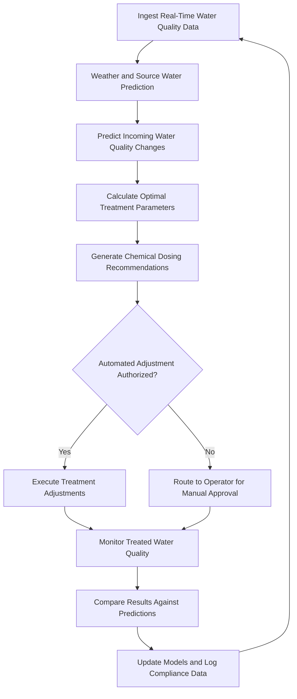

# Water Treatment Optimizer

Frankmax

NAICS 221310

> **National Critical Infrastructure** — Water Treatment Optimizer Module

## Objective & Purpose

Water treatment operations face a fundamental challenge: raw water quality varies continuously due to seasonal changes, weather events, agricultural runoff, industrial discharge, and source water conditions, yet chemical dosing and treatment process adjustments are largely reactive. Operators sample water quality at intervals, often hourly, and adjust treatment based on lagging indicators. This reactive approach results in over-dosing (wasting chemicals and producing excess disinfection byproducts), under-dosing (risking regulatory violations and public health), and inability to respond proactively to sudden water quality changes caused by storm events, algal blooms, or upstream contamination incidents.

The Water Treatment Optimizer applies AI-driven real-time process control to continuously adjust chemical dosing, filtration rates, and treatment parameters based on predictive models that anticipate water quality changes before they reach the treatment plant. The system integrates data from online water quality analyzers, weather forecasts, upstream monitoring stations, and historical treatment records to build predictive models that optimize treatment for both regulatory compliance and cost efficiency. Operators transition from reactive adjustment to proactive optimization, reducing chemical costs by 15-25% while improving treated water quality consistency.

All treatment decisions and automated adjustments are governed by ETLB protocols ensuring that liability for water quality outcomes is explicitly bound to the appropriate authority level. The ORF framework maintains complete records of every treatment parameter change, water quality measurement, and regulatory compliance data point, supporting EPA and state regulatory reporting requirements.

## Business Context

| Attribute | Value |
|---|---|
| **Business Process** | Water quality management |
| **Business Function** | Utility Operations |
| **Category** | Operations |
| **Target Audience** | 3. National Critical Infrastructure |
| **Bundle** | Critical Infrastructure Pack ($15,000/mo) |
| **Monthly Cost of Inaction** | $120,000 in chemical waste, compliance risk, and suboptimal treatment |

## BPMN Workflow

## Features

1. **Predictive Water Quality Modeling** — Forecasts incoming raw water quality 2-24 hours in advance by integrating upstream monitoring data, weather predictions, seasonal patterns, and watershed activity indicators.

2. **Chemical Dosing Optimization** — Calculates optimal coagulant, disinfectant, pH adjustment, and specialty chemical dosing rates that minimize chemical usage while maintaining treated water quality within regulatory limits.

3. **Disinfection Byproduct Control** — Models disinfection byproduct formation potential based on precursor concentrations, disinfectant type and dose, contact time, and temperature to minimize DBP levels while maintaining adequate disinfection.

4. **Algal Bloom Response** — Detects early indicators of algal blooms through source water monitoring and satellite imagery, automatically adjusting treatment processes to handle elevated taste-and-odor compounds and cyanotoxins.

5. **Filter Performance Optimization** — Monitors individual filter performance including head loss development, turbidity breakthrough, and run time optimization. Predicts optimal backwash timing to maximize filter life and treated water quality.

6. **Regulatory Compliance Dashboard** — Continuously tracks compliance with Safe Drinking Water Act requirements, state regulations, and distribution system water quality targets, generating alerts when parameters approach regulatory limits.

7. **Energy Cost Optimization** — Schedules energy-intensive treatment processes (pumping, ozone generation, UV treatment) to coincide with off-peak electricity rates where treatment flexibility allows.

## Workflow & Automation

**Step 1: Data Collection** — Online water quality analyzers, flow meters, chemical feed systems, and environmental sensors continuously feed data into the optimization platform at intervals of 1-5 minutes.

**Step 2: Source Water Prediction** — Upstream monitoring data and weather forecasts are analyzed to predict how raw water quality will change in the coming hours, enabling proactive rather than reactive treatment adjustments.

**Step 3: Treatment Modeling** — Process models simulate the effect of different treatment parameter combinations on treated water quality, chemical consumption, energy usage, and regulatory compliance margins.

**Step 4: Optimization Calculation** — The optimal treatment parameter set is calculated by balancing water quality targets, chemical costs, energy costs, and equipment constraints. Multiple optimization scenarios are generated.

**Step 5: Implementation** — Optimized parameters are either implemented automatically through SCADA integration (within operator-defined limits) or presented to operators for manual approval when changes exceed automated authority thresholds.

**Step 6: Verification** — Treated water quality is continuously monitored and compared against predictions. Deviations trigger model recalibration and, if necessary, corrective treatment adjustments.

**Step 7: Compliance Logging** — All water quality data, treatment parameters, and operational decisions are logged in compliance-ready formats for regulatory reporting and audit purposes.

## Input/Output Specifications

| Direction | Data | Format | Description |
|---|---|---|---|
| Input | Online water quality data | OPC-UA/Modbus | Turbidity, pH, chlorine, TOC, UV254 measurements |
| Input | Weather forecasts | JSON/GRIB | Precipitation, temperature, and runoff predictions |
| Input | Upstream monitoring data | JSON/CSV | Source water quality from upstream stations |
| Input | Chemical inventory data | JSON | Available chemical stocks and delivery schedules |
| Output | Dosing recommendations | JSON | Optimized chemical feed rates and setpoints |
| Output | Compliance reports | PDF/XML | Regulatory reporting documentation |
| Output | Performance analytics | JSON/CSV | Treatment efficiency and cost optimization metrics |

## Integration Points

| System | Integration Type | Data Flow |
|---|---|---|
| SCADA Systems | OPC-UA/Modbus | Bidirectional process data and control setpoints |
| Laboratory Information Systems (LIMS) | REST API | Inbound lab analysis results for model calibration |
| Weather Service Providers | REST API | Inbound forecast data for source water prediction |
| Chemical Supplier Systems | API | Inbound inventory data, outbound order triggers |
| Regulatory Compliance Automator | Internal API | Outbound compliance data for reporting |
| ORF Compliance Layer | Event-driven | Outbound treatment decision audit trail |

## Pricing & Revenue Model

| Component | Price |
|---|---|
| **Bundle** | Critical Infrastructure Pack |
| **Bundle Price** | $15,000/mo |
| **Standalone Module** | $2,800/mo |
| **Per-Plant Add-on** | $1,500/mo per additional treatment plant |
| **Implementation** | $30,000 one-time |

Revenue scales with the number of treatment plants under optimization. Chemical cost savings of 15-25% typically provide payback within 3-6 months, making the ROI case straightforward. The regulatory compliance dashboard and DBP control features represent high-margin "fries" at 86% margin. Accumulated plant-specific treatment models create "kitchen" moat value that becomes more accurate and valuable over each operating season.

## NAICS/SIC Mapping

| NAICS | SIC | Industry | Relevance |
|---|---|---|---|
| 221310 | 4941 | Water Supply and Irrigation Systems | Primary — water treatment optimization |
| 221320 | 4952 | Sewerage Systems | Wastewater treatment optimization |
| 221330 | 4959 | Steam and Air-Conditioning Supply | Industrial water treatment applications |
| 924110 | 9511 | Administration of Air and Water Resource Programs | Regulatory compliance and reporting |
