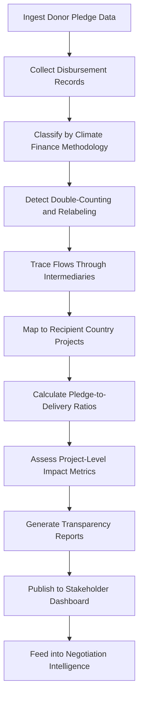

# Climate Finance Tracker

Frankmax

NAICS 928120

> **International Institutions (UN/EU/AU/GCC/ASEAN)** — Financial Tracking Module

## Objective & Purpose

Developed nations pledged $100 billion per year in climate finance to developing countries, yet tracking whether these flows materialize, where they go, and what impact they achieve remains deeply contested. The Climate Finance Tracker uses AI to trace financial flows from donor pledge through intermediary institutions to on-the-ground projects, providing the transparency that both donors and recipients demand but current systems cannot deliver.

The core challenge is definitional and structural. There is no universally agreed definition of what counts as "climate finance." Donors report bilateral aid, multilateral contributions, and private-sector mobilization using different methodologies. A single project may be counted by multiple donors, or a development loan may be relabeled as climate finance without genuinely new resources. This tool applies consistent classification methodology to raw financial data, identifying double-counting, relabeling, and genuine additionality.

For negotiating parties at COP and other climate forums, the ability to verify climate finance claims with data rather than rhetoric is transformative. For recipient countries, tracking what arrives versus what was pledged enables evidence-based advocacy. For intermediary institutions (Green Climate Fund, Climate Investment Funds), the platform provides the monitoring infrastructure their governing boards require.

## Business Context

| Attribute | Value |
|---|---|
| **Business Process** | Climate funding flows |
| **Business Function** | Financial Tracking |
| **Category** | Finance |
| **Target Audience** | 4. International Institutions (UN/EU/AU/GCC/ASEAN) |
| **Bundle** | Custom Pricing |
| **Monthly Cost of Inaction** | $1M+ in disputed financial claims and misallocated climate resources |

## BPMN Workflow

## Features

1. **Pledge-to-Disbursement Tracking** --- Maps every dollar from initial donor pledge through budget allocation, commitment, disbursement, and project delivery, identifying where flows stall or leak.
2. **Classification Engine** --- Applies consistent climate finance definitions (OECD DAC Rio Markers, MDB joint methodology, UNFCCC Standing Committee) to raw financial data, enabling apples-to-apples comparison.
3. **Double-Counting Detector** --- Identifies cases where the same financial flow is claimed by multiple donors or counted under multiple funding windows, producing adjusted net flow figures.
4. **Additionality Analyzer** --- Distinguishes genuinely new climate finance from relabeled development aid, using historical baseline analysis and project-level classification.
5. **Intermediary Flow Mapper** --- Traces funds through multilateral development banks, climate funds, and bilateral agencies, mapping the full financial chain from source to recipient.
6. **Project Impact Connector** --- Links financial flows to on-the-ground project outcomes (tonnes CO2 reduced, renewable capacity installed, people with climate resilience benefits).
7. **Negotiation Intelligence** --- Produces verified financial data summaries formatted for use in COP and other climate negotiation contexts, replacing contested claims with transparent numbers.

## Workflow & Automation

**Step 1: Data Collection** --- Automated pipelines ingest pledge data from UNFCCC, disbursement records from OECD DAC, multilateral fund reports, and bilateral aid databases.

**Step 2: Standardization** --- Financial data is normalized across currencies, fiscal years, and reporting methodologies to enable consistent comparison.

**Step 3: Classification** --- AI applies climate finance classification rules, categorizing each flow as mitigation, adaptation, cross-cutting, or non-climate, with confidence scores.

**Step 4: Integrity Checks** --- Double-counting detection, additionality analysis, and relabeling identification are applied to produce adjusted net climate finance figures.

**Step 5: Flow Tracing** --- Funds are traced through intermediary channels to recipient countries and projects, building a complete financial chain for each dollar pledged.

**Step 6: Impact Linking** --- Financial flows are connected to project-level outcome data where available, calculating cost-effectiveness ratios for different intervention types.

**Step 7: Reporting** --- Transparent reports and dashboards are generated for donors, recipients, negotiators, and the public, with full methodology documentation.

## Input/Output Specifications

| Direction | Data | Format | Description |
|---|---|---|---|
| Input | Donor pledge declarations | PDF, structured data | COP decisions, bilateral pledges, fund replenishments |
| Input | OECD DAC CRS data | API, CSV | Official development assistance with Rio Markers |
| Input | Multilateral fund reports | PDF, API | Green Climate Fund, CIF, GEF disbursement data |
| Input | Project-level outcome data | CSV, API | Emissions reductions, capacity installed, beneficiaries |
| Output | Climate finance dashboards | Web, API | Interactive pledge-to-delivery tracking |
| Output | Verification reports | PDF, XLSX | Audited climate finance flow summaries |
| Output | Negotiation briefs | PDF, PPTX | Formatted data for COP and climate forums |

## Integration Points

| System | Integration Type | Data Flow |
|---|---|---|
| OECD DAC Creditor Reporting System | API | Inbound bilateral climate finance data |
| Green Climate Fund Portal | API | Inbound multilateral fund disbursements |
| UNFCCC Financial Mechanism | API | Inbound pledge and commitment data |
| World Bank Climate Finance Data | API | Inbound MDB climate finance tracking |
| National Climate Action Plans (NDCs) | Document ingestion | Reference for alignment assessment |

## Pricing & Revenue Model

| Component | Price |
|---|---|
| Platform Access | Custom pricing based on tracking scope |
| Donor Portfolio Module | Per-donor tracking |
| Recipient Country Dashboard | Per-country access |
| Negotiation Intelligence Package | Per-event pricing |
| ORF Governance Layer | Included |

Revenue is driven by the breadth of financial flows tracked and the number of stakeholder access points. A platform tracking all OECD DAC donor flows to 150+ recipient countries represents $700K-$2M annually. The verified data becomes the reference standard for climate negotiations, creating a "source of truth" position that generates recurring institutional subscription revenue.

## NAICS/SIC Mapping

| NAICS | SIC | Industry | Relevance |
|---|---|---|---|
| 928120 | 9721 | International Affairs | Primary: international climate finance coordination |
| 813910 | 8611 | Business Associations | Secondary: climate finance stakeholder coordination |
| 523910 | 6159 | Miscellaneous Business Credit Institutions | Tertiary: development finance tracking |
| 541620 | 8711 | Environmental Consulting Services | Tertiary: climate policy advisory |
