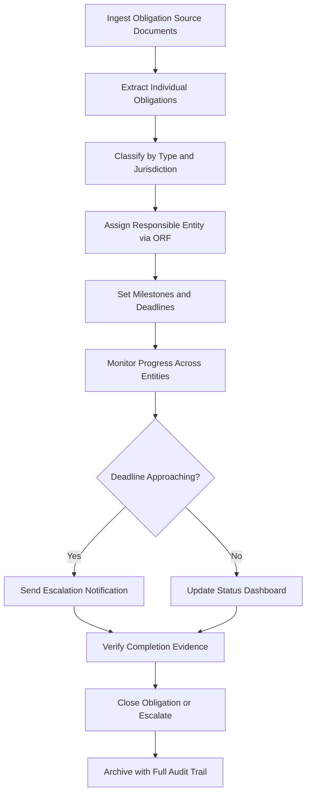

# Cross-Border Obligation Router

Frankmax

NAICS 928120

> **International Institutions (UN/EU/AU/GCC/ASEAN)** — Coordination Module

## Objective & Purpose

International institutions operate under a web of overlapping obligations --- financial contributions, reporting requirements, program deliverables, and diplomatic commitments --- that span dozens of jurisdictions and legal frameworks. The Cross-Border Obligation Router uses AI to ingest, classify, route, and track these obligations across organizational units, member states, and partner agencies, ensuring nothing falls through jurisdictional cracks.

The core problem is structural: obligations originate from different treaty bodies, funding agreements, and resolutions, each with distinct timelines, responsible parties, and escalation procedures. A single institution may carry over 10,000 active obligations across hundreds of agreements. Manual tracking in spreadsheets and email chains leads to missed deadlines, duplicated efforts, and diplomatic friction when one party believes another has dropped the ball.

This tool creates a unified obligation ledger that maps every commitment to its source agreement, responsible entity, deadline, and verification mechanism. The ORF (Obligation and Responsibility Finality) protocol ensures that each obligation has a single accountable owner at any point in time, eliminating the ambiguity that causes institutional paralysis.

## Business Context

| Attribute | Value |
|---|---|
| **Business Process** | International obligation management |
| **Business Function** | Coordination |
| **Category** | Operations |
| **Target Audience** | 4. International Institutions (UN/EU/AU/GCC/ASEAN) |
| **Bundle** | Custom Pricing |
| **Monthly Cost of Inaction** | $180,000+ in coordination failures and duplicated effort |

## BPMN Workflow

## Features

1. **Obligation Extraction Engine** --- Parses resolutions, agreements, MOUs, and funding contracts to extract discrete obligations with AI-identified deadlines, owners, and deliverables.
2. **Jurisdiction Mapping** --- Tags each obligation with applicable legal jurisdictions, routing compliance requirements to the correct national or regional authority.
3. **ORF Assignment Protocol** --- Applies Obligation and Responsibility Finality rules to ensure every obligation has exactly one accountable entity at any time, with documented handoff procedures.
4. **Deadline Intelligence** --- Calculates effective deadlines accounting for business days across jurisdictions, holiday calendars, and dependency chains between related obligations.
5. **Escalation Workflow** --- Configurable escalation paths route overdue or at-risk obligations through institutional hierarchies with increasing urgency levels.
6. **Dependency Chain Mapping** --- Visualizes upstream and downstream dependencies between obligations, identifying critical path items whose delay cascades across multiple commitments.
7. **Cross-Institutional Handoff Tracking** --- Monitors obligation transfers between institutions (e.g., UN agency to member state), maintaining accountability through the transition.
8. **Completion Verification** --- Validates obligation fulfillment against defined acceptance criteria, requiring evidence uploads and multi-party confirmation.

## Workflow & Automation

**Step 1: Document Ingestion** --- Upload source documents (treaties, MOUs, resolutions, funding agreements) for automated obligation extraction and classification.

**Step 2: Obligation Registration** --- Each extracted obligation is registered in the central ledger with source, type, jurisdiction, responsible entity, deadline, and verification criteria.

**Step 3: ORF Assignment** --- The system applies ORF protocol rules to assign accountable owners, requiring explicit acceptance from designated responsible parties.

**Step 4: Milestone Tracking** --- Automated monitoring tracks progress against defined milestones, collecting status updates from responsible entities on configurable schedules.

**Step 5: Deadline Management** --- Proactive notifications fire at configurable intervals before deadlines (90, 60, 30, 14, 7 days), escalating through institutional hierarchy as deadlines approach.

**Step 6: Completion Processing** --- Responsible entities submit completion evidence, which is validated against acceptance criteria before the obligation is marked fulfilled.

## Input/Output Specifications

| Direction | Data | Format | Description |
|---|---|---|---|
| Input | Treaty and agreement documents | PDF, DOCX, XML | Source documents containing obligations |
| Input | Organizational structure data | JSON, LDAP | Entity hierarchies for routing and escalation |
| Input | Status updates | Web form, API | Progress reports from responsible entities |
| Output | Obligation ledger | Dashboard, API | Centralized view of all active obligations |
| Output | Escalation notifications | Email, SMS, webhook | Deadline and risk alerts |
| Output | Compliance reports | PDF, XLSX | Periodic obligation fulfillment summaries |

## Integration Points

| System | Integration Type | Data Flow |
|---|---|---|
| Treaty Management Systems | API | Inbound obligation source documents |
| HR/Organizational Directory | LDAP, API | Inbound entity and personnel data for routing |
| Financial Management Systems | API | Bidirectional funding obligation tracking |
| Email/Calendar Systems | SMTP, CalDAV | Outbound notifications and deadline reminders |
| Document Management Systems | API | Bidirectional evidence storage and retrieval |

## Pricing & Revenue Model

| Component | Price |
|---|---|
| Platform Access | Custom pricing based on obligation volume |
| Per-Agreement Monitoring | Tiered by obligation count |
| ORF Protocol Engine | Included in base |
| Cross-Institutional Module | Premium add-on |
| API Access | Included |

Revenue correlates with obligation volume and institutional complexity. A mid-size international organization with 5,000 active obligations represents $400K-$1M annually. The ORF protocol creates deep institutional dependency --- once obligations are tracked through this system, switching costs are prohibitive because the audit trail and accountability chain cannot be easily migrated.

## NAICS/SIC Mapping

| NAICS | SIC | Industry | Relevance |
|---|---|---|---|
| 928120 | 9721 | International Affairs | Primary: international obligation coordination |
| 813910 | 8611 | Business Associations | Secondary: multi-stakeholder obligation tracking |
| 541611 | 7371 | Administrative Management Consulting | Tertiary: organizational coordination consulting |
| 561110 | 7389 | Office Administrative Services | Tertiary: administrative process management |
