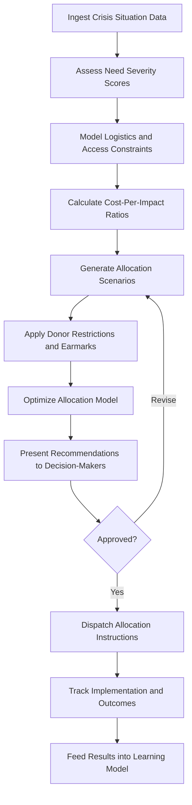

# Humanitarian Response Optimizer

Frankmax

NAICS 928120

> **International Institutions (UN/EU/AU/GCC/ASEAN)** — Resource Management Module

## Objective & Purpose

Humanitarian aid allocation is distorted by political pressure, media attention cycles, and information asymmetry. Crises that dominate headlines attract disproportionate funding while protracted emergencies affecting millions receive a fraction of what is needed. The Humanitarian Response Optimizer uses AI to model need severity, logistics constraints, and cost-per-impact ratios to recommend allocations that maximize lives saved and suffering reduced per dollar deployed.

The platform ingests data from UN OCHA situation reports, IPC food security classifications, displacement tracking matrices, health cluster reports, and satellite-derived damage assessments. It builds a real-time model of humanitarian need across all active emergencies globally, scoring each by severity, population affected, access constraints, and absorption capacity of local implementing partners.

For institutions managing humanitarian budgets in the billions, the difference between optimized and politically-driven allocation is measured in lives. A 15% improvement in allocation efficiency across a $5B humanitarian portfolio translates to coverage for an additional 3-4 million affected people. This tool provides the analytical backbone for evidence-based humanitarian decision-making while producing the audit trail that donor accountability demands.

## Business Context

| Attribute | Value |
|---|---|
| **Business Process** | Aid allocation |
| **Business Function** | Resource Management |
| **Category** | Operations |
| **Target Audience** | 4. International Institutions (UN/EU/AU/GCC/ASEAN) |
| **Bundle** | Custom Pricing |
| **Monthly Cost of Inaction** | $2M+ in suboptimal aid allocation per emergency cycle |

## BPMN Workflow

## Features

1. **Multi-Crisis Need Assessment** --- Aggregates situation data across all active emergencies to produce standardized severity scores enabling cross-crisis comparison and prioritization.
2. **Logistics Constraint Modeling** --- Factors in supply chain bottlenecks, access restrictions, seasonal weather patterns, and infrastructure damage when calculating deliverable aid volumes.
3. **Cost-Per-Impact Optimization** --- Models the marginal impact of each additional dollar allocated to each crisis, sector, and geographic area, recommending allocations that maximize aggregate impact.
4. **Donor Restriction Engine** --- Incorporates earmarking rules, geographic restrictions, and sector preferences from major donors to produce allocations that are both optimal and compliant.
5. **Scenario Comparison Dashboard** --- Displays multiple allocation scenarios side-by-side, showing projected outcomes (lives reached, mortality reduction, food security improvement) for each.
6. **Real-Time Reallocation** --- As situations evolve, the system recommends reallocation adjustments to shift resources from stabilizing crises to deteriorating ones.
7. **Outcome Tracking and Learning** --- Monitors actual outcomes against projected impact, feeding results back into models to improve future allocation accuracy.

## Workflow & Automation

**Step 1: Situation Monitoring** --- Automated pipelines ingest data from OCHA ReliefWeb, IPC, UNHCR displacement tracking, WHO disease surveillance, and satellite imagery providers.

**Step 2: Need Scoring** --- AI models produce standardized severity scores for each crisis across dimensions: mortality risk, food insecurity, displacement, health burden, and protection concerns.

**Step 3: Constraint Mapping** --- Logistics models calculate deliverable aid volumes by location, accounting for transport infrastructure, security conditions, and partner absorption capacity.

**Step 4: Optimization Run** --- Mathematical optimization algorithms generate allocation recommendations maximizing projected impact within budget constraints and donor restrictions.

**Step 5: Decision Support** --- Scenario comparison dashboards present options to humanitarian coordinators with projected outcome metrics for each allocation strategy.

**Step 6: Implementation Tracking** --- Once allocations are approved, the system tracks disbursement, delivery, and outcome metrics against projections.

## Input/Output Specifications

| Direction | Data | Format | Description |
|---|---|---|---|
| Input | Situation reports | PDF, API (ReliefWeb) | UN OCHA and cluster lead situation assessments |
| Input | Displacement data | API, CSV | UNHCR and IOM population movement tracking |
| Input | Food security classifications | API (IPC) | Integrated Phase Classification data |
| Input | Donor funding data | CSV, API | Pledges, disbursements, and earmarking rules |
| Output | Allocation recommendations | Dashboard, PDF | Optimized resource distribution proposals |
| Output | Impact projections | JSON, dashboard | Expected outcomes per allocation scenario |
| Output | Implementation tracking reports | PDF, XLSX | Progress against allocation targets |

## Integration Points

| System | Integration Type | Data Flow |
|---|---|---|
| OCHA ReliefWeb | API | Inbound situation reports and appeals data |
| UNHCR Population Statistics | API | Inbound displacement and refugee data |
| IPC Global Platform | API | Inbound food security classification data |
| Financial Tracking Service (FTS) | API | Bidirectional funding flow data |
| Logistics Cluster Systems | API | Inbound supply chain and access data |

## Pricing & Revenue Model

| Component | Price |
|---|---|
| Platform Access | Custom pricing based on portfolio scope |
| Per-Emergency Module | Tiered by crisis complexity |
| Optimization Engine | Included in base |
| Outcome Tracking Add-on | Premium |
| ORF Governance Layer | Included |

Revenue correlates with humanitarian budget under management. An institution allocating $1B+ annually across 20+ emergencies represents $800K-$2M in annual contract value. The learning model improves allocation accuracy with each cycle, and the audit trail satisfies donor accountability requirements that are increasingly mandated by major government donors.

## NAICS/SIC Mapping

| NAICS | SIC | Industry | Relevance |
|---|---|---|---|
| 928120 | 9721 | International Affairs | Primary: humanitarian coordination for international bodies |
| 813910 | 8611 | Business Associations | Secondary: humanitarian consortium coordination |
| 624190 | 8399 | Other Individual and Family Services | Tertiary: humanitarian service delivery |
| 541720 | 8732 | Research and Development | Tertiary: humanitarian research and analytics |
