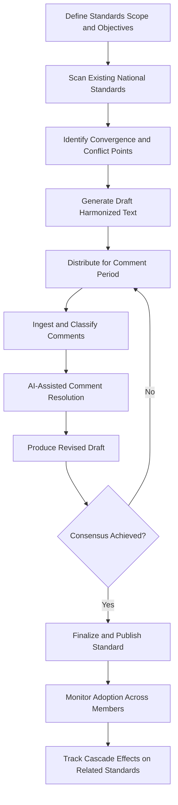

# International Standards Compiler

Frankmax

NAICS 813910

> **International Institutions (UN/EU/AU/GCC/ASEAN)** — Standards Management Module

## Objective & Purpose

Developing an international standard takes 5-10 years through traditional committee processes --- drafting, comment periods, revision cycles, and consensus building across dozens of national standards bodies. The International Standards Compiler uses AI to accelerate every phase: analyzing existing national standards for convergence points, drafting harmonized text, identifying conflicts between proposed provisions, and modeling the economic impact of adoption across member economies.

The standards development bottleneck is not technical complexity but coordination overhead. A working group revising a single ISO standard may involve 40 national delegations, each comparing proposed text against their domestic regulatory framework. AI can perform this cross-referencing in hours rather than months, identifying where proposed language conflicts with existing national regulation and suggesting alternative formulations that achieve the same technical objective without creating compliance conflicts.

Beyond acceleration, the platform ensures consistency. International standards bodies maintain thousands of active standards that must remain internally coherent. When one standard is updated, the compiler identifies cascade effects on related standards, flagging provisions that need revision to maintain consistency. For organizations whose entire value proposition depends on the quality and coherence of their standards catalog, this capability protects institutional credibility.

## Business Context

| Attribute | Value |
|---|---|
| **Business Process** | Standards development |
| **Business Function** | Standards Management |
| **Category** | Governance |
| **Target Audience** | 4. International Institutions (UN/EU/AU/GCC/ASEAN) |
| **Bundle** | Custom Pricing |
| **Monthly Cost of Inaction** | $200,000+ per standard in extended development cycle costs |

## BPMN Workflow

## Features

1. **National Standards Scanner** --- Ingests and analyzes existing national and regional standards relevant to the development topic, identifying common provisions and divergent approaches.
2. **Conflict Detection Engine** --- Compares proposed standard language against regulatory frameworks of member states, flagging provisions that would conflict with existing domestic law.
3. **Harmonized Text Generator** --- Drafts standard language that maximizes technical precision while minimizing conflicts with existing national frameworks, using legal NLP models.
4. **Comment Management System** --- Ingests, classifies, and clusters comments from national delegations, identifying common themes and conflicting positions to streamline resolution.
5. **Economic Impact Modeler** --- Estimates the cost of standard adoption for each member economy, segmented by industry sector, to inform development decisions and transition timelines.
6. **Cascade Impact Analyzer** --- When a standard is updated, identifies all related standards that may need revision to maintain internal coherence across the catalog.
7. **Adoption Tracking** --- Monitors which member states have transposed the standard into national regulation, tracking adoption rates and identifying barriers to implementation.

## Workflow & Automation

**Step 1: Scope Definition** --- Working group defines the standard's scope, objectives, and target industries. AI scans existing standards landscape to identify relevant precedents.

**Step 2: Landscape Analysis** --- The compiler ingests national standards from member states, producing a gap analysis showing areas of convergence, divergence, and absence.

**Step 3: Draft Generation** --- AI produces an initial harmonized draft, incorporating common provisions and proposing compromise language for divergent areas.

**Step 4: Comment Processing** --- National delegations submit comments through a structured portal. AI classifies, clusters, and prioritizes comments for working group review.

**Step 5: Iterative Revision** --- The compiler generates revised drafts incorporating accepted comments, tracking changes and maintaining a complete revision history.

**Step 6: Impact Assessment** --- Before finalization, the economic impact modeler estimates adoption costs for each member economy, informing transition period decisions.

**Step 7: Publication and Monitoring** --- Published standards are integrated into the catalog with automated cascade impact analysis and adoption tracking across member states.

## Input/Output Specifications

| Direction | Data | Format | Description |
|---|---|---|---|
| Input | National standards documents | PDF, XML, HTML | Existing standards from member state bodies |
| Input | Regulatory framework databases | API, structured data | Domestic laws relevant to standard scope |
| Input | Delegation comments | Structured forms, DOCX | National delegation feedback on drafts |
| Output | Harmonized draft standards | DOCX, XML (ISO STS) | AI-generated standard text in ISO format |
| Output | Conflict analysis reports | PDF, dashboard | Identified conflicts with national frameworks |
| Output | Adoption tracking dashboards | Web, API | Member state adoption status and timelines |

## Integration Points

| System | Integration Type | Data Flow |
|---|---|---|
| ISO Standards Database (OBP) | API | Bidirectional standards catalog access |
| National Standards Body Portals | Web scraping, API | Inbound national standards texts |
| WTO TBT Notification System | API | Inbound technical barrier notifications |
| Document Collaboration Platforms | API | Bidirectional draft editing and commenting |
| Publication Management Systems | API | Outbound finalized standards for publication |

## Pricing & Revenue Model

| Component | Price |
|---|---|
| Platform Access | Custom pricing based on standards catalog size |
| Per-Standard Development Module | Tiered by complexity and member count |
| Comment Management System | Included |
| Economic Impact Modeler | Premium add-on |
| ORF Governance Layer | Included |

Revenue correlates with the number of standards under active development or revision. An international standards body managing 200+ active development projects represents $600K-$2M annually. The national standards database grows with each project, creating an increasingly comprehensive landscape analysis capability that makes the compiler more valuable over time.

## NAICS/SIC Mapping

| NAICS | SIC | Industry | Relevance |
|---|---|---|---|
| 813910 | 8611 | Business Associations | Primary: international standards development bodies |
| 928120 | 9721 | International Affairs | Secondary: intergovernmental standards coordination |
| 541620 | 8711 | Environmental Consulting Services | Tertiary: environmental standards development |
| 541380 | 8734 | Testing Laboratories and Services | Tertiary: conformity assessment standards |
