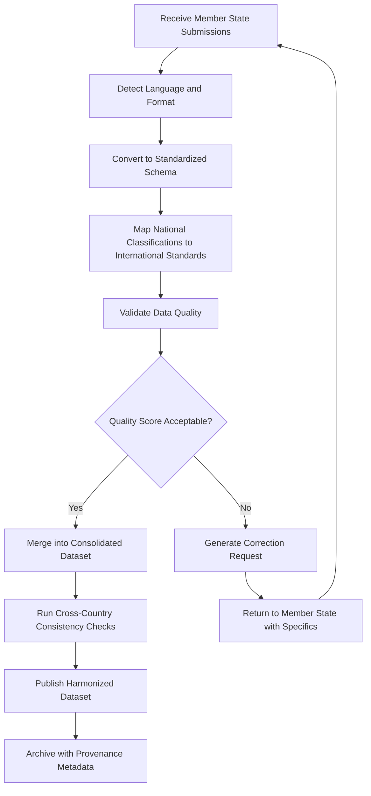

# Member State Reporting Harmonizer

Frankmax

NAICS 928120

> **International Institutions (UN/EU/AU/GCC/ASEAN)** — Data Management Module

## Objective & Purpose

International institutions collect reports from 50 to 193 member states, each submitting data in different formats, languages, classification systems, and quality levels. The Member State Reporting Harmonizer uses AI to normalize, validate, and reconcile incoming reports into standardized datasets that enable meaningful cross-country comparison and aggregate analysis.

The scale of the problem is staggering. A single UN reporting cycle might receive submissions in 30+ languages, using dozens of national classification systems, with wildly varying completeness and accuracy. Manual harmonization requires teams of statisticians working for months, and even then, discrepancies persist. This tool automates the structural work --- format conversion, unit normalization, classification mapping, outlier detection --- freeing human analysts to focus on interpretation rather than data wrangling.

Beyond normalization, the platform performs intelligent validation: flagging statistical anomalies, identifying copy-paste submissions from prior years, detecting inconsistencies between related indicators, and scoring each submission on a data quality index. For institutions whose credibility depends on the accuracy of their published statistics, this validation layer is the difference between authoritative data and contested numbers.

## Business Context

| Attribute | Value |
|---|---|
| **Business Process** | Standardized reporting |
| **Business Function** | Data Management |
| **Category** | Compliance |
| **Target Audience** | 4. International Institutions (UN/EU/AU/GCC/ASEAN) |
| **Bundle** | Custom Pricing |
| **Monthly Cost of Inaction** | $300,000+ per reporting cycle in manual harmonization labor |

## BPMN Workflow

## Features

1. **Multi-Format Ingestion** --- Accepts submissions in PDF, Excel, CSV, XML, SDMX, and scanned documents, automatically converting to the target standardized schema.
2. **Multilingual Processing** --- Processes submissions in 40+ languages, translating field names, category labels, and metadata into the institution's working languages.
3. **Classification Crosswalk Engine** --- Maintains mapping tables between national classification systems (industry codes, geographic divisions, demographic categories) and international standards (ISIC, HS, SITC).
4. **Anomaly Detection** --- Flags statistical outliers, year-over-year changes exceeding plausible thresholds, and internal inconsistencies between related indicators within the same submission.
5. **Duplicate and Stale Data Detection** --- Identifies submissions that appear to be copied from prior reporting periods with minimal or no updates, a common form of non-compliance.
6. **Data Quality Index** --- Assigns each submission a composite quality score based on completeness, timeliness, internal consistency, and alignment with independent data sources.
7. **Automated Correction Requests** --- Generates specific, actionable correction requests in the member state's language, citing exact fields and discrepancies to resolve.
8. **Provenance Tracking** --- Maintains complete lineage from raw submission through every transformation step, ensuring any published statistic can be traced back to its source.

## Workflow & Automation

**Step 1: Submission Receipt** --- Member states upload reports through a secure portal. The system detects language, format, and reporting template version automatically.

**Step 2: Format Conversion** --- AI converts each submission into the institution's standardized data schema, handling unit conversions, date format normalization, and encoding corrections.

**Step 3: Classification Mapping** --- National classification codes are mapped to international standards using maintained crosswalk tables, with AI-assisted matching for unmapped categories.

**Step 4: Quality Validation** --- Automated checks flag anomalies, missing required fields, implausible values, and inconsistencies with historical data and related indicators.

**Step 5: Correction Loop** --- Submissions failing quality thresholds trigger automated correction requests sent to national focal points with specific guidance on required fixes.

**Step 6: Consolidation** --- Validated submissions are merged into the consolidated dataset with full provenance metadata, ready for analysis and publication.

## Input/Output Specifications

| Direction | Data | Format | Description |
|---|---|---|---|
| Input | Member state reports | PDF, XLSX, CSV, XML, SDMX | Raw submissions in national formats |
| Input | Classification crosswalk tables | CSV, JSON | Mapping between national and international codes |
| Input | Historical submission data | Database | Prior-year submissions for trend validation |
| Output | Harmonized datasets | SDMX, CSV, API | Standardized cross-country datasets |
| Output | Data quality scorecards | PDF, dashboard | Per-country quality assessment reports |
| Output | Correction requests | Email, PDF | Specific guidance for member state resubmission |

## Integration Points

| System | Integration Type | Data Flow |
|---|---|---|
| SDMX Registry | API | Bidirectional data structure definitions |
| National Statistical Office Portals | File upload, API | Inbound member state submissions |
| UN Classifications Registry | API | Reference data for classification crosswalks |
| Publication Platforms | API | Outbound harmonized data for public databases |
| Statistical Analysis Tools | Export (R, Python) | Outbound datasets for analyst workflows |

## Pricing & Revenue Model

| Component | Price |
|---|---|
| Platform Access | Custom pricing based on member state count |
| Per-Reporting-Cycle Processing | Tiered by submission volume |
| Classification Crosswalk Maintenance | Included |
| Quality Validation Module | Included |
| ORF Governance Layer | Included |

Revenue is driven by the number of member states and reporting cycles managed. An institution processing submissions from 100+ member states across 4 annual reporting cycles represents $500K-$1.5M annually. The classification crosswalk engine becomes more valuable with each reporting cycle as mappings are refined, creating a data moat that competing solutions cannot easily replicate.

## NAICS/SIC Mapping

| NAICS | SIC | Industry | Relevance |
|---|---|---|---|
| 928120 | 9721 | International Affairs | Primary: international data harmonization |
| 813910 | 8611 | Business Associations | Secondary: member organization reporting |
| 519190 | 7375 | All Other Information Services | Tertiary: data processing and normalization |
| 541720 | 8732 | Research and Development | Tertiary: statistical methodology and research |
