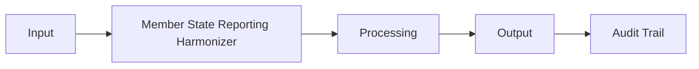

# Member State Reporting Harmonizer

Frankmax

Audience 4

> **International Institutions (UN/EU/AU/GCC/ASEAN)** — Institutional Governance

## Objective & Purpose

193 member states report in different formats; AI normalizes and validates

## Business Context

| Attribute | Value |
|---|---|
| **Business Process** | Standardized reporting |
| **Business Function** | Data Management |
| **Category** | Compliance |
| **Target Audience** | 4. International Institutions (UN/EU/AU/GCC/ASEAN) |

## BPMN Workflow

<!-- TODO: Expand BPMN with actual process steps -->

## Features

<!-- TODO: Define 5-8 key features -->

1. Feature 1
2. Feature 2
3. Feature 3

## Workflow & Automation

<!-- TODO: Step-by-step automation description -->

## Input/Output Specifications

| Direction | Data | Format |
|---|---|---|
| Input | <!-- TODO --> | <!-- TODO --> |
| Output | <!-- TODO --> | <!-- TODO --> |

## Integration Points

<!-- TODO: Connections to other systems -->

## Pricing & Revenue Model

<!-- TODO: From economic model -->

## NAICS/SIC Mapping

<!-- TODO: Industry codes -->
