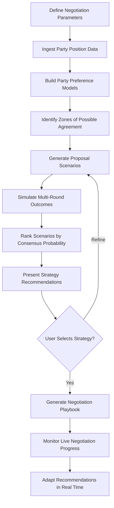

# Multilateral Negotiation Simulator

Frankmax

NAICS 928120

> **International Institutions (UN/EU/AU/GCC/ASEAN)** — Strategic Planning Module

## Objective & Purpose

Multilateral negotiations involve dozens of parties with competing interests, cultural communication styles, and domestic political constraints. The Multilateral Negotiation Simulator uses AI to model party positions, simulate negotiation dynamics, identify zones of possible agreement, and recommend convergence strategies --- transforming months of opaque diplomatic maneuvering into structured, data-driven preparation.

Traditional negotiation preparation relies on individual diplomats' experience and institutional memory, both of which are fragile. A rotating ambassador who arrives mid-negotiation inherits incomplete context. The simulator ingests historical negotiation records, public statements, voting patterns, economic data, and domestic political signals to build dynamic models of each party's revealed preferences, red lines, and flexibility points.

The tool does not replace human diplomacy --- it augments it. By running thousands of scenario simulations before each negotiation round, delegations can identify the proposals most likely to achieve broad consensus, anticipate objections, and prepare targeted responses. For institutions where a single stalled negotiation can delay global action on climate, trade, or security by years, this capability is not a luxury --- it is an operational necessity.

## Business Context

| Attribute | Value |
|---|---|
| **Business Process** | Diplomatic negotiation support |
| **Business Function** | Strategic Planning |
| **Category** | Planning |
| **Target Audience** | 4. International Institutions (UN/EU/AU/GCC/ASEAN) |
| **Bundle** | Custom Pricing |
| **Monthly Cost of Inaction** | $1M+ per stalled negotiation round in institutional costs and delayed outcomes |

## BPMN Workflow

## Features

1. **Party Position Modeling** --- Builds quantitative models of each negotiation party's priorities, constraints, and flexibility using historical voting records, public statements, and economic data.
2. **Zone of Possible Agreement Mapping** --- Identifies overlapping acceptable ranges across all parties for each negotiation issue, visualizing where consensus is achievable.
3. **Multi-Round Simulation Engine** --- Runs Monte Carlo simulations of negotiation sequences, modeling concession dynamics, coalition formation, and blocking strategies across thousands of scenarios.
4. **Coalition Analysis** --- Identifies natural coalition structures, swing parties whose positions could shift the outcome, and spoiler dynamics that could derail consensus.
5. **Cultural Communication Advisor** --- Adjusts strategy recommendations based on cultural negotiation styles (high-context vs. low-context, consensus-seeking vs. adversarial).
6. **Real-Time Adaptation** --- During live negotiations, ingests new position statements and proposal texts to update models and recalibrate strategy recommendations.
7. **Historical Pattern Library** --- Maintains a searchable database of past multilateral negotiation outcomes, identifying precedents and patterns relevant to current discussions.

## Workflow & Automation

**Step 1: Negotiation Setup** --- Define the negotiation topic, participating parties, key issues, and known constraints. Import relevant historical negotiation records.

**Step 2: Position Intelligence** --- AI ingests public statements, voting records, economic data, and domestic political signals to build baseline position models for each party.

**Step 3: ZOPA Identification** --- The system maps zones of possible agreement for each issue, highlighting areas of natural convergence and persistent disagreement.

**Step 4: Scenario Generation** --- Monte Carlo simulation generates hundreds of negotiation scenarios varying proposal sequences, concession timing, and coalition structures.

**Step 5: Strategy Ranking** --- Scenarios are ranked by consensus probability, implementation feasibility, and alignment with the user's institutional objectives.

**Step 6: Playbook Delivery** --- The selected strategy is packaged as an actionable negotiation playbook with talking points, concession thresholds, and contingency plans.

**Step 7: Live Support** --- During active negotiations, the system updates models based on observed positions and provides real-time tactical recommendations.

## Input/Output Specifications

| Direction | Data | Format | Description |
|---|---|---|---|
| Input | Historical negotiation records | PDF, structured data | Past agreements, voting records, proposals |
| Input | Party position statements | Text, PDF, API | Public and classified position documents |
| Input | Economic and political data | API, CSV | GDP, trade data, domestic polling, election results |
| Output | ZOPA visualizations | Dashboard, SVG | Interactive maps of agreement zones |
| Output | Scenario analysis reports | PDF, dashboard | Ranked negotiation scenarios with probabilities |
| Output | Negotiation playbooks | PDF, DOCX | Actionable strategy documents for delegations |

## Integration Points

| System | Integration Type | Data Flow |
|---|---|---|
| UN Voting Records Database | API | Inbound historical voting patterns |
| Open-source intelligence feeds | API | Inbound political and economic signals |
| Secure communication platforms | API | Bidirectional real-time position updates |
| Document management systems | API | Inbound historical negotiation texts |
| Briefing preparation systems | Export | Outbound strategy playbooks |

## Pricing & Revenue Model

| Component | Price |
|---|---|
| Platform Access | Custom pricing per negotiation track |
| Simulation Engine | Per-scenario pricing for large-scale runs |
| Real-Time Adaptation Module | Premium add-on |
| Historical Pattern Library | Included |
| ORF Governance Layer | Included |

Revenue is event-driven, peaking around major negotiation cycles (COP, WTO rounds, UNGA sessions). Annual contracts for institutions managing multiple simultaneous negotiation tracks range from $600K-$2M. The historical pattern library appreciates in value with each negotiation, creating a compounding data moat that improves simulation accuracy over time.

## NAICS/SIC Mapping

| NAICS | SIC | Industry | Relevance |
|---|---|---|---|
| 928120 | 9721 | International Affairs | Primary: multilateral diplomatic negotiation support |
| 813910 | 8611 | Business Associations | Secondary: multi-stakeholder negotiation facilitation |
| 541618 | 7389 | Other Management Consulting | Tertiary: strategic advisory services |
| 541720 | 8732 | Research and Development | Tertiary: negotiation research and modeling |
