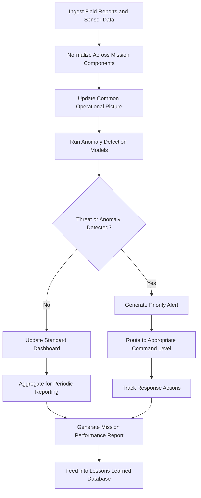

# Peacekeeping Operations Dashboard

Frankmax

NAICS 928120

> **International Institutions (UN/EU/AU/GCC/ASEAN)** — Operations Management Module

## Objective & Purpose

Peacekeeping missions are among the most complex operational undertakings on earth --- multi-country deployments involving military, police, and civilian personnel from dozens of contributing nations, operating under mandate constraints with limited real-time visibility into field conditions. The Peacekeeping Operations Dashboard consolidates operational data from all mission components into a unified command picture, enabling headquarters to make informed decisions without waiting for weekly situation reports.

Current peacekeeping management relies on fragmented reporting chains: military observers report through one channel, police components through another, and civilian staff through a third. Information from contributing nations about troop readiness, equipment serviceability, and rotation schedules arrives in inconsistent formats on inconsistent timelines. By the time headquarters synthesizes a complete operational picture, the situation on the ground has already changed.

This platform integrates real-time data feeds from mission areas --- including patrol reports, incident logs, logistics status, personnel tracking, and environmental monitoring --- into a single operational dashboard. AI-powered anomaly detection identifies emerging security threats, logistics bottlenecks, and mandate compliance risks before they escalate. For organizations responsible for the safety of over 80,000 deployed personnel across a dozen active missions, this visibility is not optional.

## Business Context

| Attribute | Value |
|---|---|
| **Business Process** | Mission management |
| **Business Function** | Operations Management |
| **Category** | Operations |
| **Target Audience** | 4. International Institutions (UN/EU/AU/GCC/ASEAN) |
| **Bundle** | Custom Pricing |
| **Monthly Cost of Inaction** | $500,000+ in operational inefficiency and delayed incident response |

## BPMN Workflow

## Features

1. **Common Operational Picture** --- Consolidates data from military, police, and civilian components into a unified geospatial dashboard showing personnel, assets, incidents, and environmental conditions.
2. **Multi-Mission Overview** --- Provides headquarters with simultaneous visibility across all active missions, enabling resource comparison and cross-mission coordination.
3. **Incident Tracking and Analysis** --- Logs, categorizes, and geo-tags security incidents, identifying patterns and trends that inform threat assessments and patrol planning.
4. **Personnel and Equipment Status** --- Tracks troop contributing nation deployments, rotation schedules, equipment serviceability, and readiness levels in real time.
5. **Logistics Pipeline Monitor** --- Visualizes supply chain status from origin to mission area, flagging potential shortages of critical supplies (fuel, water, medical, ammunition).
6. **Mandate Compliance Tracker** --- Maps operational activities against mandate requirements, identifying areas where mission activities fall short of Security Council directives.
7. **Anomaly Detection Engine** --- AI models trained on historical peacekeeping data identify unusual patterns in incident frequency, population movement, or communications that may indicate emerging threats.

## Workflow & Automation

**Step 1: Data Ingestion** --- Automated feeds from mission communication systems, GPS tracking devices, incident reporting platforms, and logistics management systems flow into the central data lake.

**Step 2: Normalization** --- Data from different contributing nations and mission components is normalized into standardized formats, resolving differences in terminology, classification, and reporting conventions.

**Step 3: Dashboard Update** --- The common operational picture updates in near-real-time, showing current force disposition, recent incidents, logistics status, and environmental conditions.

**Step 4: Anomaly Scanning** --- AI models continuously scan incoming data for anomalies that may indicate emerging security threats, logistics failures, or mandate compliance gaps.

**Step 5: Alert Processing** --- Detected anomalies and threshold breaches trigger alerts routed to the appropriate command level with recommended response actions.

**Step 6: Performance Reporting** --- Automated periodic reports compile mission performance metrics, trend analyses, and benchmark comparisons for senior leadership and governing bodies.

**Step 7: Lessons Capture** --- Incident outcomes and response effectiveness data feed into a lessons learned database that improves future operational planning and anomaly detection models.

## Input/Output Specifications

| Direction | Data | Format | Description |
|---|---|---|---|
| Input | Field situation reports | Structured forms, free text | Daily and incident-specific reports from field |
| Input | GPS and tracking data | API, real-time feeds | Personnel and vehicle location tracking |
| Input | Logistics management data | API, CSV | Supply chain and equipment status |
| Input | Satellite and aerial imagery | GeoTIFF, API | Environmental and infrastructure monitoring |
| Output | Common operational picture | Web dashboard, API | Real-time mission status visualization |
| Output | Alert notifications | SMS, email, secure messaging | Priority threat and anomaly alerts |
| Output | Mission performance reports | PDF, PPTX | Periodic reports for governing bodies |

## Integration Points

| System | Integration Type | Data Flow |
|---|---|---|
| UN Field Mission Communication Systems | API, radio gateway | Inbound field reports and voice data |
| Force Generation Service | API | Inbound troop contributing nation status |
| UN Logistics Base (Brindisi) | API | Bidirectional logistics and supply data |
| Satellite Imagery Providers | API | Inbound geospatial intelligence |
| Security Council Reporting Systems | Export | Outbound mission reports and briefings |

## Pricing & Revenue Model

| Component | Price |
|---|---|
| Platform Access | Custom pricing per mission |
| Multi-Mission Headquarters Module | Enterprise pricing |
| Anomaly Detection Engine | Included |
| Lessons Learned Database | Included |
| ORF Governance Layer | Included |

Revenue scales with the number and complexity of active missions monitored. A peacekeeping operations headquarters managing 12+ active missions with 80,000+ personnel represents $1M-$3M in annual contract value. The anomaly detection models improve with operational data from each mission, creating a learning advantage that deepens with time and makes the platform increasingly difficult to replace.

## NAICS/SIC Mapping

| NAICS | SIC | Industry | Relevance |
|---|---|---|---|
| 928120 | 9721 | International Affairs | Primary: peacekeeping operations management |
| 928110 | 9711 | National Security | Secondary: security operations and monitoring |
| 541614 | 7381 | Process, Physical Distribution, and Logistics Consulting | Tertiary: logistics optimization |
| 519190 | 7375 | All Other Information Services | Tertiary: operational data aggregation |
