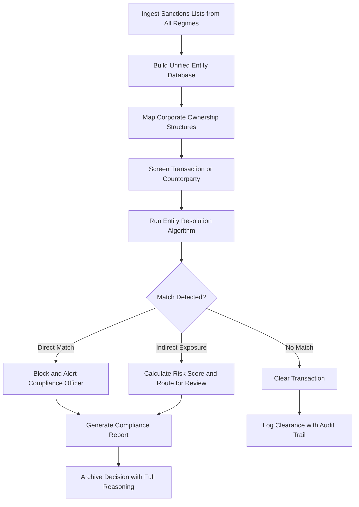

# Sanctions Compliance Engine

Frankmax

NAICS 928120

> **International Institutions (UN/EU/AU/GCC/ASEAN)** — Compliance Module

## Objective & Purpose

International sanctions regimes are layered, overlapping, and constantly evolving. The UN Security Council, EU, US (OFAC), UK, and dozens of other jurisdictions each maintain their own sanctions lists, with different designated entities, exemption procedures, and enforcement mechanisms. The Sanctions Compliance Engine uses AI to map entities, relationships, and beneficial ownership structures against all active sanctions regimes simultaneously, providing real-time exposure analysis for international institutions operating across jurisdictions.

For international institutions, sanctions compliance is not just a legal requirement --- it is an existential risk. A single transaction with a sanctioned entity can trigger asset freezes, reputational damage, and loss of correspondent banking relationships that take years to rebuild. The challenge is that sanctioned entities actively obscure their identities through shell companies, name variations, and complex ownership structures that make list-matching grossly insufficient.

This platform goes beyond name matching to perform entity resolution using corporate registry data, beneficial ownership databases, shipping records, and financial network analysis. It identifies not just direct matches but indirect exposure through subsidiaries, joint ventures, and business partners, quantifying risk at every degree of separation. For institutions processing billions in transactions annually across conflict-affected and sanctions-heavy jurisdictions, this depth of analysis is the difference between operational continuity and catastrophic compliance failure.

## Business Context

| Attribute | Value |
|---|---|
| **Business Process** | Sanctions enforcement |
| **Business Function** | Compliance |
| **Category** | Legal |
| **Target Audience** | 4. International Institutions (UN/EU/AU/GCC/ASEAN) |
| **Bundle** | Custom Pricing |
| **Monthly Cost of Inaction** | $5M+ in potential penalties, banking access loss, and reputational damage |

## BPMN Workflow

## Features

1. **Multi-Regime List Aggregation** --- Consolidates sanctions lists from UN, EU, OFAC, UK HMT, and 30+ additional jurisdictions into a unified, continuously updated database with automated change detection.
2. **Advanced Entity Resolution** --- Goes beyond simple name matching using fuzzy matching, transliteration handling, alias databases, and machine learning models to identify sanctioned entities despite name variations.
3. **Beneficial Ownership Mapping** --- Traces corporate ownership structures through multiple layers to identify indirect sanctions exposure through subsidiaries, joint ventures, and beneficial owners.
4. **Network Risk Scoring** --- Assigns risk scores based on degrees of separation from sanctioned entities, ownership percentages, and transaction patterns, enabling risk-proportionate responses.
5. **Real-Time Screening** --- Processes transaction and counterparty screening requests in under 2 seconds, supporting high-volume operations without creating processing bottlenecks.
6. **Exemption and License Tracking** --- Maintains a database of sanctions exemptions, humanitarian licenses, and carve-outs applicable to international institutions, ensuring legitimate operations are not blocked.
7. **Regulatory Change Monitor** --- Tracks sanctions regime updates across all jurisdictions in real time, alerting compliance teams to new designations, delistings, and regime modifications.
8. **Decision Audit Trail** --- Records every screening decision with full reasoning, supporting regulatory examinations and demonstrating due diligence to banking partners and auditors.

## Workflow & Automation

**Step 1: List Synchronization** --- Automated feeds from sanctions list providers update the unified database within minutes of regime changes, new designations, or delistings.

**Step 2: Entity Enrichment** --- Corporate registry data, beneficial ownership databases, and open-source intelligence enrich the entity database with aliases, addresses, ownership structures, and network connections.

**Step 3: Transaction Screening** --- Incoming transactions, vendor registrations, and counterparty onboarding requests are screened against the enriched entity database in real time.

**Step 4: Match Resolution** --- Potential matches are classified by confidence level and routed to appropriate review workflows --- automatic blocks for high-confidence matches, analyst review for ambiguous cases.

**Step 5: Risk Assessment** --- For indirect exposure (ownership connections, business relationships), the system calculates aggregate risk scores and recommends proportionate responses.

**Step 6: Decision Documentation** --- Every screening result, whether cleared or blocked, is documented with full reasoning, data sources, and timestamp for audit trail purposes.

## Input/Output Specifications

| Direction | Data | Format | Description |
|---|---|---|---|
| Input | Sanctions lists | XML, CSV, API | UN, EU, OFAC, UK HMT, and 30+ additional regimes |
| Input | Corporate registry data | API, bulk download | Company ownership and director information |
| Input | Transaction data | API, batch file | Counterparty details for screening |
| Input | Beneficial ownership data | API | Ultimate ownership and control information |
| Output | Screening results | API, JSON | Match/no-match with confidence scores |
| Output | Risk assessment reports | PDF, dashboard | Exposure analysis with network visualizations |
| Output | Audit trail records | Database, API | Complete decision logs for regulatory examination |

## Integration Points

| System | Integration Type | Data Flow |
|---|---|---|
| UN Security Council Sanctions Lists | API | Inbound consolidated list updates |
| EU Sanctions Map | API | Inbound EU restrictive measures |
| OFAC SDN List | API | Inbound US sanctions designations |
| Enterprise Resource Planning (ERP) | API | Bidirectional transaction screening |
| Banking and Payment Systems | API, SWIFT | Bidirectional payment screening |

## Pricing & Revenue Model

| Component | Price |
|---|---|
| Platform Access | Custom pricing based on screening volume |
| Multi-Regime Coverage | Tiered by number of jurisdictions |
| Beneficial Ownership Module | Premium add-on |
| Real-Time API Screening | Per-transaction pricing |
| ORF Governance Layer | Included |

Revenue is driven by screening volume and jurisdictional coverage. An international institution processing 100,000+ transactions monthly across 10+ sanctions regimes represents $500K-$1.5M annually. The entity resolution database improves with every screening, building a proprietary knowledge base of entity relationships and aliases that directly improves accuracy and creates a compounding competitive moat.

## NAICS/SIC Mapping

| NAICS | SIC | Industry | Relevance |
|---|---|---|---|
| 928120 | 9721 | International Affairs | Primary: international sanctions administration |
| 813910 | 8611 | Business Associations | Secondary: compliance-focused institutional coordination |
| 541199 | 7389 | All Other Legal Services | Tertiary: sanctions compliance advisory |
| 522320 | 6159 | Financial Transactions Processing | Tertiary: transaction screening services |
