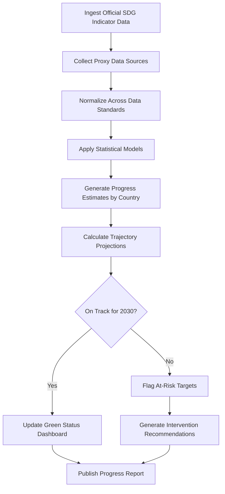

# SDG Progress Tracker

Frankmax

NAICS 928120

> **International Institutions (UN/EU/AU/GCC/ASEAN)** — Performance Management Module

## Objective & Purpose

The 17 Sustainable Development Goals encompass 169 targets and 231 unique indicators, yet progress tracking relies on self-reported national data that arrives with a 2-3 year lag. The SDG Progress Tracker synthesizes real-time proxy indicators from satellite imagery, economic data feeds, health surveillance systems, and social media signals to produce near-real-time SDG progress estimates at national and sub-national levels.

Traditional SDG monitoring depends on national statistical offices that often lack capacity, funding, or political incentive to report accurately. This tool bridges the data gap by triangulating official statistics with independent data sources --- nighttime light intensity for economic activity (Goal 8), vegetation indices for food security (Goal 2), air quality sensors for climate action (Goal 13), and mobile connectivity data for infrastructure access (Goal 9).

The platform enables program officers, donor agencies, and member state delegations to identify where progress is stalling before official reports confirm it, shifting the paradigm from retrospective reporting to prospective intervention. For institutions allocating billions in development funding, the difference between 2-year-old data and 30-day-old data translates directly into lives and resources.

## Business Context

| Attribute | Value |
|---|---|
| **Business Process** | Development goals monitoring |
| **Business Function** | Performance Management |
| **Category** | Analytics |
| **Target Audience** | 4. International Institutions (UN/EU/AU/GCC/ASEAN) |
| **Bundle** | Custom Pricing |
| **Monthly Cost of Inaction** | $500,000+ in misallocated development funds due to stale data |

## BPMN Workflow

## Features

1. **Multi-Source Data Fusion** --- Combines official statistical data, satellite imagery, IoT sensor networks, economic indicators, and social data into unified SDG progress scores.
2. **Real-Time Proxy Indicators** --- Uses machine learning to correlate high-frequency data sources with SDG indicators, producing estimates within 30 days versus 2-3 year official lag.
3. **Sub-National Disaggregation** --- Breaks national-level SDG data down to provincial, district, and municipal levels to identify geographic disparities invisible in aggregate reporting.
4. **2030 Trajectory Modeling** --- Projects current trends forward to estimate probability of meeting each target by 2030, enabling early course correction.
5. **Cross-Goal Impact Analysis** --- Maps interdependencies between SDG targets (e.g., education outcomes driving economic growth), quantifying spillover effects of interventions.
6. **Data Quality Scoring** --- Rates confidence levels for each estimate based on source reliability, recency, and coverage, making uncertainty transparent to decision-makers.
7. **Voluntary National Review Support** --- Auto-generates country-specific progress narratives aligned with VNR reporting templates used at the UN High-Level Political Forum.

## Workflow & Automation

**Step 1: Data Collection** --- Automated pipelines ingest data from UN Statistics Division, World Bank Open Data, WHO Global Health Observatory, satellite providers, and 200+ additional sources.

**Step 2: Data Normalization** --- Harmonizes disparate data formats, units, and temporal resolutions into a unified analytical framework aligned with the Global Indicator Framework.

**Step 3: Gap Filling** --- Machine learning models impute missing data points using proxy indicators and statistical relationships validated against historical ground truth.

**Step 4: Progress Scoring** --- Calculates composite progress scores for each of the 231 indicators, 169 targets, and 17 goals at country and sub-national levels.

**Step 5: Trajectory Projection** --- Time-series forecasting models project current trajectories to 2030, flagging targets at risk of being missed with confidence intervals.

**Step 6: Alert Distribution** --- Automated alerts notify program officers when country-target combinations show declining trajectories or fall below critical thresholds.

## Input/Output Specifications

| Direction | Data | Format | Description |
|---|---|---|---|
| Input | Official SDG indicator data | CSV, API (SDMX) | National statistical office submissions |
| Input | Satellite imagery | GeoTIFF, API | Earth observation data for proxy indicators |
| Input | Economic data feeds | API, CSV | World Bank, IMF, regional development banks |
| Input | Health surveillance data | API, HL7 | WHO and national health system feeds |
| Output | Progress dashboards | Web, API | Interactive SDG progress visualizations |
| Output | Country progress reports | PDF, DOCX | Formatted reports for VNR and HLPF |
| Output | At-risk target alerts | Email, webhook | Early warning notifications |

## Integration Points

| System | Integration Type | Data Flow |
|---|---|---|
| UN Global SDG Database | API (SDMX) | Bidirectional indicator data exchange |
| World Bank Open Data | API | Inbound economic and development indicators |
| Copernicus/Sentinel Hub | API | Inbound satellite imagery for proxy indicators |
| WHO Global Health Observatory | API | Inbound health-related SDG indicators |
| National Statistical Offices | File upload, API | Inbound official statistics |

## Pricing & Revenue Model

| Component | Price |
|---|---|
| Platform Access | Custom pricing based on scope |
| Per-Country Monitoring | Tiered by indicator coverage depth |
| Sub-National Disaggregation | Premium add-on |
| VNR Report Generation | Per-report pricing |
| ORF Governance Layer | Included |

Revenue scales with the number of countries and indicator depth monitored. A regional body tracking 20 countries across all 17 goals represents $300K-$800K annually. The data fusion layer compounds in value as more sources are integrated, creating a telemetry moat that improves estimate accuracy over time and locks in institutional users.

## NAICS/SIC Mapping

| NAICS | SIC | Industry | Relevance |
|---|---|---|---|
| 928120 | 9721 | International Affairs | Primary: SDG monitoring for international bodies |
| 813910 | 8611 | Business Associations | Secondary: development-focused coalitions |
| 541720 | 8732 | Research and Development | Tertiary: development research analytics |
| 519190 | 7375 | All Other Information Services | Tertiary: data aggregation and analytics |
